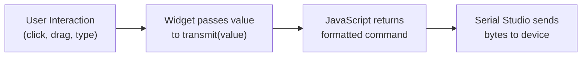

# Output Controls

## Overview

Output controls are interactive dashboard widgets that send data back to a connected device. While standard widgets visualize incoming telemetry, output controls transmit commands, setpoints, and parameters from the Serial Studio dashboard, so the dashboard can both read from and write to the device.

Each output control uses a user-defined JavaScript `transmit(value)` function that converts widget interactions (button clicks, slider drags, text input) into the exact bytes your device expects. That makes output controls protocol-agnostic: the same slider widget can drive a plain-text serial command, a JSON payload, or a binary packet by changing only the transmit function.

Output controls require a **Pro license**.

## How Output Controls Work


```mermaid
flowchart LR
    A["User Interaction<br/>(click, drag, type)"] --> B["Widget passes value<br/>to transmit(value)"]
    B --> C["JavaScript returns<br/>formatted command"]
    C --> D["Serial Studio sends<br/>bytes to device"]
```

1. The user interacts with a control on the dashboard (clicks a button, moves a slider, types text, etc.).
2. The widget calls its JavaScript `transmit(value)` function with the interaction value.
3. The function returns a string (binary payloads are byte-strings built with `String.fromCharCode`).
4. Serial Studio transmits the result to the connected device.

Transmission is rate-limited to a minimum of 50 ms between sends, preventing device buffer overflows during continuous interactions like slider drags.

## Output Control Types

### Button

Sends a single command on click, or latches on and off when **Toggle Button** is enabled.

| Property | Value |
|----------|-------|
| Value passed to `transmit()` | `1` (integer), or `1` / `0` when Toggle Button is enabled |
| Interaction | Single click, or click to latch and click again to release |
| Use cases | Reset, start/stop, trigger measurement, relay and enable lines |

| Property | Default | Description |
|----------|---------|-------------|
| Button Icon | (none) | Icon shown next to the caption |
| Colorize Icon | off | Tint the icon with the button color |
| Button Color | Automatic | Custom fill color; automatic uses the group accent color |
| Button Size | Normal | Small, Normal, Large or Extra Large |
| Toggle Button | off | Stay pressed between clicks and send `1` (on) / `0` (off) |
| On Label | (empty) | Caption while latched; falls back to the widget label |
| Off Label | (empty) | Caption while released; falls back to the widget label |

A latching button is filled with the button color while it is on and drawn as a plain
button while it is off, so its state is readable without opening the device. It sends
the same values as a Toggle, so a transmit function written for one works for the other.

Button Size scales the button, its icon and its caption together, and the panel packer
reserves a proportionally larger cell for it, so a large button is never clipped by its
neighbours. When a custom Button Color is set, the caption switches between black and
white to stay readable on that fill.

### Slider

Sends a numeric value from a draggable slider.

| Property | Default | Description |
|----------|---------|-------------|
| Min Value | 0 | Lower bound of the slider range |
| Max Value | 100 | Upper bound of the slider range |
| Step Size | 1 | Increment between discrete positions |
| Initial Value | 0 | Starting position |

The value passed to `transmit()` is a number clamped to [Min, Max]. Transmissions occur continuously while dragging, rate-limited to 50 ms intervals.

### Toggle

Binary on/off switch.

| Property | Default | Description |
|----------|---------|-------------|
| Initial Value | 0 | Starting state (0 = off, 1 = on) |

Passes `1` to `transmit()` when switched on, `0` when switched off.

### Text Field

Accepts arbitrary typed input and sends it as a string.

| Property | Value |
|----------|-------|
| Value passed to `transmit()` | The typed string |
| Interaction | Press Enter or click Send |
| Use cases | AT commands, debug console, custom queries |

### Knob

Rotary dial for continuous setpoint adjustment. Same numeric properties as Slider (Min, Max, Step, Initial Value) but displayed as a circular dial.

## Creating Output Controls

1. Open the Project Editor (toolbar wrench icon).
2. Click one of the **Add Output** buttons in the toolbar (Button, Slider, Toggle, Text Field, or Knob).
3. An **Output Panel** group is created automatically if one does not exist.
4. Select the new control in the tree view to configure its properties, then click **Edit Code** in the toolbar to write its transmit function.

Output controls live inside **Output Panel** groups. You can also add an Output Panel group first (via the toolbar), then add controls to it. Each Output Panel can hold multiple controls of mixed types, packed automatically into as many columns as fit the available width.

## The Transmit Function

Every output control has a JavaScript `transmit(value)` function that defines how interactions become device commands. The function is compiled once when the dashboard opens and executed on each interaction.

### Writing a Transmit Function

Select the control and click **Edit Code** in the Project Editor toolbar. The transmit function opens in its own window, with the template list, import, validation and testing all in its header, a live preview of the control beside the code, and a status line that reports whether the script compiles and defines `transmit(value)` as you type.

A script that does not compile, or that never defines `transmit(value)`, is not saved: the project keeps the last version that worked, and closing the window with a broken script asks before discarding it.

The preview drives the real control through its own range, step size and labels, and shows the exact bytes the script produces. It never transmits: nothing reaches a connected device from the preview, so a relay or PWM script is safe to exercise with hardware attached.

The function receives a single `value` parameter and must return a string:

```javascript
function transmit(value) {
  // value is:
  //   1           for Button clicks
  //   0 or 1      for Toggle state changes and latching Buttons
  //   number       for Slider and Knob
  //   "string"    for TextField input

  return "CMD " + value + "\r\n";
}
```

The return value must be a string. For binary protocols, build a byte-string with `String.fromCharCode(...)` (see the Binary Packet template); returning a plain array of numbers transmits nothing. Payloads are capped at 65536 bytes, and a `transmit()` call that runs longer than 500 ms is stopped by a watchdog. Both conditions abort the transmission and flash a red border on the control; hover the control to see the error message.

### Built-in Templates

The code editor includes a set of ready-to-use templates: Simple command, JSON command, Binary packet, PWM control, PID setpoint, Relay toggle, AT command, Modbus write, CAN Bus frame, G-Code command, GRBL command, NMEA sentence, SCPI command, SLCAN command, and Default template. Select one from the template dropdown and customize it for your device.

#### Simple Command

Sends plain text with a line terminator. Adapts to the widget type automatically.

```javascript
function transmit(value) {
  if (typeof value === "string")
    return value + "\r\n";

  if (value === 1)
    return "ON\r\n";

  if (value === 0)
    return "OFF\r\n";

  return "SET " + value + "\r\n";
}
```

#### JSON Command

Sends structured JSON objects. Useful for firmware that parses JSON input.

```javascript
function transmit(value) {
  var obj = {
    cmd: "set",
    value: value,
    ts: Date.now()
  };
  return JSON.stringify(obj) + "\n";
}
```

#### Binary Packet

Sends framed binary data with STX/ETX delimiters.

```javascript
function transmit(value) {
  var STX = String.fromCharCode(0x02);
  var ETX = String.fromCharCode(0x03);
  var cmd = String.fromCharCode(0x01);
  var val = String.fromCharCode(Math.round(value) & 0xFF);

  // XOR checksum over cmd + value
  var chk = String.fromCharCode(0x01 ^ (Math.round(value) & 0xFF));
  return STX + cmd + val + chk + ETX;
}
```

#### PWM Control

Sends a duty cycle value (0-255) for motor speed, LED brightness, or heater control.

```javascript
var CHANNEL = 0;

function transmit(value) {
  var duty = Math.round(Math.max(0, Math.min(255, value)));
  return "PWM " + CHANNEL + " " + duty + "\r\n";
}
```

#### PID Setpoint

Sends a floating-point setpoint with 2 decimal places for PID controllers.

```javascript
var SP_MIN = 0.0;
var SP_MAX = 100.0;

function transmit(value) {
  var sp = Math.max(SP_MIN, Math.min(SP_MAX, Number(value)));
  return "SP " + sp.toFixed(2) + "\r\n";
}
```

#### Relay Toggle

Sends distinct ON/OFF commands for relay or digital output control.

```javascript
var CHANNEL = 0;

function transmit(value) {
  var state = value ? "ON" : "OFF";
  return "RELAY " + CHANNEL + " " + state + "\r\n";
}
```

#### AT Command

Sends AT-style commands for modems, Bluetooth modules, and WiFi modules.

```javascript
function transmit(value) {
  if (typeof value === "string" && value.length > 0)
    return "AT+" + value + "\r\n";

  return "AT\r\n";
}
```

#### Modbus Register Write

Writes a slider value directly to a Modbus holding register using the built-in helper function.

```javascript
function transmit(value) {
  return modbusWriteRegister(0x0001, value);
}
```

#### CAN Bus Frame

Sends a numeric value as a CAN frame using the built-in helper function.

```javascript
function transmit(value) {
  return canSendValue(0x100, value, 2);
}
```

### Importing from File

Click **Import** in the transmit function window's header to load a `.js` file from disk. This is useful for sharing transmit functions across projects or version-controlling them separately.

## State Feedback

By default an output control shows the state **you** last set it to. The equipment can change on its own: an interlock trips, someone uses a local panel, a command is refused. The control keeps showing your last click and quietly says something untrue about the machine.

Bind a control to a **state source** and it shows what the equipment reports instead. Select the control in the Project Editor and set **State Source** to a dataset or a table variable, then pick the source itself.

A load bank makes the case. Stopping the bank also stops its cooling fan, because the two are interlocked in the equipment rather than in Serial Studio. Bind the fan's control to the dataset carrying fan status and it stops claiming the fan is running the moment the bank goes down.

### On Value

For a toggle or a latching button, **On Value** decides which readings mean on.

Leave it empty and any non-zero number means on. That works for a dataset reporting `1` and `0`, but a device reporting text like `RUN` and `STOP` carries no number at all, so it would read as off even while running — fill in `RUN` and the control matches it exactly, comparing as text or as a number automatically.

Anything more involved (a bit within a status word, a threshold, hysteresis) belongs in the dataset's own transform, which already exists for exactly this. Produce a clean `0` or `1` there and leave **On Value** empty.

### Waiting and No Data

A bound control shows three states rather than two.

**live**: the source is reporting, and the control shows what it says.

**waiting…**: you acted and the equipment has not confirmed yet. **Confirm Within (ms)** sets how long this lasts; a contactor may close in well under a second while a fan takes several. During this window the control keeps showing what you asked for, and feedback does not override it.

**no data**: the source has not reported, or has gone quiet. The control dims and says so, because showing "off" when the truth is "we have not heard" is the failure this feature exists to remove.

Feedback never transmits. Reflecting equipment state is not an operator action, so a bound control cannot command itself in a loop. Dragging a bound slider is also never interrupted: feedback is held until you let go.

If you delete the dataset or variable a control was bound to, the project still loads and the control still works — it stops correcting itself, and the Problems list reports it.

## Protocol Helper Functions

Every output widget's JavaScript engine includes built-in helper functions for Modbus and CAN Bus protocols. These handle binary byte-packing so you don't have to construct raw bytes manually.

### Modbus Helpers

#### `modbusWriteRegister(address, value, unit)`

Every Modbus helper takes an optional trailing `unit` (1 to 247). When given, the payload is prefixed with `0xFF 0x83 <unit>` and the Modbus driver writes to that device instead of the connection's own unit, which is how a control commands the second device on a shared RS-485 bus. Because the helpers return a byte string, set the control's transmit encoding to Latin-1 so bytes above 127 are not re-encoded.

Writes a 16-bit integer to a single holding register.

| Parameter | Type | Description |
|-----------|------|-------------|
| `address` | Number | Register address (0x0000–0xFFFF) |
| `value` | Number | Value to write (rounded to integer, 0–65535) |

```javascript
function transmit(value) {
  return modbusWriteRegister(0x0001, value);
}
```

#### `modbusWriteCoil(address, on)`

Writes the ON/OFF convention (ON = 0xFF00, OFF = 0x0000) to a holding register. This helper is presently an alias for `modbusWriteRegister()`: it packs the same 4-byte holding-register write and does not issue a native Modbus coil write (function code 5/15) — the driver always targets holding registers (function code 6/16). Use it when a downstream PLC program maps that holding register to a physical relay or coil; it will not work against a device that expects an actual coil write.

| Parameter | Type | Description |
|-----------|------|-------------|
| `address` | Number | Holding register address (0x0000–0xFFFF) |
| `on` | Boolean/Number | Truthy = ON, falsy = OFF |

```javascript
// Toggle widget writing ON/OFF to a holding register a PLC maps to a relay
function transmit(value) {
  return modbusWriteCoil(0x0000, value);
}
```

#### `modbusWriteFloat(address, value)`

Writes an IEEE-754 32-bit float across two consecutive holding registers (big-endian).

| Parameter | Type | Description |
|-----------|------|-------------|
| `address` | Number | Starting register address |
| `value` | Number | Floating-point value |

```javascript
// Slider writing a temperature setpoint as a 32-bit float
function transmit(value) {
  return modbusWriteFloat(0x0010, value);
}
```

### CAN Bus Helpers

#### `canSendFrame(id, payload)`

Sends an arbitrary CAN frame with the given identifier and payload.

| Parameter | Type | Description |
|-----------|------|-------------|
| `id` | Number | CAN identifier, packed as two bytes (masked to 0x0000–0xFFFF) |
| `payload` | Array or String | Payload bytes as an array of numbers (0–255), or a raw string |

```javascript
// Button sending a fixed command frame
function transmit(value) {
  return canSendFrame(0x200, [0x01, 0x00, 0xFF]);
}
```

```javascript
// Slider packing its value into a 3-byte payload
function transmit(value) {
  var v = Math.round(value);
  return canSendFrame(0x100, [0x01, (v >> 8) & 0xFF, v & 0xFF]);
}
```

#### `canSendValue(id, value, bytes)`

Sends a numeric value packed big-endian into a CAN frame.

| Parameter | Type | Default | Description |
|-----------|------|---------|-------------|
| `id` | Number | Required | CAN identifier |
| `value` | Number | Required | Numeric value (rounded to integer) |
| `bytes` | Number | 2 | Number of payload bytes (1–8) |

```javascript
// Slider sending a 16-bit value on CAN ID 0x100
function transmit(value) {
  return canSendValue(0x100, value, 2);
}
```

```javascript
// Knob sending a 32-bit value on CAN ID 0x300
function transmit(value) {
  return canSendValue(0x300, value, 4);
}
```

### Combining Helpers with Custom Logic

The helpers return strings that can be concatenated or conditionally selected:

```javascript
// Write different registers based on a toggle state
function transmit(value) {
  if (value)
    return modbusWriteRegister(0x0010, 1);  // Enable
  else
    return modbusWriteRegister(0x0010, 0);  // Disable
}
```

```javascript
// Send a CAN frame with a header byte and the widget value
function transmit(value) {
  return canSendFrame(0x150, [0xAA, Math.round(value) & 0xFF]);
}
```

## Output Panel Layout

Output controls are displayed in an Output Panel widget on the dashboard. The panel uses an adaptive layout engine:

- Controls are packed automatically into as many columns as fit the available width, derived from each control's minimum width.
- Small controls (Button, Slider, Toggle, TextField) stack vertically within columns.
- Tall controls (Knob) span the full column height.
- If controls overflow the visible area, the panel scrolls vertically.

## Multi-Source Projects

In projects with multiple data sources (devices), the target device is determined by the source of the Output Panel group a control belongs to, not by a per-control property. Every control in a group transmits to that group's source. To send to a different device, place the control in an Output Panel group assigned to that source.

## Output Controls vs. Actions

Both output controls and [Actions](Actions.md) send data to connected devices, but they serve different purposes:

| Feature | Output Controls | Actions |
|---------|----------------|---------|
| Widget types | 5 (button, slider, toggle, text, knob) | Button only |
| Data formatting | JavaScript `transmit()` function | Fixed TX Data + EOL |
| Continuous values | Yes (slider, knob) | No |
| Timer/auto-repeat | No | Yes (5 timer modes) |
| Auto-execute on connect | No | Yes |
| License | Pro | Free |

**Use Actions** for simple fire-and-forget commands, periodic polling, and auto-execute-on-connect sequences. **Use Output Controls** when you need interactive controls with continuous values, custom data formatting, or a mix of widget types.

## Examples

### Motor Speed Controller

Control motor speed with a slider and an emergency stop button.

| Control | Type | Properties |
|---------|------|------------|
| Speed | Slider | Min: 0, Max: 100, Units: "%" |
| Emergency Stop | Button |   |

Speed transmit function:
```javascript
function transmit(value) {
  return "SPD " + Math.round(value) + "\r\n";
}
```

Emergency Stop transmit function:
```javascript
function transmit(value) {
  return "ESTOP\r\n";
}
```

### Relay Control Panel

Toggle 3 relays independently.

| Control | Type | Properties |
|---------|------|------------|
| Relay 1 | Toggle | ON: "Closed", OFF: "Open" |
| Relay 2 | Toggle | ON: "Closed", OFF: "Open" |
| Relay 3 | Toggle | ON: "Closed", OFF: "Open" |

Each relay uses a customized transmit function with its relay number:
```javascript
// Relay 1
function transmit(value) {
  return value ? "R1 ON\r\n" : "R1 OFF\r\n";
}
```

### Sensor Calibration Interface

Combine a text field for commands with a knob for fine adjustment.

| Control | Type | Properties |
|---------|------|------------|
| Command | TextField |   |
| Offset | Knob | Min: -10, Max: 10, Step: 0.1, Units: "mV" |

Command transmit function:
```javascript
function transmit(value) {
  return "CAL " + value + "\r\n";
}
```

Offset transmit function:
```javascript
function transmit(value) {
  return "OFFSET " + Number(value).toFixed(1) + "\r\n";
}
```

### Modbus PID Controller

Control a PID loop over Modbus by writing setpoint, Kp, and enable/disable to holding registers.

| Control | Type | Properties |
|---------|------|------------|
| Setpoint | Slider | Min: 0, Max: 500, Step: 0.5, Units: "°C" |
| Kp Gain | Knob | Min: 0, Max: 10, Step: 0.01 |
| Enable | Toggle | ON: "Running", OFF: "Stopped" |

Setpoint transmit function (32-bit float to registers 0x0010–0x0011):
```javascript
function transmit(value) {
  return modbusWriteFloat(0x0010, value);
}
```

Kp Gain transmit function (32-bit float to registers 0x0012–0x0013):
```javascript
function transmit(value) {
  return modbusWriteFloat(0x0012, value);
}
```

Enable transmit function (holding register 0x0000 via the `modbusWriteCoil` alias, mapped to a relay downstream):
```javascript
function transmit(value) {
  return modbusWriteCoil(0x0000, value);
}
```

### CAN Bus Motor Controller

Control a motor over CAN Bus with speed setpoint and emergency stop.

| Control | Type | Properties |
|---------|------|------------|
| Speed | Slider | Min: 0, Max: 10000, Units: "RPM" |
| Direction | Toggle | ON: "Forward", OFF: "Reverse" |
| E-Stop | Button |   |

Speed transmit function (16-bit value on CAN ID 0x100):
```javascript
function transmit(value) {
  return canSendValue(0x100, value, 2);
}
```

Direction transmit function (single byte on CAN ID 0x101):
```javascript
function transmit(value) {
  return canSendFrame(0x101, [value ? 0x01 : 0x00]);
}
```

E-Stop transmit function (fixed command frame on CAN ID 0x1FF):
```javascript
function transmit(value) {
  return canSendFrame(0x1FF, [0xFF, 0x00]);
}
```

## Common Mistakes

### Controls Do Not Appear on Dashboard

**Symptom:** Output controls are configured in the Project Editor but do not appear on the dashboard.

**Fix:** Ensure the device is connected. Output panels only appear on the dashboard while a connection is active. Also verify that the controls are inside an Output Panel group (group type must be "Output").

### Commands Not Received by Device

**Symptom:** The control is visible and interactive, but the device does not respond.

**Fix:**
1. Check the **Console** view to confirm data is being sent.
2. Verify the transmit function returns a properly terminated string (most devices expect `\r\n`).
3. In multi-source projects, confirm the control is in an Output Panel group assigned to the correct device.
4. Check that your Pro license is active. Transmission is disabled without it.

### Slider Sends Too Many Commands

**Symptom:** The device is overwhelmed or the serial buffer overflows while dragging a slider.

**Fix:** The built-in 50 ms rate limit prevents most flooding, but if your device needs more time between commands, increase the step size to reduce the number of discrete values, or add debouncing logic in your transmit function.

### Transmit Function Error

**Symptom:** The control shows the red text "No transmit function defined" instead of its widget.

**Fix:** Open the Project Editor and check the transmit function for syntax errors. The function must be a valid JavaScript function named `transmit` that accepts one parameter and returns a string. This label also appears when the field is left empty. Runtime errors raised during a transmit (watchdog timeout, a script exception, or an oversize payload) flash a red border on the control for a few seconds; hover it to read the error message.

## Tips

- Start with a built-in template and modify it. That avoids common syntax mistakes.
- Test with the Console view open to see exactly what bytes are being transmitted.
- Combine output controls with input widgets in the same dashboard for full closed-loop monitoring (e.g., a slider to set a target temperature alongside a gauge showing the actual temperature).
- Use the built-in protocol helpers (`modbusWriteRegister`, `canSendFrame`, and so on) instead of packing binary bytes by hand. See [Protocol Helper Functions](#protocol-helper-functions) above.
- For protocols beyond the built-in helpers, define your own helper functions next to `transmit()` in the same script. Variables declared outside `transmit()` persist across calls.

## See Also

- [SDK Reference](SerialStudio-SDK.md): the protocol encoders (`modbusWriteRegister`, `canSendFrame`, ...) a `transmit()` function returns, and the wider scripting surface.
- [Actions](Actions.md): simple command buttons with timer support.
- [Project Editor](Project-Editor.md): full guide to creating and configuring projects.
- [Toolbar & Button Reference](Toolbar-Reference.md): the Project Editor's add-control buttons and the rest of the app's chrome.
- [Widget Reference](Widget-Reference.md): all input and visualization widget types.
- [Frame Parser Scripting](JavaScript-API.md): Lua and JavaScript parser reference.
- [Data Sources](Data-Sources.md): configuring device connections.
