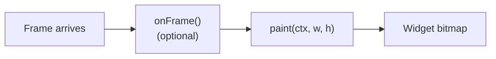

# Painter widget

The Painter is a Pro dashboard widget that exposes a JavaScript `paint(ctx, w, h)` callback. The script renders directly into the widget's bitmap on every dashboard tick. Use it when no built-in widget covers the visualization required by the project.

Painter is a Pro feature.

## Pipeline



Each Painter widget is bound to one project group. On every dashboard tick:

1. Serial Studio updates the group's datasets with the latest parsed values.
2. If the script defines `onFrame()`, it runs once. Use it to advance time-domain state such as ring buffers, peak-hold decay, or accumulated angles.
3. `paint(ctx, w, h)` runs. `ctx` is a Canvas2D-shaped context, `w` and `h` are the widget's pixel dimensions. The result is composited onto the dashboard.

The context is a `QPainter` exposed through a `CanvasRenderingContext2D`-style API. The widget repaints at the dashboard refresh rate (60 Hz by default, configurable from 1 to 240 Hz), independent of the data rate.

## Script structure

A Painter script defines two functions: `paint()` (required) and `onFrame()` (optional).

```javascript
// Minimal example: a single bar that follows datasets[0].
function paint(ctx, w, h) {
  ctx.fillStyle = "#f5f5f1";
  ctx.fillRect(0, 0, w, h);

  if (datasets.length === 0) return;

  const ds = datasets[0];
  const v  = (ds.value - ds.min) / (ds.max - ds.min || 1);

  ctx.fillStyle = "#10b981";
  ctx.fillRect(8, h - v * (h - 16) - 8, w - 16, v * (h - 16));
}
```

### `paint(ctx, w, h)`

Called every UI tick. The bitmap is cleared to transparent before the call, and the path is empty. All other context state (`fillStyle`, `strokeStyle`, `font`, `globalAlpha`, transform, line styles) persists from the previous frame. Set every property on which the frame depends at the top of `paint()`, or wrap mid-frame changes in `save()` / `restore()` pairs.

The function should return in under 10 ms to keep up with the refresh rate. If `paint()` exceeds 30 ms on two consecutive ticks the widget surfaces a slow-paint warning. A 250 ms watchdog terminates the script if a single call does not return.

### `onFrame()`

Called once per data-bearing dashboard tick, immediately before `paint()`. Optional. `paint()` can additionally run on UI-refresh ticks that carry no new data, where `onFrame()` is not invoked, so keep state that must advance on every tick out of `onFrame()` if it depends on the UI cadence. Both functions run regardless of widget visibility, so a Painter on a hidden workspace tab continues to update its state.

`onFrame()` is the place for time-domain bookkeeping: pushing samples into history buffers, decaying peak holds, integrating a phase angle. Keeping that logic out of `paint()` makes both functions easier to read and review.

```javascript
const HISTORY = 256;
const trace   = [];

function onFrame() {
  if (datasets.length === 0) return;
  trace.push(datasets[0].value);
  if (trace.length > HISTORY) trace.shift();
}

function paint(ctx, w, h) {
  ctx.fillStyle = "#06140a";
  ctx.fillRect(0, 0, w, h);

  if (trace.length < 2) return;

  ctx.strokeStyle = "#22c55e";
  ctx.lineWidth   = 2;
  ctx.beginPath();
  for (let i = 0; i < trace.length; ++i) {
    const x = (i / (HISTORY - 1)) * w;
    const y = h - (trace[i] / 100) * h;
    i === 0 ? ctx.moveTo(x, y) : ctx.lineTo(x, y);
  }
  ctx.stroke();
}
```

### Persistent state

Variables declared at the top of the script (`const`, `let`, `var`) live for the lifetime of the widget and retain their values between calls. State is reset when the script is recompiled (after an edit in the editor) or when the widget is destroyed (project closed, group deleted). Disconnecting and reconnecting the device does not reset state.

## Globals

Three globals are available inside `paint()` and `onFrame()`.

### `datasets`

An array-like view of the group's datasets. `datasets.length` returns the count, `datasets[i]` returns the i-th dataset. Each dataset is a frozen object with the fields below. The fields are getters and always return the current value.

| Field        | Type    | Description |
|--------------|---------|-------------|
| `index`      | number  | Frame index (column position). |
| `uniqueId`   | number  | Stable unique ID across project edits. |
| `title`      | string  | Display name. |
| `units`      | string  | Measurement units (`"degC"`, `"rpm"`, ...). |
| `widget`     | string  | Dataset widget type, if any (`"bar"`, `"gauge"`, `"compass"`, `"meter"`). |
| `value`      | number  | Post-transform numeric value. `NaN` if the dataset is invalid. |
| `rawValue`   | number  | Pre-transform numeric value. |
| `text`       | string  | Post-transform string value. |
| `rawText`    | string  | Pre-transform string value. |
| `min`, `max` | number  | Effective range. Falls back through widget bounds, plot bounds, then FFT bounds. |
| `widgetMin`, `widgetMax` | number | Widget-specific bounds (`wgtMin` / `wgtMax`). |
| `plotMin`, `plotMax`     | number | Plot bounds. |
| `fftMin`, `fftMax`       | number | FFT bounds. |
| `alarmLow`, `alarmHigh`  | number | Alarm thresholds. |
| `ledHigh`                | number | LED activation threshold. |
| `hasPlot`, `hasFft`, `hasLed` | boolean | Visualization flags from the project. |

`datasets` is implemented as a Proxy. Out-of-range indices return `undefined`; entries cannot be added or removed.

### `group`

Metadata about the group bound to this Painter.

| Field      | Type    | Description |
|------------|---------|-------------|
| `id`       | number  | Group ID. |
| `title`    | string  | Group title. |
| `columns`  | number  | Configured column count for the group. |
| `sourceId` | number  | Source feeding this group (for multi-source projects). |

### `frame`

Metadata about the current dashboard tick.

| Field          | Type    | Description |
|----------------|---------|-------------|
| `number`       | number  | Monotonic frame counter, starting from 1. |
| `timestampMs`  | number  | Wall-clock timestamp in milliseconds since epoch. |

`frame.timestampMs` is the dashboard's reference clock. Use it for animation timing in preference to `Date.now()` so timestamps remain consistent across widgets.

### `console`

`console.log`, `console.info`, `console.debug`, `console.warn`, and `console.error` route to the Painter widget's console output, which is visible in the script editor. Each call has the same signature as the browser console.

## Control APIs — `deviceWrite()` and `actionFire()`

Painter scripts can write back to the device or fire any existing project [Action](Actions.md):

```javascript
deviceWrite(data, sourceId?)     // -> { ok: true } | { ok: false, error: "..." }
actionFire(actionId)             // -> { ok: true } | { ok: false, error: "..." }
```

Both are synchronous, fire-and-forget, and never throw. `deviceWrite` defaults `sourceId` to the painter's group `sourceId`; pass an explicit one to target a different source.

**Important:** `paint()` runs on every dashboard tick (60 Hz by default). Calling `deviceWrite` or `actionFire` from `paint()` will saturate the link. `onFrame()` runs at the same cadence (once per dashboard tick, with frames batched at high rates), so move the calls there and guard them on a state transition or a `frame.number` change:

```javascript
var alarmRaised = false;
function onFrame() {
  var high = datasets[0].value > 100;
  if (high && !alarmRaised) actionFire(7);   // existing "Alarm" action
  alarmRaised = high;
}
```

The dashboard helpers (`clearPlots()`, `setPlotPoints(n)`, `setTerminalVisible(bool)`, `setNotificationLogVisible(bool)`, `setClockVisible(bool)`, `setStopwatchVisible(bool)`, `setActiveWorkspace(idOrName)`) are also available, with the same `{ ok, error }` return shape and the same "fire once on a state transition" guidance. Do not call them from `paint()`.

See [Frame Parser Scripting](JavaScript-API.md) for full signatures and failure modes shared across parsers, transforms, and painters.

## Drawing API

The context exposes a Canvas2D-style API backed by `QPainter`. The sections below cover the commonly used methods and properties. Additional Canvas2D members are implemented (`roundRect`, `arcTo`, `ellipse`, `transform` / `setTransform` / `getTransform`, `setLineDash` / `getLineDash`, `isPointInPath`, `isPointInStroke`, `measureText`, `globalCompositeOperation`, `miterLimit`, `lineDashOffset`, the `shadow*` properties, and image-smoothing controls). Calling a member that does not exist throws.

### State

| Property       | Notes |
|----------------|-------|
| `fillStyle`    | CSS color string (`"#22c55e"`, `"rgba(255,0,0,0.5)"`, named colors). |
| `strokeStyle`  | Same syntax as `fillStyle`. |
| `lineWidth`    | Pixels. |
| `lineCap`      | `"butt"`, `"round"`, `"square"`. |
| `lineJoin`     | `"miter"`, `"round"`, `"bevel"`. |
| `font`         | CSS font shorthand (`"bold 14px monospace"`, `"12px sans-serif"`). |
| `textAlign`    | `"left"` / `"start"`, `"center"`, `"right"` / `"end"`. |
| `textBaseline` | `"alphabetic"`, `"top"`, `"middle"`, `"bottom"`, `"hanging"`. |
| `globalAlpha`  | 0.0 to 1.0. |

`save()` and `restore()` push and pop the full state stack, including the current transform.

Gradient and pattern objects are supported. `createLinearGradient(x0, y0, x1, y1)`, `createRadialGradient(x0, y0, r0, x1, y1, r1)`, `createConicGradient(startRad, cx, cy)`, and `createPattern(src, repetition)` each return a handle that can be assigned to `fillStyle` or `strokeStyle`; gradient handles take stops via `addColorStop(offset, color)`. `fillStyle` and `strokeStyle` also accept plain color strings. The bundled templates favor stacks of solid-color rectangles or arcs for a flat look, but a gradient is available when a smooth ramp is wanted.

### Transforms

`translate(x, y)`, `rotate(radians)`, `scale(sx, sy)`, `resetTransform()`. Rotations are in radians. Convert from degrees with `* Math.PI / 180`.

### Paths

`beginPath()`, `closePath()`, `moveTo(x, y)`, `lineTo(x, y)`, `rect(x, y, w, h)`, `arc(x, y, r, startRad, endRad, counterClockwise=false)`, `quadraticCurveTo(cpx, cpy, x, y)`, `bezierCurveTo(c1x, c1y, c2x, c2y, x, y)`. Commit with `fill()`, `stroke()`, or `clip()`.

`arc()` requires a preceding `moveTo()` to the arc's start point. The implementation maps to `QPainterPath::arcTo`, which connects the path's current cursor to the arc's start with an implicit line. Without the `moveTo`, the cursor is at the origin (0, 0) and the chord becomes part of the path. A subsequent `stroke()` strokes the chord, `fill()` encloses it, and `clip()` removes a wedge from the clipping region.

```javascript
ctx.beginPath();
ctx.moveTo(cx + Math.cos(startA) * r, cy + Math.sin(startA) * r);
ctx.arc(cx, cy, r, startA, endA);
ctx.stroke();
```

For full circles, `moveTo(cx + r, cy)` is sufficient.

### Direct shapes

`fillRect(x, y, w, h)`, `strokeRect(x, y, w, h)`, `clearRect(x, y, w, h)`. These bypass the path and are appropriate for backgrounds and grids.

### Text

`fillText(text, x, y)`, `strokeText(text, x, y)`, `measureTextWidth(text)`, `measureText(text)`. Honors the current `font`, `textAlign`, and `textBaseline`. `measureTextWidth` returns the advance width as a plain number; `measureText` returns a metrics object with `width`, `actualBoundingBoxAscent`, `actualBoundingBoxDescent`, `fontBoundingBoxAscent`, and `fontBoundingBoxDescent`.

### Images

`drawImage(src, x, y)` and `drawImageScaled(src, x, y, w, h)`. The `src` string is resolved through a sandbox: `qrc:/` resources and paths inside the project file's directory are accepted. Other paths are rejected.

```javascript
ctx.drawImage("logo.png", 12, 12);                        // relative to the project
ctx.drawImage("qrc:/icons/dashboard-large/painter.svg",   // bundled resource
              0, 0);
```

## Adding a Painter widget to a project

1. Open the **Project Editor** from the main toolbar.
2. Click **Painter** in the toolbar. A new Painter group is created with a default template attached.
3. Add datasets to the group. The script accesses them through the `datasets` global.
4. Select the group in the tree and click **Edit Code** to open the script editor.
5. Optionally click **Template** to load a built-in template. Edits compile and reload live.

## Built-in templates

Eighteen templates are bundled with Serial Studio. Most use the light-theme card layout described in [Composition reference](#composition-reference). The instrument-style templates (oscilloscope, radar sweep, artificial horizon) use a dark instrument-panel layout.

| Template                | Datasets needed | What it draws |
|-------------------------|-----------------|---------------|
| Default template        | 3 (X, Y, Z)     | Position indicator with a planar dot and a Z bar. |
| Audio VU meter          | 2               | Dual VU bars with peak markers. |
| Bars with peak hold     | 1+              | Vertical bars with decaying peak-hold lines. |
| Clock face              | 1 (seconds)     | Analog clock driven by the dataset value. |
| Dial gauge              | 1               | Single arc gauge with a needle. |
| Heatmap                 | N               | Color-mapped grid, one cell per dataset. |
| Artificial horizon      | 2 (pitch, roll) | Aviation attitude indicator. |
| LED matrix              | N               | Discrete LED grid driven by per-row values. |
| Oscilloscope            | 1+              | Phosphor-style traces with a CRT background. |
| Polar plot              | 2N (angle, mag) | Multi-trace polar coordinate plot. |
| Progress rings          | 1+              | Concentric ring gauges. |
| Radar sweep             | 2N (az, range)  | Sweeping radar PPI with target blips. |
| 7-segment display       | 1+              | Segmented numeric readout. |
| Sparkline grid          | N               | One mini line chart per dataset. |
| Status grid             | 1+              | Tile grid with values and color-coded states. |
| Strip chart             | 1+              | Multi-trace rolling line chart. |
| Vector field            | 2N (Vx, Vy)     | Vector arrows on a grid. |
| XY scope (Lissajous)    | 2 per pair      | XY mode oscilloscope. |

Templates are stored as plain `.js` files under `app/rcc/scripts/painter/`.

## Composition reference

The bundled templates use a shared visual layout. None of this is enforced by the engine; the patterns are documented here so user-authored Painters can match the built-in style when desired.

### Background and card

```javascript
ctx.fillStyle = "#f5f5f1";        // background
ctx.fillRect(0, 0, w, h);
ctx.strokeStyle = "#e7e5de";      // outer border
ctx.lineWidth = 2;
ctx.strokeRect(1, 1, w - 2, h - 2);
```

A white card with border and drop shadow holds the content:

```javascript
const pad = 14;
ctx.fillStyle = "#e2e8f0";        // shadow
ctx.fillRect(pad + 1, pad + 2, w - pad * 2, h - pad * 2);
ctx.fillStyle = "#ffffff";        // card body
ctx.fillRect(pad, pad, w - pad * 2, h - pad * 2);
ctx.strokeStyle = "#d4d4d8";
ctx.lineWidth = 1;
ctx.strokeRect(pad + 0.5, pad + 0.5, w - pad * 2 - 1, h - pad * 2 - 1);
```

The 0.5-pixel offset on `strokeRect` aligns the stroke to a single pixel column. See "Lines look fuzzy" under [Common errors](#common-errors).

### Header strip

A header consists of a left-aligned bold title, an optional right-aligned secondary label, and a 1-pixel rule:

```javascript
ctx.fillStyle = "#0f172a";
ctx.font = "bold 11px sans-serif";
ctx.textAlign = "start";
ctx.fillText("STEREO  VU", pad + 16, headerY + 4);

ctx.fillStyle = "#64748b";
ctx.font = "9px sans-serif";
ctx.textAlign = "end";
ctx.fillText("dB FS", w - pad - 16, headerY + 4);

ctx.fillStyle = "#e5e7eb";
ctx.fillRect(pad + 12, headerY + 12, w - (pad + 12) * 2, 1);
```

The double space in `"STEREO  VU"` widens the inter-letter spacing without requiring a font change.

### Segmented bars

The templates draw bars as a sequence of solid-color segments rather than a gradient fill. Each segment is rendered in one of two states (lit or unlit) so the full range of the bar remains visible:

```javascript
const SEGMENTS = 32;
const SEG_GAP  = 2;
const segW = (w - SEG_GAP * (SEGMENTS - 1)) / SEGMENTS;
for (let i = 0; i < SEGMENTS; ++i) {
  const t   = (i + 0.5) / SEGMENTS;
  const lit = t <= level;
  ctx.fillStyle = lit ? lit_color(t) : unlit_color(t);
  ctx.fillRect(x + i * (segW + SEG_GAP), y, segW, h);
}
```

The dial gauge and progress rings templates apply the same approach to colored arc zones.

### Peak hold marker

A dark 2-pixel core with a 1-pixel light halo on each side gives a peak indicator that remains visible across light and dark backgrounds:

```javascript
const px = x + w * peak;
ctx.fillStyle = "#cbd5e1";        // halo
ctx.fillRect(px - 2, y - 2, 1, h + 4);
ctx.fillRect(px + 2, y - 2, 1, h + 4);
ctx.fillStyle = "#0f172a";        // core
ctx.fillRect(px - 1, y - 3, 2, h + 6);
```

### Typography

Three font roles cover most layouts:

| Role            | Font spec                       | Color      |
|-----------------|---------------------------------|------------|
| Card header     | `"bold 11px sans-serif"`        | `#0f172a`  |
| Body label      | `"10px sans-serif"`             | `#64748b`  |
| Numeric value   | `"bold 18px sans-serif"`        | `#0f172a`  |

To place a value and a unit label side by side, measure the value with the value's own font:

```javascript
ctx.font = "bold 18px sans-serif";
const valueW = ctx.measureTextWidth(value);
ctx.fillText(value, x, y);

ctx.fillStyle = "#64748b";
ctx.font      = "10px sans-serif";
ctx.fillText(units, x + valueW + 6, y);
```

For centered text, prefer `textAlign` over a measured offset:

```javascript
ctx.textAlign = "center";
ctx.fillText(label, cx, y);
```

### Light and dark themes

The bundled templates default to a light theme (cream background, slate text, saturated accent colors). The instrument-style templates (`oscilloscope`, `radar_sweep`, `horizon`) use a dark instrument-panel theme inside the same card frame. Pick the theme that matches the visualization's reference: an oscilloscope is recognizable as one only when rendered on a dark CRT background; a tank-level readout is not.

### Sizing

Compute the available area first, fit content into the smaller dimension, and center horizontally. Hard-coded fractional positions like `cy = h * 0.55` look correct at one aspect ratio and break at others.

```javascript
const labelH = 36;                          // reserved for bottom labels
const margin = 12;
const availW = w - margin * 2;
const availH = h - margin * 2 - labelH;
const r      = Math.max(8, Math.min(availW, availH) * 0.5 - 8);
const cx     = w / 2;
const cy     = margin + r + 8;
```

## Examples

### Sparkline

A 60-sample rolling trace with a filled area and a marker at the latest sample.

```javascript
const HISTORY = 60;
const trace   = [];

function onFrame() {
  if (datasets.length === 0) return;
  const v = datasets[0].value;
  if (Number.isFinite(v)) {
    trace.push(v);
    if (trace.length > HISTORY) trace.shift();
  }
}

function paint(ctx, w, h) {
  ctx.fillStyle = "#f5f5f1";
  ctx.fillRect(0, 0, w, h);
  ctx.strokeStyle = "#e7e5de";
  ctx.lineWidth = 2;
  ctx.strokeRect(1, 1, w - 2, h - 2);

  if (trace.length < 2) return;

  const ds   = datasets[0];
  const span = (ds.max - ds.min) || 1;

  // Filled area under the line.
  ctx.fillStyle = "#dbeafe";
  ctx.beginPath();
  ctx.moveTo(0, h);
  for (let i = 0; i < trace.length; ++i) {
    const x = (i / (HISTORY - 1)) * w;
    const n = (trace[i] - ds.min) / span;
    const y = h - Math.max(0, Math.min(1, n)) * h;
    ctx.lineTo(x, y);
  }
  ctx.lineTo(((trace.length - 1) / (HISTORY - 1)) * w, h);
  ctx.closePath();
  ctx.fill();

  // Line on top of the fill.
  ctx.strokeStyle = "#2563eb";
  ctx.lineWidth   = 1.5;
  ctx.beginPath();
  for (let i = 0; i < trace.length; ++i) {
    const x = (i / (HISTORY - 1)) * w;
    const n = (trace[i] - ds.min) / span;
    const y = h - Math.max(0, Math.min(1, n)) * h;
    if (i === 0) ctx.moveTo(x, y);
    else         ctx.lineTo(x, y);
  }
  ctx.stroke();
}
```

### Tank level with alarm coloring

Renders one dataset as a segmented vertical fill. The fill color switches through green, amber, and red based on the dataset's alarm thresholds.

```javascript
function paint(ctx, w, h) {
  ctx.fillStyle = "#f5f5f1";
  ctx.fillRect(0, 0, w, h);
  ctx.strokeStyle = "#e7e5de";
  ctx.lineWidth = 2;
  ctx.strokeRect(1, 1, w - 2, h - 2);

  if (datasets.length === 0) return;

  const ds   = datasets[0];
  const v    = Number.isFinite(ds.value) ? ds.value : ds.min;
  const span = (ds.max - ds.min) || 1;
  const norm = Math.max(0, Math.min(1, (v - ds.min) / span));

  // Card with header.
  const pad = 16;
  ctx.fillStyle = "#ffffff";
  ctx.fillRect(pad, pad + 22, w - pad * 2, h - pad * 2 - 22);
  ctx.strokeStyle = "#d4d4d8";
  ctx.lineWidth = 1;
  ctx.strokeRect(pad + 0.5, pad + 22 + 0.5, w - pad * 2 - 1, h - pad * 2 - 23);

  ctx.fillStyle = "#0f172a";
  ctx.font = "bold 11px sans-serif";
  ctx.textAlign = "start";
  ctx.fillText("TANK  LEVEL", pad, 18);
  ctx.fillStyle = "#64748b";
  ctx.font = "9px sans-serif";
  ctx.textAlign = "end";
  ctx.fillText(ds.units || "", w - pad, 18);

  // Tank body.
  const tx = pad + 24;
  const ty = pad + 36;
  const tw = w - pad * 2 - 48;
  const th = h - ty - pad - 28;

  ctx.fillStyle = "#f1f5f9";
  ctx.fillRect(tx, ty, tw, th);

  // Color selection based on alarms.
  let color = "#10b981";
  if (Number.isFinite(ds.alarmHigh) && v >= ds.alarmHigh) color = "#dc2626";
  else if (norm > 0.85) color = "#f59e0b";

  // Segmented fill, bottom-up.
  const SLICES = 20;
  const sliceH = (th - 4) / SLICES;
  const filled = Math.round(norm * SLICES);
  for (let i = 0; i < filled; ++i) {
    ctx.fillStyle = color;
    ctx.fillRect(tx + 2, ty + th - (i + 1) * sliceH - 2, tw - 4, sliceH - 1);
  }

  ctx.strokeStyle = "#94a3b8";
  ctx.lineWidth = 1;
  ctx.strokeRect(tx + 0.5, ty + 0.5, tw - 1, th - 1);

  // Numeric readout below the tank.
  ctx.fillStyle = "#0f172a";
  ctx.font = "bold 16px sans-serif";
  ctx.textAlign = "center";
  ctx.textBaseline = "alphabetic";
  ctx.fillText(v.toFixed(1) + " " + (ds.units || ""), w / 2, h - 10);

  ctx.textAlign = "start";
}
```

### Polar bug indicator

Two datasets, bearing in degrees and range in 0..1, plotted as a marker on a polar grid. Each `arc()` is preceded by a `moveTo()` to its start point.

```javascript
function paint(ctx, w, h) {
  ctx.fillStyle = "#f5f5f1";
  ctx.fillRect(0, 0, w, h);
  ctx.strokeStyle = "#e7e5de";
  ctx.lineWidth = 2;
  ctx.strokeRect(1, 1, w - 2, h - 2);

  if (datasets.length < 2) return;

  const cx = w / 2;
  const cy = h / 2;
  const r  = Math.min(w, h) * 0.42;

  // Concentric range rings.
  ctx.strokeStyle = "#cbd5e1";
  ctx.lineWidth   = 1;
  for (let i = 1; i <= 4; ++i) {
    const rr = (r * i) / 4;
    ctx.beginPath();
    ctx.moveTo(cx + rr, cy);
    ctx.arc(cx, cy, rr, 0, Math.PI * 2);
    ctx.stroke();
  }

  // Bearing spokes every 30 degrees.
  ctx.strokeStyle = "#e2e8f0";
  for (let deg = 0; deg < 360; deg += 30) {
    const a = (deg - 90) * Math.PI / 180;
    ctx.beginPath();
    ctx.moveTo(cx, cy);
    ctx.lineTo(cx + Math.cos(a) * r, cy + Math.sin(a) * r);
    ctx.stroke();
  }

  // Marker.
  const bearing = datasets[0].value;
  const range   = Math.max(0, Math.min(1, datasets[1].value));
  const a       = (bearing - 90) * Math.PI / 180;
  const x       = cx + Math.cos(a) * r * range;
  const y       = cy + Math.sin(a) * r * range;

  ctx.fillStyle = "#dc2626";
  ctx.beginPath();
  ctx.moveTo(x + 6, y);
  ctx.arc(x, y, 6, 0, Math.PI * 2);
  ctx.fill();

  // Readout.
  ctx.fillStyle    = "#0f172a";
  ctx.font         = "bold 12px sans-serif";
  ctx.textAlign    = "center";
  ctx.textBaseline = "alphabetic";
  ctx.fillText(bearing.toFixed(0) + "°  /  " + (range * 100).toFixed(0) + "%",
               cx, h - 10);
  ctx.textAlign = "start";
}
```

## Performance

The Painter pipeline targets the dashboard refresh rate (60 Hz by default) for moderately complex scenes: a few hundred line segments, a few hundred filled shapes, and on the order of ten text labels per frame.

Common causes of slow paints:

- **Allocation in the paint path.** Iterating with `for (const ds of datasets)` is fine. `datasets.map(d => d.value)` allocates a new array each frame. So does `ds.title.toUpperCase()` inside a tight loop. Move the work into `onFrame()` and cache the result if the cost is non-trivial.
- **`measureTextWidth()` per label.** Each call is a real metrics call into Qt. Measure fixed labels once at compile time and cache the width.
- **One `stroke()` per point.** A single `beginPath()` followed by many `lineTo()` calls and one `stroke()` is one QPainter call. A `beginPath()`, `lineTo()`, `stroke()` per point is N calls.
- **`drawImage` from disk every frame.** `drawImage` reloads the image from disk on every call with no internal caching, so per-frame disk reads are not free. Pre-resolve to `qrc:/` paths or read the image once at the top of the script and reuse it.

The 250 ms watchdog terminates the script if a single `paint()` or `onFrame()` call exceeds it. The 30 ms slow-paint warning fires after two consecutive ticks over budget.

## Common errors

### `ReferenceError: datasets is not defined`

The bridge globals are always defined when the script runs. If this error appears, the engine is failing to bootstrap. Check the script editor's status bar for a `bootstrap:` message and report the issue if no message is shown.

### Widget renders once and then freezes

`paint()` or `onFrame()` is throwing an exception, which sets `runtimeOk` to false. The error message is shown next to the widget. Common causes: indexing `datasets[0]` when the group is empty; dividing by `(ds.max - ds.min)` when both are zero; calling `.toFixed()` on `undefined`.

### A diagonal line crosses the arc

`arc()` does not start a new subpath. Immediately after `beginPath()` the path cursor is at the implicit origin (0, 0); the first `arc()` call connects that origin to the arc's start with an implicit `lineTo`. A subsequent `stroke()` strokes the chord; `fill()` encloses it; `clip()` removes a wedge from the clipping region.

Add a `moveTo()` to the arc's start point:

```javascript
ctx.beginPath();
ctx.moveTo(cx + Math.cos(startA) * r, cy + Math.sin(startA) * r);
ctx.arc(cx, cy, r, startA, endA);
ctx.stroke();
```

For full circles, `moveTo(cx + r, cy)` is sufficient.

### Gradient or pattern fill shows nothing

`createLinearGradient`, `createRadialGradient`, `createConicGradient`, and `createPattern` return handles that must be assigned to `fillStyle` or `strokeStyle` before drawing, and a gradient needs at least two `addColorStop()` entries to render visible color. A pattern whose `src` falls outside the image sandbox resolves to an empty tile. The bundled audio meter, dial gauge, and progress rings templates avoid gradients entirely and stack solid-color rectangles or arcs instead.

### Measuring text width

`measureTextWidth(text)` returns the advance width as a number directly:

```javascript
const w = ctx.measureTextWidth("hello");
```

`measureText(text)` is also available and returns a metrics object with `width`, `actualBoundingBoxAscent`, `actualBoundingBoxDescent`, `fontBoundingBoxAscent`, and `fontBoundingBoxDescent`. For centered text, prefer `ctx.textAlign = "center"` over measuring.

### Lines look fuzzy

Canvas2D pixel coordinates address the boundaries between pixels. A 1-pixel line at integer Y is split between two rows and rendered as a 2-pixel anti-aliased band. Offset by 0.5 (`ctx.moveTo(x, y + 0.5)`) or set `ctx.lineWidth = 1` and round coordinates.

### Colors do not match what was set

Context state (`fillStyle`, `strokeStyle`, `globalAlpha`, transform, line styles) carries over between `paint()` calls. If a previous frame ended with `globalAlpha = 0.5`, the next frame starts with the same value. Set every state property the frame depends on at the top of `paint()`, or wrap mid-frame changes in matched `save()` / `restore()` pairs. Bitmap pixels are wiped between frames; context state is not.

### State leaks between channels

The script has a single global scope per Painter widget, not per dataset. A top-level `let trace = []` is one buffer shared across all datasets. Use an array indexed by dataset index instead:

```javascript
const traces = [];
function onFrame() {
  while (traces.length < datasets.length) traces.push([]);
  for (let i = 0; i < datasets.length; ++i) {
    traces[i].push(datasets[i].value);
  }
}
```

### `drawImage` shows nothing

The image path resolver accepts `qrc:/` resources and paths inside the project file's directory. Other paths are rejected, and a rejected path is silently skipped: nothing is drawn and no exception is raised. Confirm the resource path or that the file resolves under the project directory.

## Recommendations

- Start from a built-in template and modify it. The eighteen bundled scripts cover most common shapes.
- Keep `paint()` free of per-tick state mutation. Move bookkeeping into `onFrame()` so `paint()` is a function of the current state.
- Use `frame.timestampMs` for animation timing instead of `Date.now()`.
- If a built-in widget covers the visualization, use the built-in widget. The Painter is appropriate when no other widget fits.
- A `console.log` called once per `paint()` emits one line per dashboard tick (60 lines per second at the default refresh rate). Useful during development; remove from shipped projects.
- For scripts longer than around 100 lines, split rendering into named helpers (`drawGrid`, `drawTraces`, `drawLegend`).

## See also

- [Widget Reference](Widget-Reference.md): the full list of built-in dashboard widgets.
- [Frame Parser Scripting](JavaScript-API.md): the JavaScript engine on the receiving side of the data pipeline.
- [Output Controls](Output-Controls.md): user-scripted widgets that send data to the device.
- [Dataset Value Transforms](Dataset-Transforms.md): per-dataset scripts for calibration and filtering.
- [Project Editor](Project-Editor.md): adding groups, datasets, and Painter widgets to a project.
