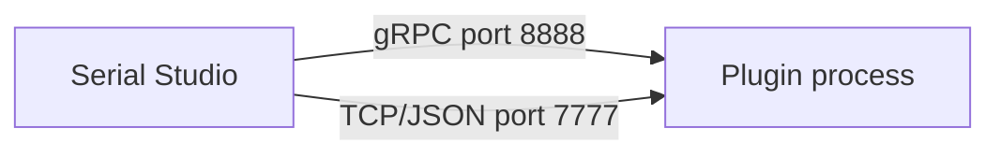

# Plugin Development

## Table of Contents

- [Overview](#overview)
- [How Plugins Work](#how-plugins-work)
- [Getting Started](#getting-started)
- [Plugin Structure](#plugin-structure)
- [info.json Reference](#infojson-reference)
- [Connecting to Serial Studio](#connecting-to-serial-studio)
- [Platform-Specific Builds](#platform-specific-builds)
- [State Persistence](#state-persistence)
- [Lifecycle Events](#lifecycle-events)
- [Extension Manager API](#extension-manager-api)
- [Testing Your Plugin](#testing-your-plugin)
- [Packaging and Distribution](#packaging-and-distribution)

---

## Overview

Plugins are external programs that connect to Serial Studio's API to receive live data, compute statistics, display custom visualizations, or automate workflows. They run as separate processes alongside Serial Studio and communicate over the network.

Plugins can be written in any language (Python, C++, Go, Rust, Node.js, and so on) and are distributed through the [Extension Manager](Extensions.md).

### What plugins can do

- **Custom visualizations.** 3D renders, maps, specialized charts.
- **Data processing.** Filtering, FFT analysis, anomaly detection.
- **Export to external systems.** Push data to databases, cloud services, or other tools.
- **Automated test sequences.** Connect, configure, validate, and report.
- **Hardware control.** Send commands back to the device based on incoming data.

---

## How Plugins Work



1. The user installs the plugin via the Extension Manager.
2. The user clicks **Run** on the plugin card.
3. Serial Studio ensures the API server is running, then launches the plugin process.
4. The plugin connects to Serial Studio and starts sending commands or streaming data.
5. The user clicks **Stop** (or Serial Studio exits) to terminate the plugin.

---

## Getting Started

### Minimal Python Plugin (TCP/JSON)

Create a folder with two files:

**info.json:**
```json
{
  "id": "my-first-plugin",
  "type": "plugin",
  "title": "My First Plugin",
  "description": "Prints connection status every second.",
  "author": "Your Name",
  "version": "1.0.0",
  "entry": "plugin.py",
  "runtime": "python3",
  "terminal": true,
  "files": ["info.json", "plugin.py"]
}
```

**plugin.py:**
```python
import socket
import json
import time

def send_command(sock, command, params=None):
    msg = {"type": "command", "id": "1", "command": command}
    if params:
        msg["params"] = params
    sock.sendall((json.dumps(msg) + "\n").encode())
    return json.loads(sock.recv(4096).decode())

def main():
    sock = socket.socket(socket.AF_INET, socket.SOCK_STREAM)
    sock.connect(("127.0.0.1", 7777))

    while True:
        result = send_command(sock, "io.manager.getStatus")
        print(f"Connected: {result.get('result', {}).get('isConnected')}")
        time.sleep(1)

if __name__ == "__main__":
    main()
```

### Minimal Python Plugin (gRPC)

For real-time frame streaming, use gRPC:

**info.json:**
```json
{
  "id": "my-grpc-plugin",
  "type": "plugin",
  "title": "My gRPC Plugin",
  "description": "Streams frames via gRPC.",
  "author": "Your Name",
  "version": "1.0.0",
  "entry": "plugin.py",
  "runtime": "python3",
  "grpc": true,
  "files": [
    "info.json",
    "plugin.py",
    "serialstudio_pb2.py",
    "serialstudio_pb2_grpc.py"
  ]
}
```

**plugin.py:**
```python
import grpc
import serialstudio_pb2 as pb
import serialstudio_pb2_grpc as rpc

def main():
    channel = grpc.insecure_channel("localhost:8888")
    stub = rpc.SerialStudioAPIStub(channel)

    print("Streaming frames...")
    for frame in stub.StreamFrames(pb.StreamRequest()):
        print(frame.frame)

if __name__ == "__main__":
    main()
```

Generate `serialstudio_pb2.py` and `serialstudio_pb2_grpc.py` from the `.proto` file (see the [gRPC Server](gRPC-Server.md) guide).

---

## Plugin Structure

A plugin lives in its own folder inside a repository:

```
plugin/my-plugin/
  info.json          # Required: metadata and entry point
  plugin.py          # Entry point script
  requirements.txt   # Optional: Python dependencies
  run.sh             # Optional: launcher for macOS/Linux
  run.cmd            # Optional: launcher for Windows
  serialstudio_pb2.py       # Optional: gRPC stubs
  serialstudio_pb2_grpc.py  # Optional: gRPC stubs
```

### Launcher Scripts

Launcher scripts (`run.sh` / `run.cmd`) are useful for:
- Auto-installing dependencies (e.g., `grpcio` via pip in a local venv).
- Setting environment variables.
- Running native binaries without specifying a runtime.

Example `run.sh`:
```bash
#!/bin/bash
SCRIPT_DIR="$(cd "$(dirname "$0")" && pwd)"
cd "$SCRIPT_DIR"

# Create venv and install deps if needed
if [ ! -d "venv" ]; then
    echo "Setting up virtual environment..."
    python3 -m venv venv
    echo "Installing required packages (this may take a moment)..."
    ./venv/bin/pip install -r requirements.txt
    echo "Setup complete."
fi

./venv/bin/python plugin.py
```

Example `run.cmd`:
```batch
@echo off
setlocal
set "SCRIPT_DIR=%~dp0"
cd /d "%SCRIPT_DIR%"

if not exist "venv" (
    echo Setting up virtual environment...
    python -m venv venv
    echo Installing required packages (this may take a moment)...
    venv\Scripts\pip install -r requirements.txt
    echo Setup complete.
)

venv\Scripts\python plugin.py
```

When using launcher scripts, set `"runtime": ""` in `info.json` (the script itself is the executable).

---

## info.json Reference

| Field | Required | Description |
|-------|----------|-------------|
| `id` | Yes | Unique identifier (lowercase, hyphens). Must be unique across all extensions. |
| `type` | Yes | Must be `"plugin"`. |
| `title` | Yes | Display name in the Extension Manager. |
| `description` | Yes | Short description shown on the card. |
| `author` | Yes | Author name or organization. |
| `version` | Yes | Semantic version string (e.g., `"1.0.0"`). |
| `license` | No | License identifier (e.g., `"MIT"`, `"GPL-3.0"`). |
| `category` | No | Category for filtering in the Extension Manager. |
| `screenshot` | No | Relative path to a preview image. |
| `files` | Yes | Array of relative file paths to download/install. Must include `info.json` itself. |
| `entry` | Yes | Script or binary entry point (e.g., `"plugin.py"`, `"run.sh"`). |
| `runtime` | Yes | Interpreter command (e.g., `"python3"`). Empty string `""` for native binaries or launcher scripts. |
| `terminal` | No | `true` to launch in a system terminal window. Default: `false`. |
| `grpc` | No | `true` if the plugin uses gRPC (port 8888). Serial Studio ensures the gRPC server is running before launch. Default: `false`. |
| `platforms` | No | Per-platform overrides (see [Platform-Specific Builds](#platform-specific-builds)). |

### Full Example

```json
{
  "id": "signal-analyzer",
  "type": "plugin",
  "title": "Signal Analyzer",
  "description": "Real-time FFT and spectral analysis of incoming data.",
  "author": "Example Corp",
  "version": "2.1.0",
  "license": "MIT",
  "category": "Analysis",
  "screenshot": "screenshot.png",
  "entry": "plugin.py",
  "runtime": "python3",
  "terminal": false,
  "grpc": true,
  "files": [
    "info.json",
    "plugin.py",
    "analyzer.py",
    "serialstudio_pb2.py",
    "serialstudio_pb2_grpc.py",
    "requirements.txt",
    "screenshot.png"
  ],
  "platforms": {
    "darwin/*":    { "entry": "run.sh",  "runtime": "", "files": ["run.sh"] },
    "linux/*":     { "entry": "run.sh",  "runtime": "", "files": ["run.sh"] },
    "windows/*":   { "entry": "run.cmd", "runtime": "", "files": ["run.cmd"] }
  }
}
```

---

## Connecting to Serial Studio

### Option 1: gRPC (Recommended for Real-Time Data)

Use gRPC when your plugin needs to stream frames at high rates. Set `"grpc": true` in `info.json`.

```python
import grpc
import serialstudio_pb2 as pb
import serialstudio_pb2_grpc as rpc

channel = grpc.insecure_channel("localhost:8888")
stub = rpc.SerialStudioAPIStub(channel)

# Execute any API command
resp = stub.ExecuteCommand(pb.CommandRequest(
    id="1", command="io.manager.getStatus"))

# Stream frames
for frame in stub.StreamFrames(pb.StreamRequest()):
    process(frame.frame)
```

See the [gRPC Server](gRPC-Server.md) documentation for the full service definition and stub generation instructions.

### Option 2: TCP/JSON (Simpler Setup)

Use TCP/JSON when gRPC tooling is not available or for simple command-and-response patterns.

```python
import socket
import json

sock = socket.socket(socket.AF_INET, socket.SOCK_STREAM)
sock.connect(("127.0.0.1", 7777))

msg = json.dumps({
    "type": "command",
    "id": "1",
    "command": "io.manager.getStatus"
}) + "\n"

sock.sendall(msg.encode())
response = json.loads(sock.recv(4096).decode())
```

See the [API Reference](API-Reference.md) for the complete command list and protocol specification.

---

## Platform-Specific Builds

Plugins can provide different entry points for each operating system and architecture. Use the `platforms` field in `info.json`:

```json
"platforms": {
  "darwin/*":        { "entry": "run.sh",  "runtime": "", "files": ["run.sh"] },
  "linux/x86_64":   { "entry": "run.sh",  "runtime": "", "files": ["run.sh", "bin/analyzer-linux-x64"] },
  "linux/arm64":    { "entry": "run.sh",  "runtime": "", "files": ["run.sh", "bin/analyzer-linux-arm64"] },
  "windows/*":      { "entry": "run.cmd", "runtime": "", "files": ["run.cmd", "bin/analyzer.exe"] }
}
```

Platform keys use the format `os/arch` or `os/*` (for universal builds):

| Key | Matches |
|-----|---------|
| `darwin/*` | macOS (always universal) |
| `linux/x86_64` | Linux x86_64 |
| `linux/arm64` | Linux ARM64 (Raspberry Pi, etc.) |
| `windows/*` | Windows (any architecture) |
| `windows/x86_64` | Windows x86_64 only |

- Platform-specific `files` are **merged** with the base `files` array during installation.
- If a plugin has no matching platform entry, the **Install** button is disabled and an **Unavailable** badge is shown.
- If no `platforms` field is present, the plugin is assumed to work on all platforms.

---

## State Persistence

Plugin state (window positions, settings, configurations) is saved in the project file alongside widget layout data. Different projects can have different plugin configurations.

### When State is Saved

- When the device disconnects.
- When the plugin is stopped.
- When Serial Studio exits.

### When State is Restored

- When the plugin starts (from saved project data).
- When a new device connects (the project may have changed).

### Saving State via API

Plugins save and restore their state using extension API commands:

```python
# Save state
send_command(sock, "extensions.saveState", {
    "pluginId": "my-plugin",
    "state": {"windowX": 100, "windowY": 200, "zoom": 1.5}
})

# Load state
result = send_command(sock, "extensions.loadState", {
    "pluginId": "my-plugin"
})
state = result.get("result", {}).get("state", {})
```

### Auto-Relaunch

Plugins that were running when Serial Studio closed are automatically relaunched on the next startup.

---

## Lifecycle Events

The API server broadcasts events to all connected clients. Plugins should listen for these to coordinate with Serial Studio:

| Event | When | Typical Plugin Action |
|-------|------|----------------------|
| `{"event": "connected"}` | Device connected | Start processing, restore state |
| `{"event": "disconnected"}` | Device disconnected | Save state, pause processing |

```python
# TCP/JSON: listen for events on the socket
import json

while True:
    data = sock.recv(4096).decode()
    for line in data.strip().split("\n"):
        msg = json.loads(line)
        if msg.get("event") == "connected":
            on_device_connected()
        elif msg.get("event") == "disconnected":
            on_device_disconnected()
```

---

## Extension Manager API

Plugins can also interact with the Extension Manager programmatically:

| Command | Description |
|---------|-------------|
| `extensions.list` | List all available extensions. |
| `extensions.getInfo` | Get details for a specific extension (`extensionId`). |
| `extensions.install` | Install an extension by index (`addonIndex`). |
| `extensions.uninstall` | Uninstall an extension by index (`addonIndex`). |
| `extensions.refresh` | Refresh catalogs from all repositories. |
| `extensions.saveState` | Save plugin state to the project (`pluginId`, `state`). |
| `extensions.loadState` | Load plugin state from the project (`pluginId`). |
| `extensions.listRepositories` | List repository URLs (Pro only). |
| `extensions.addRepository` | Add a repository URL (Pro only). |
| `extensions.removeRepository` | Remove a repository by index (Pro only). |

---

## Testing Your Plugin

### Manual Testing

1. Create a folder with your `info.json` and plugin files.
2. Point the Extension Manager to a local repository (Pro) or install manually by copying files to `~/Documents/Serial Studio/Extensions/plugin/your-plugin/`.
3. Click **Run** in the Extension Manager detail view.
4. Check the log panel for output and errors.

### Testing the API Connection

Before building a full plugin, test your API connection independently:

```bash
# Test TCP/JSON
echo '{"type":"command","id":"1","command":"api.getCommands"}' | nc localhost 7777

# Test gRPC
grpcurl -plaintext localhost:8888 serialstudio.SerialStudioAPI/ListCommands
```

### Common Issues

| Problem | Cause | Fix |
|---------|-------|-----|
| Connection refused | API server not enabled | Enable in Preferences → Miscellaneous |
| `grpcio` import error | Package not installed | `pip install grpcio grpcio-tools` |
| Plugin exits immediately | Unhandled exception | Set `"terminal": true` to see errors |
| No frames streaming | Device not connected | Connect a device first |

---

## Packaging and Distribution

### Repository Structure

```
my-extensions-repo/
  manifest.json
  plugin/my-plugin/
    info.json
    plugin.py
    run.sh
    run.cmd
    requirements.txt
    screenshot.png
```

### manifest.json

```json
{
  "version": 1,
  "repository": "My Extensions",
  "extensions": [
    "plugin/my-plugin/info.json"
  ]
}
```

### Hosting Options

- **GitHub**: Push to a repository and share the raw manifest URL:
  ```
  https://raw.githubusercontent.com/your-org/extensions/main/manifest.json
  ```
- **Local folder**: Use **Browse** in Repository Settings to point to a local folder during development.
- **Any web server**: Host files on HTTP(S). Relative paths in `files` resolve against the `info.json` URL.

### Installation Path

Installed plugins are stored at:
```
~/Documents/Serial Studio/Extensions/plugin/your-plugin/
```
