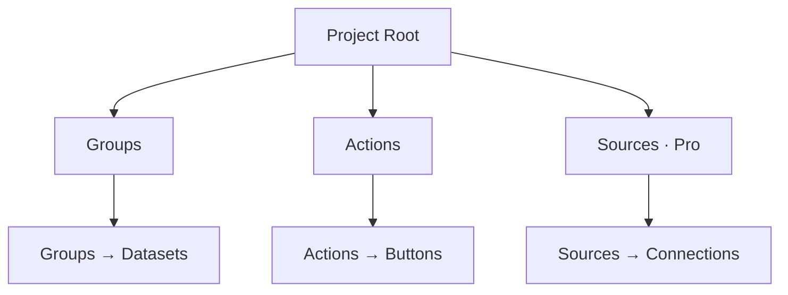
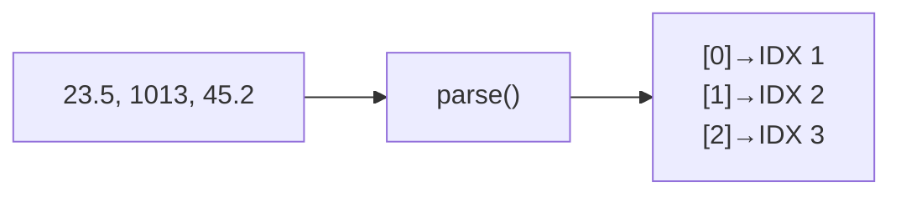

# Project Editor

## Overview

The Project Editor lets you create and edit JSON project files that define how Serial Studio interprets incoming data and displays it on the dashboard. Open it from the toolbar (wrench icon) or with Ctrl+Shift+P (Cmd+Shift+P on macOS).

A project file describes three things: the structure of your data (groups and datasets), how to detect and parse frames from the wire, and what actions (commands) the user can send back to the device. Serial Studio reads this file at connect time and builds the dashboard accordingly.

## Project Hierarchy

The following diagram shows the tree structure of a Serial Studio project file and how each element maps to the dashboard.



### Frame Index Mapping

Each value in the incoming data frame is assigned a 1-based frame index that you reference when configuring datasets. The mapping works as follows:



## Interface Layout

The editor window is divided into three areas: a toolbar across the top, a tree view on the left, and a property panel on the right.

### Toolbar

- **New Project** — create a blank project.
- **Open Project** — load an existing `.json` or `.ssproj` file.
- **Save Project** (Ctrl+S / Cmd+S) — save the current project.
- **Add Action** — add a new action button.
- **Add Data Grid** — add a group with the Data Grid widget.
- **Add Multiple Plots** — add a group with the Multiple Plot widget.
- **Add Accelerometer** — add a group pre-configured for 3-axis acceleration.
- **Add Gyroscope** — add a group pre-configured for 3-axis rotation.
- **Add Map** — add a group for GPS data (latitude, longitude, altitude).
- **Add Container** — add a group with no group-level widget.

### Tree View (Left Panel)

Shows the hierarchical structure of your project:

```
Project Root
  Groups
    Group: "Sensors"
      Dataset: "Temperature"   [IDX 1]
      Dataset: "Humidity"      [IDX 2]
      Dataset: "Pressure"      [IDX 3]
    Group: "Status"
      Dataset: "Battery"       [IDX 4]
  Actions
    Action: "Reset Device"
  Sources
    Source: "Main Device"
```

The number in brackets is the dataset's frame index — its position in the parsed data array. Click any item to edit its properties in the right panel.

### Property Panel (Right Panel)

Displays a form for the selected tree item. Every change takes effect immediately in the project model. The form fields vary depending on whether you have selected the project root, a group, a dataset, an action, or a source.

## Creating a Project Step by Step

### Step 1: Create a New Project

1. Open the Project Editor.
2. Click **New** in the toolbar.
3. Click the project root in the tree to configure it.
4. Set the **Project Title** (displayed in the dashboard header).

### Step 2: Configure Frame Detection

When the project root is selected, the property panel shows frame detection settings. These apply globally in single-source projects, or per-source in multi-source projects.

- **Frame Detection Method** — how Serial Studio finds frame boundaries in the byte stream.
  - *End Delimiter Only* — frames end with a known sequence (e.g., `\n`). This is the most common choice.
  - *Start and End Delimiter* — frames are bounded by a start marker and an end marker (e.g., `/*` and `*/`).
  - *Start Delimiter Only* — frames begin with a header; the next header marks the end of the previous frame.
  - *No Delimiters* — raw data is fed directly to the frame parser script. Use this for fixed-size or length-prefixed protocols.
- **Start Delimiter** / **End Delimiter** — the actual delimiter strings.
- **Hex Delimiters** — check this if the delimiter strings are written in hexadecimal (e.g., `0A` for newline).
- **Data Conversion** — how the byte stream inside delimiters is decoded before parsing.
  - *Plain Text (UTF-8)* — default text mode.
  - *Hexadecimal* — each byte pair is interpreted as a hex value.
  - *Base64* — data is Base64-decoded first.
  - *Binary Direct (Pro)* — raw bytes are passed to the JS parser as a byte array.
- **Checksum Algorithm** — optional integrity check appended to each frame. Supported: CRC-8, CRC-16, CRC-32, CRC-CCITT, and others.

### Step 3: Add Groups

Groups organize related datasets and determine which group-level widget is used on the dashboard.

1. Click one of the "Add ..." buttons in the toolbar, or right-click "Groups" in the tree.
2. Select the new group in the tree to configure it.
3. Set the **Title** (e.g., "Environmental Sensors").
4. Set the **Widget Type**:

| Widget | Description | Dataset Requirements |
|--------|-------------|----------------------|
| Data Grid | Tabular view of all values | Any number |
| Multiple Plot | Overlaid time-series curves | One or more |
| Accelerometer | 3D acceleration visualization | Exactly 3 (X, Y, Z) |
| Gyroscope | 3D orientation visualization | Exactly 3 (X, Y, Z) |
| GPS Map | Geographic tracking on a map | 2--3 (lat, lon, optional alt) |
| 3D Plot (Pro) | 3D scatter/trajectory | Exactly 3 (X, Y, Z) |
| Image View (Pro) | Binary image stream | None (image data in frame) |
| None | No group widget; datasets shown individually | Any number |

### Step 4: Add Datasets

Datasets map to individual data fields in your device's output.

1. Select a group in the tree.
2. Use the secondary toolbar (or right-click) to **Add Dataset**.
3. Configure the dataset properties:

**General**

- **Title** — display label (e.g., "Temperature").
- **Units** — measurement suffix (e.g., "deg C", "hPa", "%").
- **Frame Index** — 1-based position in the parsed data array. If your device sends `23.5,1013,45.2`, then Temperature = 1, Pressure = 2, Humidity = 3.
- **Widget** — per-dataset visualization: Bar, Gauge, Compass, or None.

**Plotting**

- **Graph** — enable time-series plotting.
- **Plot Min / Plot Max** — Y-axis range. Leave both at 0 for auto-scale.

**FFT (Frequency Analysis)**

- **FFT** — enable frequency-domain analysis.
- **FFT Samples** — window size (64, 128, 256, 512, 1024, etc.).
- **FFT Sampling Rate** — in Hz; must match the actual data rate for correct frequency axis labeling.
- **FFT Min / FFT Max** — Y-axis range for the FFT plot.

**LED**

- **LED** — show this dataset in the LED panel.
- **LED High** — threshold above which the LED lights up.

**Alarm**

- **Alarm** — enable threshold-based alarms.
- **Alarm Low / Alarm High** — trigger thresholds.

**Widget Range**

- **Widget Min / Widget Max** — range for Bar and Gauge displays. Defaults to 0--100.

### Step 5: Add Actions (Optional)

Actions place buttons on the dashboard that send commands to the connected device.

1. Click **Add Action** in the toolbar, or right-click "Actions" in the tree.
2. Configure the action:

- **Title** — button label (e.g., "Reset Device").
- **Icon** — choose from the built-in icon set.
- **TX Data** — the string or bytes to transmit (e.g., `RST`).
- **EOL** — append a line ending: `\n`, `\r`, `\r\n`, or nothing.
- **Binary** — when checked, TX Data is interpreted as hexadecimal bytes rather than ASCII text.
- **Auto-Execute on Connect** — send the command automatically when the device connects.
- **Timer Mode**:

| Mode | Behavior |
|------|----------|
| Off | Manual click only (default). |
| AutoStart | Timer starts automatically on connect; command repeats at the configured interval. |
| StartOnTrigger | Timer starts on first click; command repeats until stopped. |
| ToggleOnTrigger | Each click toggles the repeating timer on or off. |

- **Timer Interval** — repeat interval in milliseconds (default: 100 ms).

### Step 6: Add Sources (Multi-Device Projects)

Sources define where data comes from. Single-device projects have one implicit source; multi-device projects use explicit sources.

1. Right-click "Sources" in the tree and add a source.
2. Configure:
   - **Title** — descriptive label (e.g., "Arduino Uno").
   - **Bus Type** — Serial Port, Network Socket, Bluetooth LE, or (Pro) Audio, Modbus, CAN Bus, USB, HID, Process.
   - **Frame Detection / Delimiters** — per-source overrides (same options as the project root).
   - **Data Conversion / Checksum** — per-source overrides.
   - **Connection Settings** — bus-specific parameters (COM port, baud rate, IP address, etc.) saved with the project.

Each source has its own **Frame Parser** tab for a per-source parser script.

### Step 7: Write a Frame Parser Script (Optional)

For data that is not plain CSV, write a `parse()` function to transform each frame into an array of values. Serial Studio supports **Lua** (default, recommended) and **JavaScript**. Select the language from the **Language** dropdown in the parser editor toolbar.

1. Select a source in the tree (or the "Frame Parser" node for single-source projects).
2. Open the Frame Parser view.
3. Choose the scripting language from the **Language** dropdown.
4. Write a function:

**Lua (default):**
```lua
function parse(frame)
  -- 'frame' is a string (PlainText/Hex/Base64) or byte table (Binary Direct).
  -- Return a table of values matching dataset frame indices.
  local result = {}
  for field in frame:gmatch("([^,]+)") do
    result[#result + 1] = field
  end
  return result
end
```

**JavaScript:**
```javascript
function parse(frame) {
  // 'frame' is a string (PlainText/Hex/Base64) or byte array (Binary Direct).
  // Return an array of values matching dataset frame indices.
  return frame.split(",");
}
```

5. Click **Apply** to save the parser code.

**Rules:**

- The function must be named `parse` and accept exactly one argument.
- It must return a table (Lua) or array (JavaScript). Each element maps to a dataset frame index.
- Global variables declared outside `parse()` persist between calls — useful for stateful protocols.
- Use `print()` (Lua) or `console.log()` (JavaScript) to print debug messages to the Serial Studio terminal.

**Example — binary protocol (Lua):**

```lua
function parse(frame)
  -- frame is a byte table in Binary Direct mode (1-indexed)
  local temp     = (frame[1] << 8) | frame[2]
  local humidity = (frame[3] << 8) | frame[4]
  return {temp / 10.0, humidity / 10.0}
end
```

## Frame Index Mapping

Your device sends a sequence of values. The frame parser (or the default comma splitter) produces an array. Each dataset's **Frame Index** tells Serial Studio which array position to read:

```
Device sends:  23.5,1013,45.2
Parser returns: ["23.5", "1013", "45.2"]
                  ^        ^       ^
               Index 1  Index 2  Index 3
```

- Frame indices are 1-based. Index 1 corresponds to array element 0.
- Each index should be unique across the entire project.
- The Project Editor auto-assigns the next available index when you add a dataset.

## Multi-Source Architecture

When a project has multiple sources, each source represents a separate physical device with its own connection, bus type, frame detection, and JS parser.

1. Add one source per device in the tree.
2. Assign groups to sources via the **Input Device** dropdown in the group or dataset properties.
3. All devices connect simultaneously when you click "Connect" in the main window.
4. Each device's data routes independently to its assigned groups and datasets.

## Saving and Loading

- Click **Save** (Ctrl+S / Cmd+S) to write the project to disk as a `.json` file.
- The file can be reopened later with **Open**, or loaded automatically if set as the default project.
- Serial Studio prompts to save unsaved changes when you close the editor or open a different file.
- Use the **Examples** browser (Help menu) to open working project files as reference.

## Common Mistakes

### Dataset Index Mismatch

**Symptom:** Widget shows "0", wrong data, or no data.

**Fix:** Verify that each dataset's frame index matches the correct position in the parser's return array. Index 1 = first element, index 2 = second element, and so on.

### Frame Parser Errors

**Symptom:** Console shows "undefined" or parsing errors.

**Fix:**
1. Check the console for error messages.
2. Add `console.log()` calls to inspect the raw frame and parsed output.
3. Ensure the function always returns an array, never a string, object, or undefined.
4. Remember to click **Apply** after editing the parser code.

### Delimiter Mismatch

**Symptom:** Frames not detected, or data garbled.

**Fix:**
1. Open the Console view and inspect raw bytes.
2. Enable hex view to identify hidden characters like `\r` or `\0`.
3. Common choices: `\n` (most serial devices), `\r\n` (Windows-style), or custom markers like `/*` and `*/`.

### Wrong Widget for Data Type

**Symptom:** Widget appears but displays incorrectly.

**Fix:**
- Gauge and Bar need bounded numeric values — set Widget Min/Max.
- Accelerometer and Gyroscope groups need exactly 3 datasets.
- GPS Map needs 2--3 datasets (latitude, longitude, optional altitude).
- Compass expects a value in the 0--360 range.

### Missing Datasets for Group Widgets

**Symptom:** Group widget does not appear on the dashboard.

**Fix:** Ensure the group has the required number of datasets for its widget type. See the table in Step 3 above.

## Tips

- Use **Duplicate** (right-click) to quickly create similar groups or datasets.
- The tree shows frame indices next to dataset names for quick reference.
- Test your configuration with the Console view before switching to the Dashboard.
- Record a session to CSV, then use the CSV Player to iterate on your dashboard layout without hardware connected.
- Use meaningful dataset titles and units — they appear directly on dashboard widgets.
- Set appropriate Widget Min/Max for gauges and bars rather than relying on auto-scale.

## See Also

- [Widget Reference](Widget-Reference.md) — complete guide to all widget types.
- [Frame Parser Scripting](JavaScript-API.md) — complete Lua and JavaScript parser reference.
- [Data Flow](Data-Flow.md) — how data moves through Serial Studio.
- [Operation Modes](Operation-Modes.md) — Project File, Device Sends JSON, and Quick Plot modes.
- [Troubleshooting](Troubleshooting.md) — solutions to common problems.
