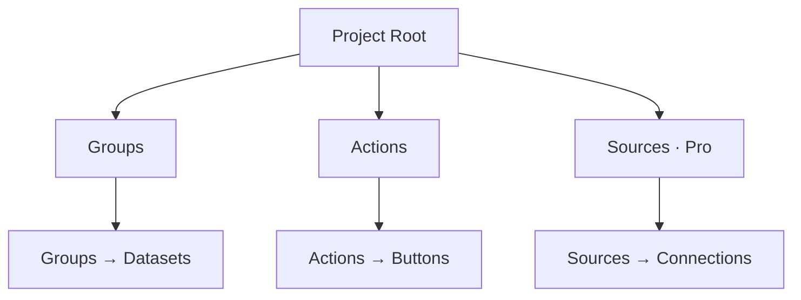
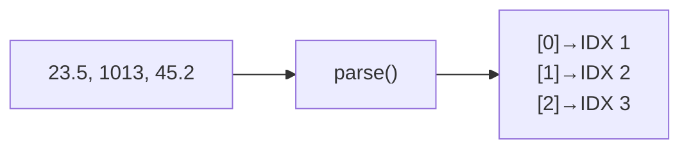

# Project Editor

## Overview

The Project Editor lets you create and edit JSON project files that define how Serial Studio interprets incoming data and displays it on the dashboard. Open it from the toolbar (wrench icon).

A project file describes three things: the structure of your data (groups and datasets), how to detect and parse frames from the wire, and what actions (commands) the user can send back to the device. Serial Studio reads the file at connect time and builds the dashboard from it.

## Project hierarchy

The diagram below shows the tree structure of a Serial Studio project file and how each element maps to the dashboard.



### Frame index mapping

Each value in the incoming data frame is assigned a 1-based frame index that you reference when configuring datasets. The mapping works like this:



## Interface layout

The editor window has three areas: a toolbar across the top, a tree view on the left, and a property panel on the right.

### Toolbar

- **New project.** Create a blank project.
- **Open project.** Load an existing `.json` or `.ssproj` file.
- **Save project** (Ctrl+S / Cmd+S). Save the current project.
- **Add action.** Add a new action button.
- **Add data grid.** Add a group with the Data Grid widget.
- **Add multiple plots.** Add a group with the Multiple Plot widget.
- **Add accelerometer.** Add a group pre-configured for 3-axis acceleration.
- **Add gyroscope.** Add a group pre-configured for 3-axis rotation.
- **Add map.** Add a group for GPS data (latitude, longitude, altitude).
- **Add container.** Add a group with no group-level widget.
- **Import > Protobuf** (Pro). Generate a project from a Protocol Buffers (`.proto`) schema. See [Auto-Generating Projects](Auto-Generating-Projects.md).

### Tree view (left panel)

Shows the project's hierarchical structure:

```
Project Root
  Groups
    Group: "Sensors"
      Dataset: "Temperature"   [IDX 1]
      Dataset: "Humidity"      [IDX 2]
      Dataset: "Pressure"      [IDX 3]
    Group: "Status"
      Dataset: "Battery"       [IDX 4]
  Actions
    Action: "Reset Device"
  Sources
    Source: "Main Device"
```

The number in brackets is the dataset's frame index: its position in the parsed data array. Click any item to edit its properties in the right panel.

### Property panel (right panel)

Shows a form for the selected tree item. Every change takes effect immediately in the project model. The form fields vary depending on whether you selected the project root, a group, a dataset, an action, or a source.

## Project Overview

Select the project root in the tree and the right panel switches to the **Project Overview** (also called the Summary). It is a read-only diagram of the entire project configuration, laid out left-to-right in four columns:

1. **Sources** (devices). One card per data source, with its bus type, frame detection, and decoder.
2. **Frame parsers and actions**. The parser script attached to each source, plus any global action buttons.
3. **Groups**. The dataset containers and group-level widgets (Multiplot, GPS, Accelerometer, etc.).
4. **Datasets**. Per-dataset pills, with their transform block (if any) drawn between the group and the dataset pill.

Data tables, output widgets, and workspaces are drawn alongside as their own cards. Arrows show how parsed bytes flow into datasets and how transforms feed downstream consumers.

The diagram is interactive:

- **Double-click any block** to jump into the matching configuration form. Double-clicking a source card opens that source's settings; a group card opens the group form; a dataset pill opens the dataset form; a frame-parser card opens the script editor; an action card opens the action form; a data-table card opens the table editor; an output-widget card opens the output editor.
- **Right-click any block** for a context menu tailored to that node: add a sibling group, add a dataset to that group, duplicate, delete, change widget type, attach to a workspace, and so on. Right-clicking empty background opens the "add source / add table / add action" shortcuts. This lets you grow a project once the high-level shape is in place without walking back through the tree on the left.
- **Scroll wheel** zooms the diagram in and out. The toolbar has a reset-zoom button.

The overview is useful as a sanity check ("does my group widget have the three datasets it needs?") and as a navigation surface once a project gets too large to keep entirely in the tree.

## Creating a project step by step

### Step 1: create a new project

1. Open the Project Editor.
2. Click **New** in the toolbar.
3. Click the project root in the tree to configure it.
4. Set the **Project Title** (shown in the dashboard header).

### Step 2: configure frame parsing

When the project root is selected, the property panel shows the frame-parsing settings: how the byte stream is sliced into frames, how each frame is decoded, and which parser turns it into values. They apply globally in single-source projects, or per-source in multi-source projects.

#### Detection, decoding, and integrity

These settings run *before* the parser and apply to every parser type (Built-In, Lua, and JavaScript alike):

| Setting | Description | Options |
|---------|-------------|---------|
| Frame detection method | How Serial Studio finds frame boundaries in the byte stream. | *End Delimiter Only* (frames end with a known sequence such as `\n`; the most common choice); *Start and End Delimiter* (bounded by a start and an end marker, e.g. `/*` and `*/`); *Start Delimiter Only* (a header begins each frame, and the next header ends the previous one); *No Delimiters* (the whole captured chunk is one frame; use it for fixed-size or length-prefixed protocols). |
| Start delimiter / end delimiter | The actual delimiter strings. Which ones apply depends on the detection method. | Any string, e.g. `\n`, `/*`, `*/`. |
| Hex delimiters | Tick when the delimiter strings are written in hex. | e.g. `0A` for newline. |
| Data conversion (decoder) | How the bytes inside the delimiters are decoded before the parser sees them. | *Plain Text (UTF-8)* (default text mode); *Hexadecimal* (each byte pair read as a hex value); *Base64* (Base64-decoded first); *Binary Direct (Pro)* (raw bytes passed straight to the parser as a byte array/table). |
| Checksum algorithm | Optional integrity check appended to each frame; frames that fail are dropped. | XOR-8, MOD-256, CRC-8, CRC-16, CRC-16-MODBUS, CRC-16-CCITT, CRC-32. |

Picking the wrong decoder/detection pair silently mojibakes binary data or never produces a frame. The trap to remember: **Plain Text routes through `QString::fromUtf8`**, so any byte that is not valid UTF-8 (most binary payloads contain `0x00` or values above `0x7F`) is replaced with `U+FFFD` and the original bytes are lost. For anything non-text, pick **Binary Direct**.

#### Parser language

The **parser** turns a decoded frame into an array of values, one per dataset frame index. Pick the language from the Platform dropdown in the parser editor toolbar:

| Language | What you configure | Best for |
|----------|--------------------|----------|
| Built-In | No code. Pick a template and fill in its parameter form. | Common wire formats with no setup: delimited/CSV, fixed-width, key-value, NMEA 0183/2000, JSON, XML, YAML, MessagePack, Modbus, UBX, MAVLink, COBS/SLIP, and batched/time-series multi-frame data. |
| Lua | A `parse(frame)` function (default, recommended). | Custom logic the templates do not cover, with the lowest scripting overhead. |
| JavaScript | A `parse(frame)` function. | Custom logic when you prefer JavaScript or need `JSON.parse`-style ergonomics. |

For Built-In, the parameter form is per template. For example, *Delimited text* exposes a separator, an optional quote character, and trim/skip-empty toggles, while *Modbus frames* exposes a channel count, register offset, and a signed-registers toggle. The full template catalog and its parameters live in [Frame Parser Scripting](JavaScript-API.md).

Writing a Lua or JavaScript `parse()` function is covered in Step 7 below. The Built-In templates need no script: the parameter form *is* the configuration, so you can skip straight to Step 3.

### Step 3: add groups

Groups organize related datasets and determine which group-level widget is used on the dashboard.

1. Click one of the "Add ..." buttons in the toolbar, or right-click "Groups" in the tree.
2. Select the new group in the tree to configure it.
3. Set the **Title** (for example "Environmental Sensors").
4. Set the **Widget Type**:

| Widget          | Description                        | Dataset requirements |
|-----------------|------------------------------------|----------------------|
| Data Grid       | Tabular view of all values         | Any number           |
| Multiple Plot   | Overlaid time-series curves        | One or more          |
| Accelerometer   | 3D acceleration visualization      | Exactly 3 (X, Y, Z)  |
| Gyroscope       | 3D orientation visualization       | Exactly 3 (X, Y, Z)  |
| GPS Map         | Geographic tracking on a map       | 2 or 3 (lat, lon, optional alt) |
| 3D Plot (Pro)   | 3D scatter/trajectory              | Exactly 3 (X, Y, Z)  |
| Image View (Pro)| Binary image stream                | None (image data in frame) |
| None            | No group widget. Datasets shown individually | Any number |

### Step 4: add datasets

Datasets map to individual data fields in your device's output.

1. Select a group in the tree.
2. Use the secondary toolbar (or right-click) to **Add Dataset**.
3. Configure the dataset properties:

**General**

- **Title.** Display label (for example "Temperature").
- **Units.** Measurement suffix (for example "deg C", "hPa", "%").
- **Frame Index.** 1-based position in the parsed data array. If your device sends `23.5,1013,45.2`, then Temperature = 1, Pressure = 2, Humidity = 3.
- **Widget.** Per-dataset visualization: Bar, Gauge, Compass, Meter, or None. Bar, Gauge, and Meter each render on the dashboard as a two-page swipe view — page 0 is the analog visualization and page 1 is a large monospace digital readout. The active page is saved per widget in the project file.

**Plotting**

- **Graph.** Enable time-series plotting.
- **Plot Min / Plot Max.** Y-axis range. Leave both at 0 for auto-scale.

**FFT (frequency analysis)**

- **FFT.** Enable frequency-domain analysis.
- **FFT Samples.** Window size (64, 128, 256, 512, 1024, and so on).
- **FFT Sampling Rate.** In Hz. Has to match the actual data rate for correct frequency axis labeling.
- **FFT Min / FFT Max.** Y-axis range for the FFT plot.

**Waterfall (Pro)**

- **Enable Waterfall Plot.** Show a scrolling time-frequency plot (spectrogram) for this dataset. Reuses the FFT settings above (samples, sampling rate, range).
- **Waterfall Y Axis.** Source for the vertical axis. Default is **Time** (older spectra scroll down). Pick another dataset here to drive the Y axis from that dataset's value instead — typically used for order tracking (for example RPM vs. frequency).

**LED**

- **LED.** Show this dataset in the LED panel.
- **LED High.** Threshold above which the LED lights up.

**Alarm**

- **Alarm.** Enable threshold-based alarms.
- **Alarm Low / Alarm High.** Trigger thresholds.

**Widget range**

- **Widget Min / Widget Max.** Range for Bar, Gauge, and Meter displays. Both default to 0; set them to the expected range for the dataset.

### Step 5: add actions (optional)

Actions place buttons on the dashboard that send commands to the connected device.

1. Click **Add Action** in the toolbar, or right-click "Actions" in the tree.
2. Configure the action:

- **Title.** Button label (for example "Reset Device").
- **Icon.** Pick from the built-in icon set.
- **TX Data.** The string or bytes to transmit (for example `RST`).
- **EOL.** Append a line ending: `\n`, `\r`, `\r\n`, or nothing.
- **Binary.** When checked, TX Data is interpreted as hexadecimal bytes instead of ASCII.
- **Auto-Execute on Connect.** Send the command automatically when the device connects.
- **Timer mode:**

| Mode               | Behavior |
|--------------------|----------|
| Off                | Manual click only (default). |
| Auto Start         | Timer starts automatically on connect. Command repeats at the configured interval. |
| Start on Trigger   | Timer starts on the first click. Command repeats until stopped. |
| Toggle on Trigger  | Each click toggles the repeating timer on or off. |
| Repeat N Times     | Each click sends the command a fixed number of times (Repeat Count), spaced by the configured interval. |

- **Timer Interval.** Repeat interval in milliseconds (default 100 ms). Disabled when the mode is Off.
- **Repeat Count.** Number of sends in Repeat N Times mode (default 3).

### Step 6: add sources (multi-device projects)

Sources define where data comes from. Single-device projects have one implicit source. Multi-device projects use explicit sources.

1. Right-click "Sources" in the tree and add a source.
2. Configure:
   - **Title.** Descriptive label (for example "Arduino Uno").
   - **Bus Type.** Serial Port, Network Socket, Bluetooth LE, or (Pro) Audio Input, Modbus, CAN Bus, Raw USB, HID Device, Process, MQTT Subscriber.
   - **Frame Detection / Delimiters.** Per-source overrides (same options as the project root).
   - **Data Conversion / Checksum.** Per-source overrides.
   - **Connection Settings.** Bus-specific parameters (COM port, baud rate, IP address, and so on) saved with the project.

Each source has its own Frame Parser tab for a per-source parser script.

### Step 7: write a frame parser script (optional)

This step applies to the **Lua** and **JavaScript** parsers. If you picked a **Built-In** template in Step 2, the parameter form is your parser (there is no script to write), so skip ahead.

For data that isn't plain CSV and isn't covered by a Built-In template, write a `parse()` function to transform each frame into an array of values. Serial Studio supports Lua (default, recommended) and JavaScript. Pick the language from the Platform dropdown in the parser editor toolbar.

1. Select a source in the tree (or the "Frame Parser" node for single-source projects).
2. Open the Frame Parser view.
3. Pick the scripting language from the Platform dropdown.
4. Write a function:

**Lua (default):**

```lua
function parse(frame)
  -- 'frame' is a string (PlainText/Hex/Base64) or byte table (Binary Direct).
  -- Return a table of values matching dataset frame indices.
  local result = {}
  for field in frame:gmatch("([^,]+)") do
    result[#result + 1] = field
  end
  return result
end
```

**JavaScript:**

```javascript
function parse(frame) {
  // 'frame' is a string (PlainText/Hex/Base64) or byte array (Binary Direct).
  // Return an array of values matching dataset frame indices.
  return frame.split(",");
}
```

5. The parser code is stored in the project automatically as you type. Use the **Validate** button to check that the script compiles, and **Test With Sample Data** to run it against a sample frame.

**Rules:**

- The function has to be named `parse` and has to accept exactly one argument.
- It has to return a table (Lua) or array (JavaScript). Each element maps to a dataset frame index.
- Global variables declared outside `parse()` persist between calls. Useful for stateful protocols.
- Use `console.log()` (both languages) or `print()` (Lua shorthand) to print debug messages to the Serial Studio terminal. The full `console` table (`log`, `debug`, `info`, `warn`, `error`) is available in JavaScript and Lua alike; `warn` and `error` also raise application notifications.

**Example: binary protocol (Lua).**

```lua
function parse(frame)
  -- frame is a byte table in Binary Direct mode (1-indexed)
  local temp     = (frame[1] << 8) | frame[2]
  local humidity = (frame[3] << 8) | frame[4]
  return {temp / 10.0, humidity / 10.0}
end
```

### Step 7b: test the pipeline with the Test dialog

The **Test With Sample Data** button on the parser toolbar opens the **Test Frame Parser** dialog. It runs the same byte-to-channels pipeline the live dashboard uses, so what you see here is what the dashboard would see for the same input. (The separate **Validate** button in the code-editor toolbar only checks that the script compiles.)

The dialog has three sections:

1. **Pipeline configuration.** Detection mode, start / end delimiter, hex-delimiter toggle, decoder method, and checksum algorithm. These are wired to the active source: editing them in the dialog rewrites the project source immediately, and the live frame reader picks up the change. There is no separate "Apply" step.
2. **Frame data input.** A line edit for the raw stream bytes you want to test. Tick **HEX** to type bytes as space-separated hex pairs (`01 A2 FF 3C`) - the safe way to feed binary protocols. Plain text mode reads the field as UTF-8.
3. **Pipeline results.** A stats line shows `frames extracted | bytes consumed | bytes buffered | dropped`. Below it, a tree expands each extracted frame into its raw bytes (hex), its decoder output (what the parser receives), and the parsed rows with one node per channel.

Reading the tree top-down tells you exactly which stage failed:

- **Zero frames extracted.** The delimiters / detection mode did not match the input. Re-check the start / end fields.
- **Frames extracted but empty rows.** The parser ran but returned no array - usually a `parse()` that returned `nil`, `undefined`, or a non-array value.
- **Rows present but the wrong count.** Index mapping in `parse()` is off; compare row indices to the **Frame Index** field on each dataset.
- **Rows present and correct in the dialog but missing on the dashboard.** A transform on the dataset is rejecting the value (returns `nil` / `NaN`) or a widget min/max is clipping it.

### How the decoder + detection settings reach the parser

The detection mode, delimiters, and decoder you configured in Step 2 run *before* the parser. They decide where each frame starts and stops, and what `parse(frame)` receives: a `QString::fromUtf8` string for Plain Text, a hex or Base64 string, or the raw byte buffer (a 1-indexed table in Lua, a length-keyed object in JavaScript) for Binary Direct. See the table in Step 2 for the full option list and the UTF-8 trap.

## Frame index mapping

Your device sends a sequence of values. The frame parser (or the default comma splitter) produces an array. Each dataset's Frame Index tells Serial Studio which array position to read:

```
Device sends:  23.5,1013,45.2
Parser returns: ["23.5", "1013", "45.2"]
                  ^        ^       ^
               Index 1  Index 2  Index 3
```

- Frame indices are 1-based. Index 1 corresponds to array element 0.
- Each index should be unique across the whole project.
- The Project Editor auto-assigns the next available index when you add a dataset.

## Dataset value transforms

Each dataset can optionally define a `transform(value)` function that converts the raw parsed value into an engineering value before it reaches the dashboard. Use transforms for calibration, unit conversion, filtering, and signal conditioning.

To add a transform, select a dataset and click the **Transform** button in the toolbar. That opens a dedicated editor with syntax highlighting, built-in templates, and a live test area.

For the full documentation, see [Dataset Value Transforms](Dataset-Transforms.md).

## Multi-source architecture

When a project has multiple sources, each source represents a separate physical device with its own connection, bus type, frame detection, and parser (Built-In, Lua, or JavaScript).

1. Add one source per device in the tree.
2. Assign groups to sources via the **Input Device** dropdown in the group or dataset properties.
3. All devices connect at the same time when you click "Connect" in the main window.
4. Each device's data routes independently to its assigned groups and datasets.

## Saving and loading

- Click **Save** (Ctrl+S / Cmd+S) to write the project to disk as a `.ssproj` file.
- You can reopen it later with **Open**, or load it automatically if it's set as the default project.
- Serial Studio prompts to save unsaved changes when you close the editor or open a different file.
- Use the **Examples** browser (Help menu) to open working project files as reference.

## Common mistakes

### Dataset index mismatch

**Symptom.** Widget shows "0", wrong data, or no data.

**Fix.** Check that each dataset's frame index matches the correct position in the parser's return array. Index 1 = first element, index 2 = second element, and so on.

### Frame parser errors

**Symptom.** Console shows "undefined" or parsing errors.

**Fix:**

1. Check the console for error messages.
2. Add `console.log()` calls to inspect the raw frame and parsed output.
3. Make sure the function always returns an array, never a string, object, or undefined.
4. Use **Validate** to confirm the script compiles after editing the parser code.

### Delimiter mismatch

**Symptom.** Frames aren't detected, or data is garbled.

**Fix:**

1. Open the Console view and inspect raw bytes.
2. Turn on hex view to spot hidden characters like `\r` or `\0`.
3. Common choices: `\n` (most serial devices), `\r\n` (Windows-style), or custom markers like `/*` and `*/`.

### Wrong widget for data type

**Symptom.** Widget appears but displays incorrectly.

**Fix:**

- Gauge, Bar, and Meter need bounded numeric values. Set Widget Min/Max.
- Accelerometer and Gyroscope groups need exactly 3 datasets.
- GPS Map needs 2 or 3 datasets (latitude, longitude, optional altitude).
- Compass expects a value in the 0 to 360 range.

### Missing datasets for group widgets

**Symptom.** Group widget doesn't appear on the dashboard.

**Fix.** Make sure the group has the required number of datasets for its widget type. See the table in Step 3.

## Tips

- Use **Duplicate** (right-click) to quickly create similar groups or datasets.
- The tree shows frame indices next to dataset names for quick reference.
- Test your configuration with the Console view before switching to the Dashboard.
- Record a session to CSV, then use the CSV Player to iterate on your dashboard layout without hardware connected.
- Use clear dataset titles and units. They show up directly on dashboard widgets.
- Set appropriate Widget Min/Max for gauges, bars, and meters instead of relying on auto-scale.

## See also

- [Widget Reference](Widget-Reference.md): full guide to all widget types.
- [Frame Parser Scripting](JavaScript-API.md): full Lua and JavaScript parser reference.
- [Dataset Value Transforms](Dataset-Transforms.md): per-dataset calibration, filtering, and unit conversion.
- [Data Flow](Data-Flow.md): how data moves through Serial Studio.
- [Operation Modes](Operation-Modes.md): Console Only, Quick Plot, and Project File modes.
- [Troubleshooting](Troubleshooting.md): fixes for common problems.
