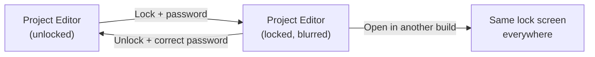

# Project Lock

A password gate for the Project Editor. Lock a project once, and from that point on the editor opens behind a blurred "Project Locked" screen until someone enters the password. The dashboard keeps running normally — only editing is gated.

This is a deliberately lightweight feature. The goal is **operator/engineer separation**: keep curious operators from rewiring frame parsers or moving widgets around mid-shift, without pretending to defend against an attacker with a text editor and ten minutes.

> **Pro feature.** Lock is part of the commercial build. Locked projects still open under GPL builds — the editor is just hidden the same way it is in Pro.

## What the lock does

The Project Editor has a **Lock** button on the toolbar (next to Save As, before Add Device). Click it once and Serial Studio walks you through two prompts:

1. **Choose a password** — the password you want operators to type when they need to unlock.
2. **Confirm the password** — paranoia check, exact-match.

Once both prompts close cleanly:

- The password is hashed (MD5) and stored in the project file under `passwordHash`.
- The editor body is replaced by a blurred backdrop with a padlock and a single **Unlock** button.
- The project is marked modified and saved automatically.

To unlock, click **Unlock** (in the blurred overlay or on the toolbar). Enter the password. If it matches, the hash is cleared, the editor body returns, and the project is saved again with the password field gone.



> **Legend:** The lock state lives in the project file, not in app settings. Move the `.ssproj` to another machine and the lock comes with it.

---

## What the dashboard sees

Nothing changes. Locking a project does **not** affect the live dashboard, frame parsers, dataset transforms, output widgets, exports, the API server, or any other runtime feature. Operators can connect, disconnect, switch workspaces, change widget layouts, run reports — all of it works exactly as before.

The lock is scoped to the **Project Editor body** only. If an operator clicks the wrench icon, they get the lock screen instead of the form panes; everything else in Serial Studio is untouched.

---

## What the lock does *not* do

Be honest with yourself about the threat model. The password hash sits in plain JSON inside the project file. Anyone who can open that file in a text editor can see the hash, and anyone with a half-decent rainbow table can probably reverse it. So:

| Question                                              | Answer |
|-------------------------------------------------------|--------|
| Will it stop a curious operator clicking around?      | Yes.   |
| Will it stop someone from accidentally moving widgets in the editor? | Yes. |
| Will it stop someone who knows the password?          | No, by design. |
| Will it stop someone with a text editor and patience? | No.    |
| Is it a substitute for OS-level file permissions?     | No.    |

If you need the project file itself protected from tampering — locked away from operators entirely — use your operating system's file ACLs, an admin-only network share, or a signed/read-only deployment. The lock here is a UI gate, not a vault.

---

## Lifecycle

### Setting a lock

1. Open the project in the Project Editor.
2. Click **Lock** in the toolbar.
3. Enter and confirm the password.
4. Done. The project is saved with the new lock; the editor switches to its locked state immediately.

If the two passwords don't match, Serial Studio shows a warning and leaves the project as it was. Empty passwords are rejected the same way.

### Unlocking

There are two entry points and they do the same thing:

- **Unlock** button on the locked overlay.
- **Unlock** action that replaces the **Lock** button on the toolbar while the editor is locked.

Either prompts for the password. Correct password → hash is cleared, the editor opens, the project is saved. Wrong password → warning dialog, lock stays in place.

### Changing the password

There's no separate "change password" flow. Unlock the project, then lock it again with the new password. Each Lock click overwrites the stored hash.

### Removing the lock entirely

Unlock the project. The Lock toolbar button reappears; just don't press it. Save the project, and the `passwordHash` field is no longer written to the file.

---

## What lives in the project file

A locked project carries a single extra key under the JSON root:

```json
{
  "title": "Production Cell A",
  "passwordHash": "5f4dcc3b5aa765d61d8327deb882cf99",
  "frameDecoder": 0,
  "frameDetection": 1,
  "groups": [ ... ],
  "actions": [ ... ]
}
```

| Field          | Meaning |
|----------------|---------|
| `passwordHash` | MD5 hex digest of the password. Empty/absent means no lock. |

When Serial Studio loads the file, `passwordHash` being non-empty is the entire trigger: the editor opens locked. There is no separate `locked` boolean — the hash is the lock.

> The lock state is **never** prompted at file-open time. Loading a locked project doesn't ask for the password; it just hides the editor body until the user explicitly clicks Unlock. This keeps live dashboards from being held hostage by a forgotten password during a shift change.

---

## Project mode and the lock screen

The blurred overlay does double duty. You'll see the same backdrop in two situations:

| Trigger                                               | Backdrop says                          | Primary button |
|-------------------------------------------------------|----------------------------------------|----------------|
| Project is locked, app is in Project mode             | "This project is password protected"   | **Unlock**     |
| Editor opened while in QuickPlot or Console-Only mode | "Editing is available in Project mode" | **Switch to Project Mode** |

Both states use the same blurred-glass treatment so the editor's chrome (toolbar, window caption) stays visible and you don't lose your place. Only the call to action changes.

---

## Frequently asked

**Can I lock a project from the command line?**
Not directly. The `lockProject()` slot is editor-only. Scripted deployments should ship a pre-locked `.ssproj` file by locking it once and then distributing the saved file.

**What if I forget the password?**
Open the `.ssproj` file in any text editor and delete the `passwordHash` line. Save. The next open will be unlocked. This is intentional — see the threat model above.

**Does the lock travel with the project file?**
Yes. The hash is part of the project JSON. Email it, commit it, ship it on a USB stick — it's locked everywhere it lands.

**Does the lock affect the API or MCP commands?**
No. The lock is purely a UI gate around the Project Editor. The API still serves frames, the MCP server still answers commands, and all scripting endpoints continue to work.

**Will the dashboard still receive frames while the editor is locked?**
Yes. The dashboard, exports, reports, and notifications are completely independent of the lock state.

---

## See also

- [Project Editor](Project-Editor.md): the editor that the lock gates.
- [Operator Deployments](Operator-Deployments.md): pair the lock with a runtime-mode deployment for a clean kiosk-style operator dashboard.
- [Operation Modes](Operation-Modes.md): how Project mode, QuickPlot, and Console-Only relate to the editor overlay.
- [Pro vs Free Features](Pro-vs-Free.md): what's included with a Pro license.
