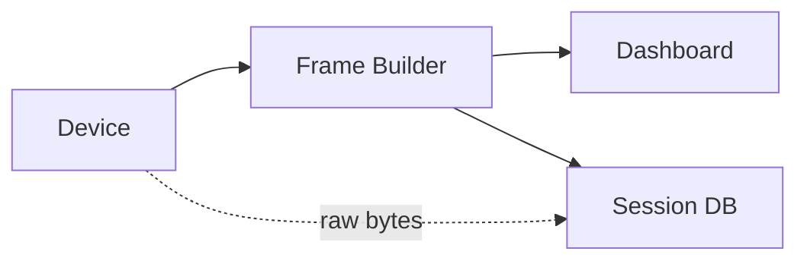

# Session Database (Pro)

Serial Studio Pro can record every connected session to a per-project SQLite database. You can browse, tag, annotate, export to CSV, and replay those sessions through the full dashboard exactly as they originally arrived. The result is a searchable archive of every run, without the per-file sprawl of CSV exports.

## Recording pipeline

Recording runs in parallel with the dashboard. Frames, raw bytes, and data-table snapshots are enqueued lock-free on the main thread, then written by a background worker in batched transactions, so disk I/O never blocks the data path.



---

## Turning recording on

Open the **Setup** panel and toggle **Create Session Log**. The first frame after you flip the toggle opens (or appends to) the project's session database. Recording stops automatically when the device disconnects, and the session's end timestamp is written at that point.

There's nothing to configure. Serial Studio picks the path, creates the schema on first use, and handles file lifecycle.

### File location

All sessions for a given project title live in a single `.db` file, grouped by project name:

```
<Workspace>/Session Databases/<Project Title>/<Project Title>.db
```

The workspace root is the folder set under **Settings → Workspace**. Project titles are sanitized (path separators and shell metacharacters are stripped) so the filename is always safe. Projects with no title fall back to `Untitled`.

Keeping all sessions for one project in the same `.db` file makes cross-session comparison and tagging practical. Sessions are separated internally by row, not by file.

---

## What gets recorded

Each session captures four parallel streams, all keyed by session ID and nanosecond timestamp.

| Data             | Table              | Contents |
|------------------|--------------------|----------|
| Frame values     | `readings`         | Per-dataset raw and final values at each frame |
| Raw bytes        | `raw_bytes`        | Every byte that arrived on the driver, exactly as received |
| Data tables      | `table_snapshots`  | Registers of user data tables at each frame |
| Session metadata | `sessions`         | Project title, start time, end time, embedded project JSON, notes |
| Column layout    | `columns`          | Dataset title, group, units, widget type, virtual flag |

The embedded project JSON in `sessions.project_json` is a snapshot of the project at the moment recording started. That's how a session recorded with one version of the project can replay faithfully later, even if the live project has changed in the meantime.

Both raw bytes and parsed frames are captured, so you can replay from either layer: re-render widgets from the parsed values, or re-run the parser over the raw stream. Tables and computed registers are snapshotted so data-table-aware transforms can be inspected after the fact.

---

## Session Explorer

Open the Session Explorer from the **File** menu or the toolbar. It lists every session recorded for every project in the workspace, newest first. For each session you can:

- **Replay.** Feed the recorded frames back through the Frame Builder and dashboard. The project embedded with the session is restored automatically, so widgets render the way they did during the original run.
- **Export to CSV.** Write the session's frames to a CSV file in the workspace. Final (post-transform) values are emitted one column per dataset, plus a timestamp column.
- **Generate report.** Export the session as a self-contained HTML file or a PDF, with a cover page, metadata, summary statistics, and interactive Chart.js plots. See [Session Reports](Session-Reports.md).
- **Tag.** Attach freeform labels like `flight-test`, `anomaly`, or `regression`. Tags are shared across the workspace so the same label can group sessions from different projects.
- **Annotate.** Add free-text notes to any session.
- **Restore project.** Extract the embedded project JSON into a standalone `.ssproj` file and open it in the editor.
- **Delete.** Remove a session and all of its readings, raw bytes, tags, and table snapshots in a single transaction.

Sessions are identified by start time, project title, duration, and tag labels.

---

## Replay

Replay feeds the recorded frames back through the same pipeline as a live connection: Frame Builder, then Dashboard, widgets, MQTT, API, and CSV or MDF4 export if those are on. From the dashboard's perspective, a replayed session is indistinguishable from a live one.

Playback controls mirror the CSV player:

| Control          | Action |
|------------------|--------|
| Play / Pause     | Start or pause playback |
| Previous / Next  | Step back or forward one frame |
| Progress slider  | Seek to any position in the session |

When replay starts, Serial Studio saves the current operation mode and project path. When it ends, they're restored automatically. You can replay a session while your live project differs, and switching back leaves you exactly where you were.

Replay is read-only. It doesn't modify the recorded session, and toggling CSV or MDF4 export during replay creates new output files as usual.

---

## Performance notes

Sessions are written in Write-Ahead-Logging (WAL) mode with `synchronous=NORMAL`, batched up to 256 frames and 1,000 raw-byte entries per transaction. That's enough to keep up with sustained data rates in the tens of kHz on SSD storage, while still letting the explorer read the database concurrently with a live recording.

Session DBs grow linearly with data rate and session length. There's no built-in retention policy: old sessions stick around until you delete them from the explorer. For long-running archive projects, consider exporting important sessions to MDF4 periodically and deleting them from the database.

---

## CSV, MDF4, session database, or report: which one?

| Goal                                                              | Best option               |
|-------------------------------------------------------------------|---------------------------|
| Hand a single file to a collaborator who uses Excel or pandas     | CSV export                |
| Long recordings, high data rates, automotive toolchain            | MDF4 export (Pro)         |
| Archive every run of a project, then search, tag, or replay later | Session database (Pro)    |
| A shareable, printable summary with charts for a customer or lab notebook | Session report (Pro) |

CSV and MDF4 produce one file per session. The session database produces one file per project, indexed by session, with replay and metadata built in. Session reports are rendered on demand from the database: one HTML or PDF per session, ready to email or archive. They're not mutually exclusive: you can use all of them together.

---

## See also

- [Session Reports](Session-Reports.md): export sessions as self-contained HTML or PDF reports with charts.
- [CSV Import & Export](CSV-Import-Export.md): live CSV export and CSV playback.
- [Data Flow](Data-Flow.md): where session recording sits in the overall pipeline.
- [Dataset Value Transforms](Dataset-Transforms.md): transforms contribute to the recorded final values.
- [Data Tables](Data-Tables.md): recorded in `table_snapshots` alongside frames.
- [Pro vs Free Features](Pro-vs-Free.md): full list of Pro-only features.
