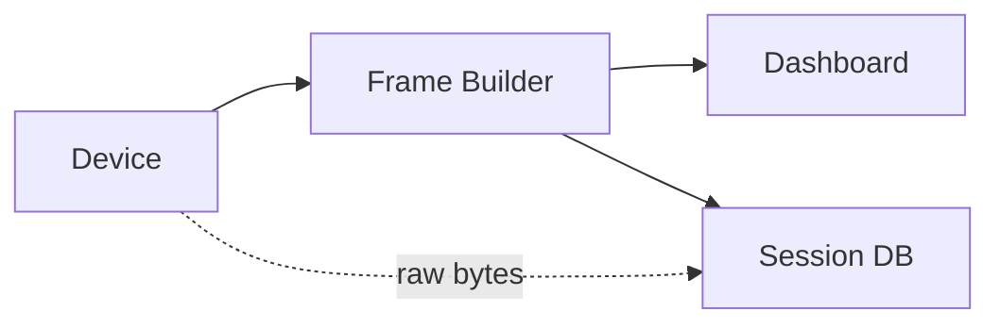

# Session Database (Pro)

Serial Studio Pro can record every connected session to a per-project SQLite database. Recorded sessions can be browsed, tagged, annotated, exported to CSV, and replayed through the full dashboard exactly as they originally arrived. This gives you a searchable archive of every run without the per-file sprawl of CSV exports.

## Recording Pipeline

Session recording runs in parallel with the dashboard. Frames, raw bytes, and data-table snapshots are enqueued lock-free on the main thread and written by a background worker in batched transactions, so disk I/O never blocks the data path.



---

## Enabling Recording

Open the **Setup** panel and toggle **Create Session Log**. The first frame received after the toggle is enabled opens (or appends to) the project's session database. Recording stops automatically when the device disconnects; the session's end timestamp is written at that point.

No configuration is required. Serial Studio picks the path, creates the schema on first use, and handles file lifecycle.

### File Location

All sessions for a given project title go into a single `.db` file, grouped by project name:

```
<Workspace>/Session Databases/<Project Title>/<Project Title>.db
```

The workspace root is the folder shown under **Settings → Workspace**. Project titles are sanitized (path separators and shell metacharacters are stripped) so the filename is always safe; projects with no title fall back to `Untitled`.

Keeping all sessions for one project in the same `.db` file makes cross-session comparison and tagging practical. Sessions are separated internally by row, not by file.

---

## What Gets Recorded

Each session captures four parallel streams, all keyed by session ID and nanosecond timestamp:

| Data | Table | Contents |
|------|-------|----------|
| Frame values | `readings` | Per-dataset raw and final values at each frame |
| Raw bytes | `raw_bytes` | Every byte that arrived on the driver, as received |
| Data tables | `table_snapshots` | Registers of user data tables at each frame |
| Session metadata | `sessions` | Project title, start time, end time, embedded project JSON, notes |
| Column layout | `columns` | Dataset title, group, units, widget type, virtual flag |

The embedded project JSON in `sessions.project_json` is a snapshot of the project at the moment recording started. That's what allows a session recorded with one version of the project to replay faithfully later, even if the live project has since changed.

Both raw bytes and parsed frames are captured, so a recorded session lets you replay from either layer: re-render widgets from the parsed values, or re-run the parser over the raw stream. Tables and computed registers are snapshotted so data-table-aware transforms can be inspected after the fact.

---

## Session Explorer

Open the Session Explorer from the **File** menu or the toolbar. It lists every session recorded for every project in the workspace, newest first. For each session you can:

- **Replay** — feed the recorded frames back through the Frame Builder and dashboard. The project embedded with the session is restored automatically, so widgets render exactly as they did during the original run.
- **Export to CSV** — write the session's frames to a CSV file in the workspace. Final (post-transform) values are emitted one column per dataset, plus a timestamp column.
- **Tag** — attach freeform labels (for example `flight-test`, `anomaly`, `regression`). Tags are shared across the workspace so the same label can group sessions from different projects.
- **Annotate** — add free-text notes to any session.
- **Restore Project** — extract the embedded project JSON into a standalone `.ssproj` file and open it in the editor.
- **Delete** — remove a session and all of its readings, raw bytes, tags, and table snapshots in a single transaction.

Sessions are identified in the list by their start time, project title, duration, and tag labels.

---

## Replay

Replay feeds the recorded frames back through the same pipeline as a live connection: Frame Builder → Dashboard, widgets, MQTT, API, CSV/MDF4 export if enabled. From the dashboard's perspective, a replayed session is indistinguishable from a live one.

Playback controls mirror the CSV player:

| Control | Action |
|---------|--------|
| Play / Pause | Start or pause playback |
| Previous / Next | Step back or forward one frame |
| Progress Slider | Seek to any position in the session |

When replay starts, Serial Studio saves the current operation mode and project path; when replay ends, they are restored automatically. You can replay a session while your live project differs — switching back gets you exactly where you were.

Replay is read-only. It does not modify the recorded session, and toggling CSV or MDF4 export during replay creates new output files as usual.

---

## Performance Notes

Sessions are written in Write-Ahead-Logging (WAL) mode with `synchronous=NORMAL`, batched up to 256 frames and 1000 raw-byte entries per transaction. This is fast enough to keep up with sustained data rates in the tens of kHz on SSD storage, while still allowing the explorer to read the database concurrently with a live recording.

Session DBs grow linearly with data rate and session length. There is no built-in retention policy — old sessions remain until you delete them from the explorer. For long-running archive projects, consider periodically exporting important sessions to MDF4 and deleting them from the database.

---

## CSV, MDF4, or Session Database — Which to Use?

| Goal | Best option |
|------|-------------|
| Hand a single file to a collaborator who uses Excel or pandas | CSV export |
| Long recordings, high data rates, automotive toolchain | MDF4 export (Pro) |
| Archive every run of a project, search/tag/replay later | Session database (Pro) |

CSV and MDF4 produce one file per session. The session database produces one file per project, indexed by session, with replay and metadata built in. They are not mutually exclusive — you can enable all three at the same time.

---

## See Also

- [CSV Import & Export](CSV-Import-Export.md) — live CSV export and CSV playback
- [Data Flow](Data-Flow.md) — where session recording sits in the overall pipeline
- [Dataset Value Transforms](Dataset-Transforms.md) — transforms contribute to the recorded final values
- [Data Tables](Data-Tables.md) — recorded in `table_snapshots` alongside frames
- [Pro vs Free Features](Pro-vs-Free.md) — full list of Pro-only features
