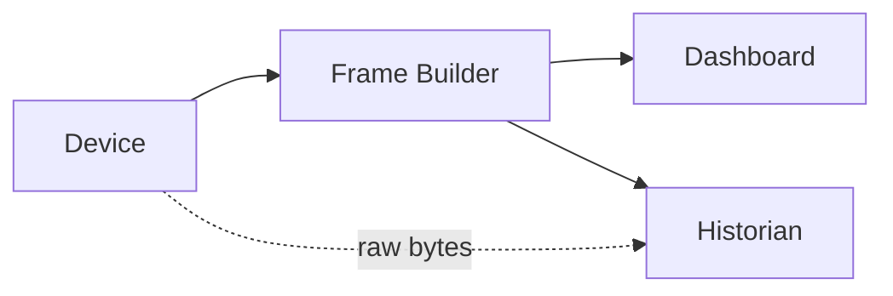

# Historian (Pro)

*Formerly called Session Database. The feature, its file layout, and its `sessions.*` API are unchanged — only the name shown in the UI and docs changed.*

Serial Studio Pro can record every connected session to a per-project SQLite database. You can browse, tag, annotate, export to CSV, and replay those sessions through the full dashboard exactly as they originally arrived. The result is a searchable archive of every run, without the per-file sprawl of CSV exports.

## Recording pipeline

Recording runs in parallel with the dashboard. Frames, raw bytes, and table snapshots are enqueued lock-free on the main thread, then written by a background worker in batched transactions, so disk I/O never blocks the data path.


```mermaid
flowchart LR
    A["Device"] --> B["Frame Builder"]
    B --> C["Dashboard"]
    B --> D["Historian"]
    A -.raw bytes.-> D
```

## Turning recording on

Open the **Device Setup** panel and, under **Data Export**, toggle **Session Recording**. The first frame after you flip the toggle opens (or appends to) the project's Historian database. Recording stops automatically when the device disconnects, and the session's end timestamp is written at that point.

There's nothing to configure. Serial Studio picks the path, creates the schema on first use, and handles file lifecycle.

Recording and the Historian can also be driven programmatically: the [API](API-Reference.md) exposes `sessions.setExportEnabled`, `sessions.getStatus`, `sessions.list`, `sessions.replay`, `sessions.exportToCsv`, `sessions.delete`, and the tagging commands (`sessions.addTag`, `sessions.assignTag`, `sessions.setNotes`). The `--session-export` flag in the [Command-Line Interface](Command-Line-Interface.md) turns recording on at startup.

### File location

All sessions for a given project title live in a single `.db` file, grouped by project name:

```
<Workspace>/Session Databases/<Project Title>/<Project Title>.db
```

The workspace root is the folder set as the **Workspace Folder** in Settings. Project titles are sanitized (path separators and shell metacharacters are stripped) so the filename is always safe. Projects with no title fall back to `Untitled`.

Keeping all sessions for one project in the same `.db` file makes cross-session comparison and tagging practical. Sessions are separated internally by row, not by file.

## What gets recorded

Each session captures three per-sample streams, keyed by session ID and nanosecond timestamp, plus two metadata tables keyed by session ID alone.

| Data             | Table              | Contents |
|------------------|--------------------|----------|
| Dataset values   | `blocks`           | Per-dataset final and pre-transform values for every published block, numeric and text |
| Raw bytes        | `raw_bytes`        | Every byte that arrived on the driver, exactly as received |
| Shared tables    | `table_snapshots`  | Variables of user shared tables, captured on change at a 1 Hz poll |
| Session metadata | `sessions`         | Project title, start time, end time, embedded project JSON, notes |
| Column layout    | `columns`          | Dataset title, group, units, widget type, virtual flag |

The embedded project JSON in `sessions.project_json` is a snapshot of the project at the moment recording started. That's how a session recorded with one version of the project can replay faithfully later, even if the live project has changed in the meantime.

Both raw bytes and parsed values are captured. Replay re-renders widgets from the stored parsed (final) values; the raw byte stream is archived for inspection, CSV, or external analysis, but it is not re-parsed during replay. Tables and computed variables are polled once a second and only changed variables are written, so `table_snapshots` is not a per-frame record like `blocks` and `raw_bytes`.

Databases recorded by older versions store per-frame rows in `readings` and `stream_blocks` instead of `blocks`. Current builds still read those tables for replay and CSV export, but no longer write them; `sessions.capture_format` records which format a session uses (`2` for the block format, `1` or NULL for the legacy per-frame format).

## Database format

The Historian file is a standard SQLite 3 database: no custom container, no compression, no encryption. Any SQLite client can open it directly, so recorded sessions are usable from your own software without going through Serial Studio at all. The schema is created with `PRAGMA user_version = 4` and evolves additively (new columns and tables are added, existing ones are never renamed or reordered), so queries that name their columns keep working across application upgrades.

The database runs in Write-Ahead-Logging mode, so reading it while Serial Studio is recording is safe. Open it read-only from external tools (`file:...?mode=ro` in SQLite URI syntax); an external writer holding a lock can stall or corrupt an active recording.

### Timestamps

Every `*_ns` column is a 64-bit signed integer counting nanoseconds from the session's first recorded sample, not from the Unix epoch. The wall-clock anchor is `sessions.started_at`, an ISO 8601 local timestamp such as `2026-08-20T14:03:11`; add a `timestamp_ns` value to it to place a sample in calendar time. `sessions.ended_at` uses the same format. Within `raw_bytes`, timestamps are strictly increasing: entries that arrive in the same nanosecond are stepped forward by 1 ns so ordering is unambiguous.

### Sample data: the `blocks` table

One row per dataset per published block, for frame-driven and stream-driven sources alike. Join `blocks` to `columns` on `(session_id, unique_id)` to resolve the dataset's title, group, units, and widget type.

| Column | Meaning |
|--------|---------|
| `session_id`, `unique_id`, `source_id` | Session, dataset, and stream source the row belongs to |
| `block_number` | Publication counter, increasing per session |
| `frames` | Number of samples encoded in the blobs of this row |
| `t0_ns`, `t_end_ns` | Timestamps of the first and last sample in the block |
| `dt_ns` | Sample period. Non-zero: sample *i* sits at `t0_ns + i * dt_ns`. Zero: the block is irregular and per-sample offsets live in `times` |
| `is_numeric` | 1 when every sample in the block is numeric |
| `min_value`, `max_value`, `sum_value`, `finite_count` | Precomputed statistics over the finite final values, NULL when the block has none |

The sample payloads are binary blobs, all little-endian regardless of the recording machine:

| Column | Encoding |
|--------|----------|
| `values_blob` | `frames` IEEE-754 float64 values (8 bytes each): the final, post-transform values |
| `raw_values` | Same encoding, the pre-transform values; NULL when the block carries no pre-transform twin. Frame-driven sources always write it, so without a transform it duplicates `values_blob` |
| `texts` | `frames` entries, each a uint32 byte count followed by that many UTF-8 bytes: the final text values; NULL for numeric-only datasets |
| `raw_texts` | Same encoding as `texts`, the pre-transform text; NULL unless the dataset has both |
| `times` | `frames` int64 values: per-sample nanosecond offsets from `t0_ns`; present only when `dt_ns` is 0 |

A blob whose length does not match `frames` (times 8 for the fixed-width blobs) is truncated or foreign; reject it rather than decoding past its end.

### Metadata tables

- **`sessions`**: one row per recording. Besides the fields listed above, it carries `app_version`, `capture_format`, `repro_class` (the verifier's reproducibility classification), `frames_dropped` and `overflow_bytes` (link-loss counters), `raw_sha256` and `readings_sha256` (integrity fingerprints checked by the built-in verifier), and `view_state` (the dashboard layout at recording time).
- **`columns`**: the per-session dataset catalog: `unique_id`, `title`, `group_title`, `units`, `widget`, `is_virtual`, plus `source_id` and `source_title` for stream sources.
- **`raw_bytes`**: `data` is the received byte stream as a BLOB, `device_id` distinguishes devices on multi-device links.
- **`table_snapshots`**: `table_name` and `register_name` identify the shared-table variable; exactly one of `numeric_value` or `string_value` is set.
- **`tags`** and **`session_tags`**: the tag catalog (labels unique, case-insensitive) and the session-to-tag join table.
- **`project_metadata`**: key/value store. `created_at` stamps database creation; `lock_password_hash` appears when the database is locked. The lock only blocks deletion inside Serial Studio; the file itself is never encrypted.
- **`verifications`**: append-only log of verifier runs with timestamp, application version, verdict, and detail JSON.
- **`readings`**, **`stream_blocks`**: legacy per-frame and stream-sample tables, present for databases recorded before the block format. `readings` stores one row per dataset per frame (`raw_*` and `final_*` value pairs); `stream_blocks` stores float64 sample blobs with the same encoding as `values_blob`.

### Reading a session from Python

```python
import sqlite3
import struct

db = sqlite3.connect("file:My Project.db?mode=ro", uri=True)

for sid, started in db.execute("SELECT session_id, started_at FROM sessions"):
    print(sid, started)

query = """
  SELECT b.t0_ns, b.dt_ns, b.frames, b.values_blob, b.times
  FROM blocks b
  JOIN columns c ON c.session_id = b.session_id AND c.unique_id = b.unique_id
  WHERE b.session_id = ? AND c.title = 'Temperature'
  ORDER BY b.t0_ns
"""
for t0, dt, frames, blob, times in db.execute(query, (1,)):
    values = struct.unpack(f"<{frames}d", blob)
    if dt:
        stamps = [t0 + i * dt for i in range(frames)]
    else:
        stamps = [t0 + off for off in struct.unpack(f"<{frames}q", times)]
```

Each iteration yields one block: `values` holds the final values and `stamps` their session-relative timestamps in nanoseconds. The same pattern with `raw_values` recovers pre-transform values, and `texts` decodes by walking uint32 length prefixes.

## The Historian window

Open the Historian from the **Historian** button on the toolbar or the start menu. It opens one project's database and lists every session recorded in that file, newest first. For each session you can:

- **Replay.** Feed the recorded frames back through the Frame Builder and dashboard. The project embedded with the session is restored automatically, so widgets render the way they did during the original run.
- **Export to CSV.** Write the session's frames to a CSV file in the workspace. Final (post-transform) values are emitted one column per dataset, plus a timestamp column.
- **Generate report.** Export the session as a self-contained HTML file or a PDF, with a cover page, metadata, summary statistics, and interactive Chart.js plots. See [Session Reports](Session-Reports.md).
- **Tag.** Attach freeform labels like `flight-test`, `anomaly`, or `regression`. Tags are shared across every session in the project database, so the same label can group sessions from different runs.
- **Annotate.** Add free-text notes to any session.
- **Restore project.** Extract the embedded project JSON into a standalone `.ssproj` file and open it in the editor.
- **Delete.** Remove a session and all of its readings, raw bytes, tags, and table snapshots in a single transaction.
- **Lock / Unlock.** Set a password on the database to block session deletion. Deletion stays blocked until you unlock the database with the same password; there's no password-recovery path, so store it somewhere safe.

Sessions are identified by start time, frame count, and tag labels.

## Replay

Replay feeds the recorded frames back through the same pipeline as a live connection: Frame Builder, then Dashboard, widgets, MQTT, API, and CSV or MDF4 export if those are on. From the dashboard's perspective, a replayed session is indistinguishable from a live one.

Playback controls mirror the CSV player:

| Control          | Action |
|------------------|--------|
| Play / Pause     | Start or pause playback |
| Previous / Next  | Step back or forward one frame |
| Progress slider  | Seek to any position in the session |

When replay starts, Serial Studio saves the current operation mode and project path. When it ends, they're restored automatically. You can replay a session while your live project differs, and switching back leaves you exactly where you were.

Replay is read-only. It doesn't modify the recorded session, and CSV/MDF4 export is suppressed while a player (CSV, MDF4, or Historian replay) is open, so replaying a session does not write new export files.

## Performance notes

Sessions are written in Write-Ahead-Logging (WAL) mode with `synchronous=NORMAL`, batched up to 1,024 frames and 1,000 raw-byte entries per transaction. That's enough to keep up with sustained data rates in the tens of kHz on SSD storage, while still letting the Historian read the database concurrently with a live recording.

Historian databases grow linearly with data rate and session length. There's no built-in retention policy: old sessions stick around until you delete them from the Historian. For long-running archive projects, consider exporting important sessions to MDF4 periodically and deleting them from the database.

## CSV, MDF4, Historian, or report: which one?

| Goal                                                              | Best option               |
|-------------------------------------------------------------------|---------------------------|
| Hand a single file to a collaborator who uses Excel or pandas     | CSV export                |
| Long recordings, high data rates, automotive toolchain            | [MDF4 export](MDF4.md) (Pro) |
| Archive every run of a project, then search, tag, or replay later | Historian (Pro)           |
| A shareable, printable summary with charts for a customer or lab notebook | Session report (Pro) |

CSV and MDF4 produce one file per session. The Historian produces one file per project, indexed by session, with replay and metadata built in. Session reports are rendered on demand from the database: one HTML or PDF per session, ready to email or archive. They're not mutually exclusive: you can use all of them together.

## See also

- [Session Reports](Session-Reports.md): export sessions as self-contained HTML or PDF reports with charts.
- [CSV Export & Playback](CSV-Export-Playback.md): live CSV export and CSV playback.
- [MDF4 Export & Playback](MDF4.md): binary logging with per-channel sample rates and channel metadata (Pro).
- [Data Flow](Data-Flow.md): where session recording sits in the overall pipeline.
- [Dataset Value Transforms](Dataset-Transforms.md): transforms contribute to the recorded final values.
- [Variables](Data-Tables.md): recorded in `table_snapshots` alongside frames.
- [Pro vs Free Features](Pro-vs-Free.md): full list of Pro-only features.
