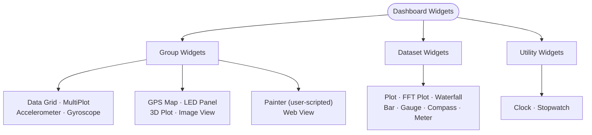

# Widget reference

## Overview

Serial Studio has 15+ widget types for real-time data visualization. Widgets fall into two categories: **group widgets** (display multiple datasets from a group) and **dataset widgets** (display a single dataset value).

## Widget type hierarchy

The diagram below shows all widget types organized by category, with their configuration keys and dataset requirements.

## Group widgets

### Data Grid

- Widget key: `"datagrid"`.
- Displays all datasets in a tabular format with titles, values, and units.
- Best for: overview of multiple channels, status monitoring.
- Configuration: none required beyond adding datasets to the group.
- Supports pause/resume.

### MultiPlot

- Widget key: `"multiplot"`.
- Overlays multiple dataset curves on shared axes.
- Per-curve visibility toggles.
- Auto-scaling Y-axis.
- Best for: comparing related signals (for example a 3-axis accelerometer over time).
- Configuration: add datasets with `graph: true` to the group.

### GPS Map

- Widget key: `"gps"` (also accepts `"map"`).
- Tile-based map with real-time position tracking.
- Plots the trajectory path.
- Shows latitude, longitude, and altitude.
- Auto-centers on the latest position.
- Zoom and pan with the mouse.
- Best for: vehicle tracking, drone telemetry, field measurements.
- Requires: datasets with latitude, longitude, and optionally altitude.
- Needs an internet connection for map tiles. Previously viewed areas are cached.

### Gyroscope

- Widget key: `"gyro"` (also accepts `"gyroscope"`).
- Attitude indicator showing yaw, pitch, roll.
- Best for: IMU visualization, drone orientation, robotics.
- Requires: exactly 3 datasets (yaw, pitch, roll).
- Expects absolute angles in degrees. If your sensor only provides angular rates (deg/s), integrate them with the **Integrate Rate to Angle** transform template.

### Accelerometer

- Widget key: `"accelerometer"`.
- 3-axis acceleration visualization with a computed total G-force.
- Shows pitch, roll, peak G, magnitude.
- Configurable max G range.
- Best for: vibration analysis, impact detection, motion sensing.
- Requires: exactly 3 datasets (X, Y, Z acceleration).

### LED Panel

- Group widget (auto-created for datasets with `led: true`).
- Multiple multi-state indicator LEDs, one per dataset.
- With alarm bands defined, each LED lights in the color of the band the value sits in, shows the band's `label` next to the dataset title, and flashes while a band marked `blink` is active. Outside every band, the LED is off (annunciator-panel behavior).
- Without bands, the LED falls back to the legacy single threshold: on (dataset color) when the value meets or exceeds `ledHigh` (default 80).
- Best for: status flags, limit indicators, digital I/O states, annunciator panels.
- Configuration: set `led: true` on each dataset, then either define `alarmBands` (see [Alarm bands](#alarm-bands)) or set `ledHigh`.

### Terminal

- Special widget. Always available when the console is enabled.
- VT-100 emulation with ANSI color support.
- Shows the raw text data stream.
- Configurable font and display settings.
- Keyboard input is forwarded to the connected device.

### 3D Plot (Pro)

- Widget key: `"plot3d"`.
- 3D scatter and trajectory visualization.
- Orbit or free-camera navigation.
- Optional anaglyph stereo (red/cyan 3D glasses).
- Interpolation support.
- Best for: 3D position tracking, spatial data, point clouds.
- Requires: exactly 3 datasets (X, Y, Z coordinates).
- Renders through Serial Studio's custom QPainter-based 3D pipeline. No GPU or OpenGL driver required. Runs on low-end hardware including Raspberry Pi.
- Pro license required.

### Image View (Pro)

- Widget key: `"image"`.
- Live JPEG/PNG/BMP/WebP image streaming from the device.
- Autodetect or manual frame delimiter configuration.
- Independent frame reader per widget. Image frames and CSV telemetry coexist in the same byte stream.
- Export, zoom, and image filter toolbar controls.
- Best for: camera feeds, thermal imaging, visual inspection.
- Group-level configuration fields:
  - `imgDetectionMode`: `"autodetect"` (default, uses format magic bytes) or `"manual"` (user-defined delimiters).
  - `imgStartSequence`: hex start delimiter (manual mode only).
  - `imgEndSequence`: hex end delimiter (manual mode only).
- No datasets required inside the group. The widget reads raw image bytes directly from the transport stream.
- Pro license required.

### Painter (Pro)

- Widget key: `"painter"`.
- User-scripted dashboard widget. The script defines a JavaScript `paint(ctx, w, h)` callback (and an optional `onFrame()` callback) that renders directly into the widget's bitmap on every dashboard tick.
- Eighteen built-in templates are bundled with Serial Studio: oscilloscope, sparkline grid, dial gauge, polar plot, radar sweep, artificial horizon, heatmap, LED matrix, vector field, XY scope, and others.
- The script reads the group's datasets through a `datasets` global and dashboard tick metadata through `frame.number` / `frame.timestampMs`.
- Best for visualizations not covered by any built-in widget: instrument mimics, project-specific layouts, lab-equipment-style readouts.
- Repaints at the dashboard refresh rate (60 Hz by default, configurable 1-240 Hz). A 250 ms watchdog terminates the script if a single call does not return.
- See the [Painter Widget](Painter-Widget.md) reference for the full API.
- Pro license required.

### Web View

- Widget key: `"webview"`.
- Embeds a web page inside a dashboard group, backed by Qt WebEngine (Chromium).
- The only configuration is a URL, set in the group's settings in the Project Editor.
- Group-level configuration fields:
  - `webViewUrl`: the address to load.
- No datasets required inside the group.
- Best for: embedding a live map, a 3D model viewer, a hardware vendor's web dashboard, or any HTML content alongside your telemetry. The ISS Tracker example uses it to show a NASA glTF model of the station.
- Requires a build compiled with Qt WebEngine. On builds without it, the widget shows a "Web View Unavailable" placeholder instead of failing to load the project.

## Dataset widgets

### Plot

- Auto-created for datasets with `graph: true` (field name `plt`).
- Single-curve 2D time-series line chart.
- Auto-scaling Y-axis.
- Configurable plot range via `pltMin` and `pltMax`.
- Optional custom X-axis from another dataset via `xAxisId` (enables XY/scatter plots).
- Pause/resume.
- Best for: individual signal monitoring, trend analysis.

### FFT Plot

- Auto-created for datasets with `fft: true`.
- Real-time frequency spectrum analysis via Fast Fourier Transform (KissFFT).
- Configurable FFT window size: 8 to 16384 samples (powers of 2). Default 256.
- Configurable sampling rate determines the frequency axis (default 100 Hz).
- Configurable frequency range via `fftMin` and `fftMax`.
- Best for: vibration frequency analysis, audio spectrum, signal quality.
- Configuration fields: `fftSamples` (window size), `fftSamplingRate` (Hz), `fftMin`, `fftMax`.

### Waterfall (Pro)

- Auto-created for datasets with `waterfall: true`.
- Scrolling time-frequency plot (spectrogram). Each row is one FFT magnitude spectrum, with the newest row drawn at the top and older rows scrolling down.
- Reuses the dataset's FFT settings (`fftSamples`, `fftSamplingRate`, `fftMin`, `fftMax`). Enable both `fft: true` and `waterfall: true` if you want the FFT plot alongside the waterfall.
- Magnitude is converted to dB. The dynamic range (`minDb` / `maxDb`) is adjustable from the widget toolbar.
- Built-in color maps: Viridis, Inferno, Magma, Plasma, Turbo, Jet, Hot, Grayscale.
- Mouse wheel to zoom, drag to pan, hover for a frequency/time readout. Reset view from the toolbar.
- Configurable history depth (number of stored rows).
- **Y-axis source.** Defaults to elapsed time. Set `waterfallYAxis` to another dataset's `uniqueId` to drive the Y axis from that dataset's value instead. This is typically used for order-tracking plots (for example RPM vs. frequency).
- Best for: vibration order tracking, audio spectrograms, RF band monitoring, transient frequency events.
- Configuration fields: `waterfall: true`, `waterfallYAxis` (0 = time; otherwise the `uniqueId` of the dataset to use as the Y axis), plus the FFT fields above.
- Pro license required.

### Bar

- Dataset widget key: `"bar"`.
- Horizontal bar gauge with min/max range.
- Color-banded alarm zones with per-band severity (Info / OK / Warning / Critical).
- Shows current value and units.
- Best for: level indicators, resource usage, bounded values.
- Configuration fields: `wgtMin` (default 0), `wgtMax` (default 0), `alarmBands` (array; see [Alarm bands](#alarm-bands)).
- **Two-page swipe view.** Page 0 is the analog bar; page 1 is a large monospace digital readout. Swipe horizontally (or use the page indicator dots at the bottom) to flip. The active page is saved per-widget in the project file, so each Bar tile remembers its own preference.

### Gauge

- Dataset widget key: `"gauge"`.
- Circular or arc gauge display with colored outer-rim arc segments for each alarm band.
- Same configuration as Bar (min/max, bands).
- Best for: speedometers, RPM, pressure, temperature.
- Configuration fields: `wgtMin`, `wgtMax`, `alarmBands`.
- **Two-page swipe view.** Page 0 is the analog dial; page 1 is a large digital readout. The active page is persisted per widget.

### Compass

- Dataset widget key: `"compass"`.
- Heading indicator (0 to 360 degrees).
- Auto-converts a numeric heading to a cardinal direction (N, NE, E, SE, S, SW, W, NW).
- Best for: heading and bearing, wind direction, orientation.
- **Two-page swipe view.** Page 0 is the compass rose; page 1 is a large digital readout (heading plus cardinal direction). The active page is persisted per widget.

### Meter

- Dataset widget key: `"meter"`.
- Analog half-arc meter with a sweeping needle, tick marks, colored arc bands, and value readout.
- Same min/max + bands model as Bar and Gauge.
- Best for: VU-style readouts, signal strength, pressure, voltage.
- Configuration fields: `wgtMin` (default 0), `wgtMax` (default 0), `alarmBands`.
- **Two-page swipe view.** Page 0 is the analog half-arc meter; page 1 is a large digital readout. The active page is persisted per widget.

## Alarm bands

Bar, Gauge, Meter, and LED Panel widgets render one or more **alarm bands**. Each band is a contiguous value range with a color and a severity tier. The gauge paints them as colored stripes (Bar) or arc segments (Gauge / Meter), and the needle / fill tints to the active band's color when the value enters it; LED Panel entries light in the active band's color. The "APU tachometer" convention (white below normal, green operating range, yellow caution, red redline) is one canonical setup; any combination of ranges and colors is allowed.

**Band schema.** Under the dataset's `alarmBands` array, each entry is an object:

| Field      | Type   | Required | Notes |
|------------|--------|----------|-------|
| `min`      | double | yes      | Lower bound of the band (inclusive). |
| `max`      | double | yes      | Upper bound of the band (exclusive at top of range). |
| `severity` | int    | yes      | `0` = Info, `1` = OK, `2` = Warning, `3` = Critical. Drives the default color and whether the band raises a notification on entry. |
| `color`    | string | no       | Hex override (`"#rrggbb"`). When empty, the severity's theme color is used (theme switches re-tint live). |
| `label`    | string | no       | Optional human-readable name. Surfaces in the band-edge notification subtitle and next to the dataset title on LED panels. |
| `blink`    | bool   | no       | When `true`, LED panels flash the LED while the value sits in this band. Defaults to `false`. |

Bands may have gaps (the dataset's default background shows through), may overlap (later bands paint over earlier ones), and need not cover the full range. Editing is via the **Alarm Bands** button in the dataset toolbar (next to **Transform**), which opens a dedicated dialog with presets (Tachometer, Speedometer, Engine Temperature, Pressure, Battery Voltage, Fuel Level, Signal Strength, CPU / System Load, OK / Warning / Critical, Indicator, Fault Indicator), per-band color picker, severity selector, blink toggle, and a live preview strip.

**Notifications.** When the value enters a band with severity ≥ Warning, Serial Studio posts a notification (`Warning` or `Critical` level, with the band's `label` in the subtitle). Alarm tracking runs per dataset at the dashboard level, so notifications fire even when the widget displaying the dataset is hidden or not instantiated. A 3-second per-dataset cooldown suppresses oscillation spam.

**Legacy compatibility.** Project files written by older Serial Studio releases carry `alarmEnabled` / `alarmLow` / `alarmHigh` instead of `alarmBands`. On load, those are converted to two `Warning`-severity bands (`[wgtMin..alarmLow]` and `[alarmHigh..wgtMax]`). The legacy keys are not written back; re-saved projects carry only `alarmBands`. For painter scripts (Pro), `dataset.alarmLow` and `dataset.alarmHigh` remain readable as derived values (first / last `Warning+` band edges) so existing scripts keep working.

## Utility widgets

Clock and Stopwatch are dashboard-level utility widgets. They are not attached to any group or dataset; toggle them from the **Start menu** (Dashboard pane) and they appear as overview entries in the taskbar alongside Terminal and Notifications. Enabled state persists in `QSettings` under `Dashboard/ClockEnabled` and `Dashboard/StopwatchEnabled`.

### Clock

- Toggle from the Dashboard Start menu.
- **Two-page swipe view.** Page 0 is an analog clock face (silver-bezel gauge style, hour/minute/second hands, 12-hour numerals); page 1 is a large monospace digital readout (12-hour time + full date).
- Driven by the system clock, ticks once per second.
- Active page is persisted in application `QSettings` (`ClockWidget/clockPageIndex`).
- Best for: visible session timestamps in screen recordings, lab/operator dashboards.

### Stopwatch

- Toggle from the Dashboard Start menu.
- Single-page widget: large `HH:MM:SS.mmm` readout, **Start/Stop**, **Lap**, **Reset** buttons, and a scrollable lap table.
- Local-only timing; data is not persisted to the project, transmitted, or sent to the device.
- Best for: bench testing, run/test timing during a session.

## Widget configuration summary

| Widget        | Type    | Key            | Min datasets | Key settings                                 |
|---------------|---------|----------------|--------------|----------------------------------------------|
| Data Grid     | Group   | `datagrid`     | 1+           | (none)                                       |
| MultiPlot     | Group   | `multiplot`    | 1+           | `graph: true` on datasets                    |
| GPS Map       | Group   | `gps`          | 2-3          | lat, lon, (alt) datasets                     |
| Gyroscope     | Group   | `gyro`         | 3            | yaw, pitch, roll                             |
| Accelerometer | Group   | `accelerometer`| 3            | x, y, z accel                                |
| LED Panel     | Group   | auto           | 1+           | `led: true`, `alarmBands[]` or legacy `ledHigh` |
| 3D Plot       | Group   | `plot3d`       | 3            | x, y, z coords (Pro)                         |
| Image View    | Group   | `image`        | 0            | binary stream (Pro)                          |
| Painter       | Group   | `painter`      | 0+           | user `paint(ctx, w, h)` JS script (Pro)      |
| Web View      | Group   | `webview`      | 0            | `webViewUrl` (Qt WebEngine build)            |
| Plot          | Dataset | auto           | n/a          | `graph: true`, `pltMin`/`pltMax`             |
| FFT Plot      | Dataset | auto           | n/a          | `fft: true`, `fftSamples`, `fftSamplingRate` |
| Waterfall     | Dataset | auto           | n/a          | `waterfall: true`, FFT fields, `waterfallYAxis` (Pro) |
| Bar           | Dataset | `bar`          | n/a          | `wgtMin`/`wgtMax`, `alarmBands[]`, swipe to digital page |
| Gauge         | Dataset | `gauge`        | n/a          | `wgtMin`/`wgtMax`, `alarmBands[]`, swipe to digital page |
| Compass       | Dataset | `compass`      | n/a          | value 0-360, swipe to digital page           |
| Meter         | Dataset | `meter`        | n/a          | `wgtMin`/`wgtMax`, `alarmBands[]`, swipe to digital page |
| Clock         | Utility | (toggle)       | 0            | system-clock driven; swipe between analog face / digital readout |
| Stopwatch     | Utility | (toggle)       | 0            | local Start/Stop/Lap/Reset with lap table    |

## Dataset fields reference

Every dataset in a project file supports these visualization-related fields:

| Field              | Type   | Default | Description |
|--------------------|--------|---------|-------------|
| `index`            | int    | 0       | Frame offset index (column position in CSV data). |
| `title`            | string | (none)  | Human-readable display name. |
| `units`            | string | (none)  | Measurement units (for example "m/s", "degC"). |
| `widget`           | string | `""`    | Dataset widget type: `"bar"`, `"gauge"`, `"compass"`, or `"meter"`. |
| `plt` (graph)      | bool   | false   | Enable time-series plot. |
| `fft`              | bool   | false   | Enable FFT spectrum plot. |
| `waterfall`        | bool   | false   | Enable waterfall (spectrogram) plot. Pro. |
| `waterfallYAxis`   | int    | 0       | Waterfall Y-axis source: 0 = time, otherwise the `uniqueId` of another dataset (order tracking). |
| `led`              | bool   | false   | Enable LED indicator. |
| `log`              | bool   | false   | Enable logging to file. |
| `overviewDisplay`  | bool   | false   | Show in the overview/status bar. |
| `pltMin`           | double | 0       | Plot Y-axis minimum (0 = auto-scale). |
| `pltMax`           | double | 0       | Plot Y-axis maximum (0 = auto-scale). |
| `wgtMin`           | double | 0       | Widget (bar/gauge/meter) minimum. |
| `wgtMax`           | double | 0       | Widget (bar/gauge/meter) maximum. |
| `ledHigh`          | double | 80      | LED activation threshold (used only when `alarmBands` is empty). |
| `alarmBands`       | array  | `[]`    | Colored value bands for bar/gauge/meter widgets and LED panels. Each entry: `{min, max, severity, color?, label?, blink?}`; see [Alarm bands](#alarm-bands). Legacy `alarmEnabled` / `alarmLow` / `alarmHigh` keys from older releases are still read and migrated to bands on load, but no longer written. |
| `fftSamples`       | int    | 256     | FFT window size (power of 2, 8 to 16384). |
| `fftSamplingRate`  | int    | 100     | FFT sampling rate in Hz. |
| `fftMin`           | double | 0       | FFT frequency axis minimum. |
| `fftMax`           | double | 0       | FFT frequency axis maximum. |
| `xAxisId`          | int    | -2      | X-axis source: `-2` = time (default), or the `uniqueId` of another dataset for an XY plot (Pro). |

## Dashboard layout

- Widgets appear as mini-windows on the dashboard canvas.
- Drag title bars to move them.
- Resize from edges and corners.
- Minimize individual widgets to the taskbar.
- Maximize to fill the canvas.
- Right-click the canvas for a context menu: tile windows, set wallpaper.
- Widget positions and sizes are saved per project via `widgetSettings` and persist between sessions.
- The Actions panel (if the project defines actions) shows up as a horizontal bar above the widgets.
- Dashboard render order follows the `DashboardWidget` enum: Terminal, DataGrid, MultiPlot, Accelerometer, Gyroscope, GPS, Plot3D, FFT, LED, Plot, Bar, Gauge, Compass, Meter, Clock, Stopwatch, Web View, ImageView, OutputPanel, NotificationLog, Waterfall, Painter.

Most widgets carry a small toolbar of icon buttons along their top edge that appears once the widget is large enough to fit it. Every button on every widget toolbar is listed in the [Toolbar & Button Reference](Toolbar-Reference.md#dashboard-widget-toolbars).

## Picking the right widget

| Data type                        | Recommended widget                  |
|----------------------------------|-------------------------------------|
| Temperature                      | Gauge, Plot, or Bar                 |
| Pressure, voltage, signal level  | Plot, Gauge, Meter, or Bar          |
| GPS coordinates                  | GPS Map (group)                     |
| Acceleration (X, Y, Z)           | Accelerometer (group)               |
| Rotation (X, Y, Z)               | Gyroscope (group)                   |
| Heading or bearing               | Compass                             |
| Audio or vibration frequency     | FFT Plot                    |
| Time-frequency / spectrogram     | Waterfall (Pro)             |
| Boolean status flags             | LED Panel (group)           |
| Mixed numeric and text values    | Data Grid (group)           |
| 3D trajectory or position        | 3D Plot (group, Pro)        |
| Live camera or image stream      | Image View (group, Pro)     |
| Embedded web page / map / 3D model | Web View (group)          |
| Wall-clock time / session timestamp | Clock (utility)          |
| Manual elapsed-time / lap timing | Stopwatch (utility)         |

## See also

- [Project Editor](Project-Editor.md): how to configure widgets in your project.
- [Toolbar & Button Reference](Toolbar-Reference.md): every button on every widget toolbar and across the app.
- [Operation Modes](Operation-Modes.md): dashboard modes and frame detection.
- [Data Flow](Data-Flow.md): how data reaches widgets from drivers through the pipeline.
