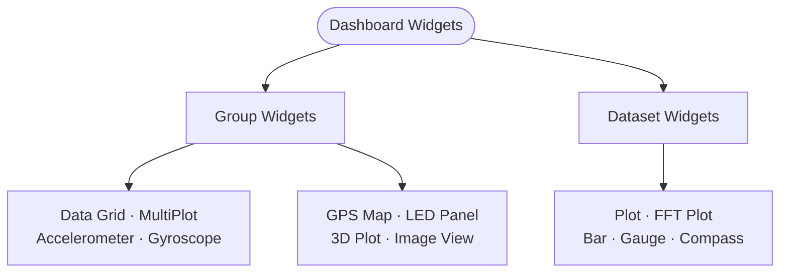

# Widget reference

## Overview

Serial Studio has 15+ widget types for real-time data visualization. Widgets fall into two categories: **group widgets** (display multiple datasets from a group) and **dataset widgets** (display a single dataset value).

## Widget type hierarchy

The diagram below shows all widget types organized by category, with their configuration keys and dataset requirements.

## Group widgets

### Data Grid

- Widget key: `"datagrid"`.
- Displays all datasets in a tabular format with titles, values, and units.
- Best for: overview of multiple channels, status monitoring.
- Configuration: none required beyond adding datasets to the group.
- Supports pause/resume.

### MultiPlot

- Widget key: `"multiplot"`.
- Overlays multiple dataset curves on shared axes.
- Per-curve visibility toggles.
- Auto-scaling Y-axis.
- Best for: comparing related signals (for example a 3-axis accelerometer over time).
- Configuration: add datasets with `graph: true` to the group.

### GPS Map

- Widget key: `"map"` (also accepts `"gps"`).
- Tile-based map with real-time position tracking.
- Plots the trajectory path.
- Shows latitude, longitude, and altitude.
- Auto-centers on the latest position.
- Zoom and pan with the mouse.
- Best for: vehicle tracking, drone telemetry, field measurements.
- Requires: datasets with latitude, longitude, and optionally altitude.
- Needs an internet connection for map tiles. Previously viewed areas are cached.

### Gyroscope

- Widget key: `"gyro"` (also accepts `"gyroscope"`).
- Attitude indicator showing yaw, pitch, roll.
- Best for: IMU visualization, drone orientation, robotics.
- Requires: exactly 3 datasets (yaw, pitch, roll).
- Expects absolute angles in degrees. If your sensor only provides angular rates (deg/s), integrate them with the **Integrate Rate to Angle** transform template.

### Accelerometer

- Widget key: `"accelerometer"`.
- 3-axis acceleration visualization with a computed total G-force.
- Shows pitch, roll, peak G, magnitude.
- Configurable max G range.
- Best for: vibration analysis, impact detection, motion sensing.
- Requires: exactly 3 datasets (X, Y, Z acceleration).

### LED Panel

- Group widget (auto-created for datasets with `led: true`).
- Multiple boolean indicator LEDs.
- LED turns on when the value exceeds the `ledHigh` threshold (default 80).
- Best for: status flags, limit indicators, digital I/O states.
- Configuration: set `led: true` and `ledHigh` on each dataset.

### Terminal

- Special widget. Always available when the console is enabled.
- VT-100 emulation with ANSI color support.
- Shows the raw text data stream.
- Configurable font and display settings.
- Keyboard input is forwarded to the connected device.

### 3D Plot (Pro)

- Widget key: `"plot3d"`.
- 3D scatter and trajectory visualization.
- Orbit or free-camera navigation.
- Optional anaglyph stereo (red/cyan 3D glasses).
- Interpolation support.
- Best for: 3D position tracking, spatial data, point clouds.
- Requires: exactly 3 datasets (X, Y, Z coordinates).
- Renders through Serial Studio's custom QPainter-based 3D pipeline. No GPU or OpenGL driver required. Runs on low-end hardware including Raspberry Pi.
- Pro license required.

### Image View (Pro)

- Widget key: `"image"`.
- Live JPEG/PNG/BMP/WebP image streaming from the device.
- Autodetect or manual frame delimiter configuration.
- Independent frame reader per widget. Image frames and CSV telemetry coexist in the same byte stream.
- Export, zoom, and image filter toolbar controls.
- Best for: camera feeds, thermal imaging, visual inspection.
- Group-level configuration fields:
  - `imgDetectionMode`: `"autodetect"` (default, uses format magic bytes) or `"manual"` (user-defined delimiters).
  - `imgStartSequence`: hex start delimiter (manual mode only).
  - `imgEndSequence`: hex end delimiter (manual mode only).
- No datasets required inside the group. The widget reads raw image bytes directly from the transport stream.
- Pro license required.

## Dataset widgets

### Plot

- Auto-created for datasets with `graph: true` (field name `plt`).
- Single-curve 2D time-series line chart.
- Auto-scaling Y-axis.
- Configurable plot range via `pltMin` and `pltMax`.
- Optional custom X-axis from another dataset via `xAxisId` (enables XY/scatter plots).
- Pause/resume.
- Best for: individual signal monitoring, trend analysis.

### FFT Plot

- Auto-created for datasets with `fft: true`.
- Real-time frequency spectrum analysis via Fast Fourier Transform (KissFFT).
- Configurable FFT window size: 8 to 16384 samples (powers of 2). Default 256.
- Configurable sampling rate determines the frequency axis (default 100 Hz).
- Configurable frequency range via `fftMin` and `fftMax`.
- Best for: vibration frequency analysis, audio spectrum, signal quality.
- Configuration fields: `fftSamples` (window size), `fftSamplingRate` (Hz), `fftMin`, `fftMax`.

### Bar

- Dataset widget key: `"bar"`.
- Horizontal bar gauge with min/max range.
- Alarm thresholds with visual trigger state.
- Shows current value and units.
- Best for: level indicators, resource usage, bounded values.
- Configuration fields: `wgtMin` (default 0), `wgtMax` (default 100), `alarmLow` (default 20), `alarmHigh` (default 80).
- Alarms have to be enabled with `alarmEnabled: true`.

### Gauge

- Dataset widget key: `"gauge"`.
- Circular or arc gauge display.
- Same configuration as Bar (min/max, alarms).
- Best for: speedometers, RPM, pressure, temperature.
- Configuration fields: `wgtMin`, `wgtMax`, `alarmLow`, `alarmHigh`.

### Compass

- Dataset widget key: `"compass"`.
- Heading indicator (0 to 360 degrees).
- Auto-converts a numeric heading to a cardinal direction (N, NE, E, SE, S, SW, W, NW).
- Best for: heading and bearing, wind direction, orientation.

## Widget configuration summary

| Widget        | Type    | Key            | Min datasets | Key settings                                 |
|---------------|---------|----------------|--------------|----------------------------------------------|
| Data Grid     | Group   | `datagrid`     | 1+           | —                                            |
| MultiPlot     | Group   | `multiplot`    | 1+           | `graph: true` on datasets                    |
| GPS Map       | Group   | `map`          | 2-3          | lat, lon, (alt) datasets                     |
| Gyroscope     | Group   | `gyro`         | 3            | yaw, pitch, roll                             |
| Accelerometer | Group   | `accelerometer`| 3            | x, y, z accel                                |
| LED Panel     | Group   | auto           | 1+           | `led: true`, `ledHigh`                       |
| 3D Plot       | Group   | `plot3d`       | 3            | x, y, z coords (Pro)                         |
| Image View    | Group   | `image`        | 0            | binary stream (Pro)                          |
| Plot          | Dataset | auto           | —            | `graph: true`, `pltMin`/`pltMax`             |
| FFT Plot      | Dataset | auto           | —            | `fft: true`, `fftSamples`, `fftSamplingRate` |
| Bar           | Dataset | `bar`          | —            | `wgtMin`/`wgtMax`, `alarmLow`/`alarmHigh`    |
| Gauge         | Dataset | `gauge`        | —            | `wgtMin`/`wgtMax`, `alarmLow`/`alarmHigh`    |
| Compass       | Dataset | `compass`      | —            | value 0-360                                  |

## Dataset fields reference

Every dataset in a project file supports these visualization-related fields:

| Field              | Type   | Default | Description |
|--------------------|--------|---------|-------------|
| `index`            | int    | 0       | Frame offset index (column position in CSV data). |
| `title`            | string | —       | Human-readable display name. |
| `units`            | string | —       | Measurement units (for example "m/s", "degC"). |
| `widget`           | string | `""`    | Dataset widget type: `"bar"`, `"gauge"`, or `"compass"`. |
| `plt` (graph)      | bool   | false   | Enable time-series plot. |
| `fft`              | bool   | false   | Enable FFT spectrum plot. |
| `led`              | bool   | false   | Enable LED indicator. |
| `log`              | bool   | false   | Enable logging to file. |
| `overviewDisplay`  | bool   | false   | Show in the overview/status bar. |
| `pltMin`           | double | 0       | Plot Y-axis minimum (0 = auto-scale). |
| `pltMax`           | double | 0       | Plot Y-axis maximum (0 = auto-scale). |
| `wgtMin`           | double | 0       | Widget (bar/gauge) minimum. |
| `wgtMax`           | double | 100     | Widget (bar/gauge) maximum. |
| `ledHigh`          | double | 80      | LED activation threshold. |
| `alarmEnabled`     | bool   | false   | Enable alarm thresholds on bar/gauge. |
| `alarmLow`         | double | 20      | Low alarm threshold. |
| `alarmHigh`        | double | 80      | High alarm threshold. |
| `fftSamples`       | int    | 256     | FFT window size (power of 2, 8 to 16384). |
| `fftSamplingRate`  | int    | 100     | FFT sampling rate in Hz. |
| `fftMin`           | double | 0       | FFT frequency axis minimum. |
| `fftMax`           | double | 0       | FFT frequency axis maximum. |
| `xAxisId`          | int    | -1      | Reference dataset for the custom X-axis (-1 = use time). |

## Dashboard layout

- Widgets appear as mini-windows on the dashboard canvas.
- Drag title bars to move them.
- Resize from edges and corners.
- Minimize individual widgets to the taskbar.
- Maximize to fill the canvas.
- Right-click the canvas for a context menu: tile windows, set wallpaper.
- Widget positions and sizes are saved per project via `widgetSettings` and persist between sessions.
- The Actions panel (if the project defines actions) shows up as a horizontal bar above the widgets.
- Dashboard render order follows the `DashboardWidget` enum: Terminal, DataGrid, MultiPlot, Accelerometer, Gyroscope, GPS, Plot3D, FFT, LED, Plot, Bar, Gauge, Compass, ImageView.

## Picking the right widget

| Data type                        | Recommended widget          |
|----------------------------------|-----------------------------|
| Temperature, pressure, voltage   | Plot, Gauge, or Bar         |
| GPS coordinates                  | GPS Map (group)             |
| Acceleration (X, Y, Z)           | Accelerometer (group)       |
| Rotation (X, Y, Z)               | Gyroscope (group)           |
| Heading or bearing               | Compass                     |
| Audio or vibration frequency     | FFT Plot                    |
| Boolean status flags             | LED Panel (group)           |
| Mixed numeric and text values    | Data Grid (group)           |
| 3D trajectory or position        | 3D Plot (group, Pro)        |
| Live camera or image stream      | Image View (group, Pro)     |

## See also

- [Project Editor](Project-Editor.md): how to configure widgets in your project.
- [Operation Modes](Operation-Modes.md): dashboard modes and frame detection.
- [Data Flow](Data-Flow.md): how data reaches widgets from drivers through the pipeline.
