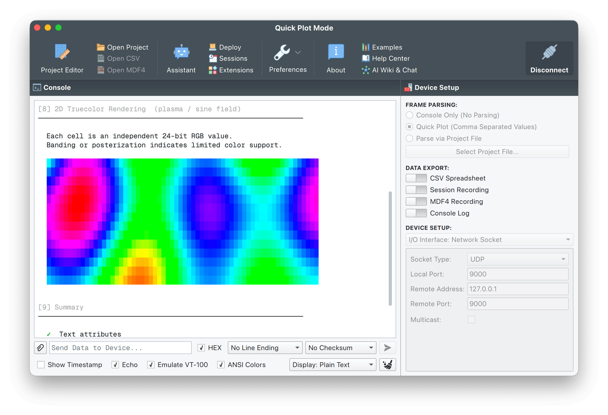

# ANSI Color & VT-100 Test Suite

This example exercises Serial Studio's ANSI color and VT-100 terminal emulation support.



## Features Tested

### Text Attributes
- Normal, bold, dim, italic, underline (single, double, curly)
- Blink, reverse, hidden, strikethrough
- Combined attributes (bold + underline, bold + reverse, italic + strikethrough)

### 4-bit Colors (Standard ANSI)
- Standard foreground colors (30-37): Black, Red, Green, Yellow, Blue, Magenta, Cyan, White
- Bright foreground colors (90-97): Bright variants of all standard colors
- Standard background colors (40-47)
- Bright background colors (100-107)
- FG × BG matrix: every foreground rendered over every background

### 8-bit Colors (256 Color Palette)
- System colors (0-15)
- 6×6×6 RGB color cube (16-231): 216 colors
- 24-step grayscale ramp (232-255)
- Rendered as background swatches: `\033[48;5;Nm`

### 24-bit RGB Colors (True Color)
- RGB foreground: `\033[38;2;R;G;Bm`
- RGB background: `\033[48;2;R;G;Bm`
- Full 16.7 million color support

### VT-100 Control Sequences
- Cursor up (`\033[1A`) and cursor back (`\033[3D`) with overwrite
- Erase to end of line (`\033[K`)
- Combined text styles with colors

### Visual Displays
- 4-bit FG × BG matrix table
- 256-color palette organized display
- Named truecolor swatches with their escape codes (CSS/X11 reference)
- Channel ramps and color gradients (red→blue, green→yellow, cyan→magenta, black→white, navy→orange)

### Creative Effects
- HSV hue, saturation, and value sweeps
- Animated 2D plasma field (per-cell 24-bit sine-field rendering)

## Requirements

- Python 3.6 or later
- Serial Studio with ANSI colors support

## Setup

1. **Configure Serial Studio**:
   - Open Serial Studio
   - In the **Setup** panel, select the **Network Socket** device
   - Set **Socket Type** to **UDP**
   - Set **Local Port** to **9000**
   - Click **Connect**

2. **Enable ANSI Colors**:
   - Open the **Console** pane
   - Check the **"ANSI Colors"** checkbox
   - Optionally check **"Show Timestamp"** to see colored timestamps

## Usage

### Run Full Test Suite

Run the complete test script with all color tests:

```bash
python3 test_ansi_colors.py
```

The script sends a full suite of ANSI color and VT-100 test sequences to Serial Studio via UDP. Watch the console pane to see:

- All color combinations rendered with their ANSI codes
- Background colors behind text
- Rainbow effects and gradients
- VT-100 cursor movement demonstrations

### Command-Line Options

You can also run individual test sections:

```bash
# Text attributes (bold, italic, underline, ...)
python3 test_ansi_colors.py --attributes

# 16-color foreground, background, and FG x BG matrix
python3 test_ansi_colors.py --4bit

# 4-bit FG x BG color matrix only
python3 test_ansi_colors.py --matrix

# 256-color (8-bit) palette
python3 test_ansi_colors.py --256

# 24-bit truecolor ramps, gradients, HSV sweeps
python3 test_ansi_colors.py --truecolor

# Named truecolor samples (CSS/X11 reference)
python3 test_ansi_colors.py --named

# VT-100 cursor, erase, and attribute sequences
python3 test_ansi_colors.py --vt100

# 2D truecolor rendering test (sine-field plasma)
python3 test_ansi_colors.py --plasma

# Show help message
python3 test_ansi_colors.py --help
```

## How It Works

The script sends formatted test sequences as UDP datagrams to `127.0.0.1:9000`. Each test section includes:

1. **Visual output**: Colored text/backgrounds displayed in the terminal
2. **ANSI codes**: The escape sequences used (e.g., `\033[38;2;255;20;147m`)
3. **Descriptions**: What each test demonstrates

## Color Code Reference

### 4-bit Foreground
```
\033[30m  Black          \033[90m  Bright Black
\033[31m  Red            \033[91m  Bright Red
\033[32m  Green          \033[92m  Bright Green
\033[33m  Yellow         \033[93m  Bright Yellow
\033[34m  Blue           \033[94m  Bright Blue
\033[35m  Magenta        \033[95m  Bright Magenta
\033[36m  Cyan           \033[96m  Bright Cyan
\033[37m  White          \033[97m  Bright White
```

### 4-bit Background
```
\033[40m   Black BG      \033[100m  Bright Black BG
\033[41m   Red BG        \033[101m  Bright Red BG
\033[42m   Green BG      \033[102m  Bright Green BG
\033[43m   Yellow BG     \033[103m  Bright Yellow BG
\033[44m   Blue BG       \033[104m  Bright Blue BG
\033[45m   Magenta BG    \033[105m  Bright Magenta BG
\033[46m   Cyan BG       \033[106m  Bright Cyan BG
\033[47m   White BG      \033[107m  Bright White BG
```

### 8-bit Colors
```
\033[38;5;Nm     Set foreground to color N (0-255)
\033[48;5;Nm     Set background to color N (0-255)
```

**Color ranges:**
- 0-7: Standard colors
- 8-15: Bright colors
- 16-231: 6×6×6 RGB cube (calculated as: 16 + 36×r + 6×g + b, where r,g,b ∈ [0,5])
- 232-255: Grayscale ramp (24 shades from dark to light)

### 24-bit RGB Colors
```
\033[38;2;R;G;Bm    Set foreground to RGB(R, G, B)
\033[48;2;R;G;Bm    Set background to RGB(R, G, B)
```

Where R, G, B are values from 0-255.

### Combined Colors
Multiple codes can be combined with semicolons:
```
\033[31;47m              Red text on white background
\033[1;32m               Bold green text
\033[38;5;206;48;5;57m   8-bit pink on blue
\033[38;2;255;82;197;48;2;155;106;0m   RGB pink on brown
```

### Reset
```
\033[0m   Reset all attributes (color, bold, etc.)
```

## Example Output

When you run the test, you should see colorful output in the Serial Studio console like:

```
[2] 4-bit Colors  (16 standard ANSI colors)
────────────────────────────────────────────────────────────────

  Foreground — normal (30–37):
    Black           \033[30m
    Red             \033[31m
    Green           \033[32m
...
```

Each color will be rendered in its actual color, with backgrounds displaying behind text.

## Customization

You can modify `test_ansi_colors.py` to:

- Change the UDP host/port (`HOST`/`PORT` constants, default `127.0.0.1:9000`)
- Add custom color combinations
- Adjust timing delays between messages
- Create your own color effects

## Technical Details

Serial Studio's ANSI color implementation:

- **Color accuracy**: Full 24-bit RGB support (16.7M colors)
- **Standards compliance**: VT-100/ANSI X3.64 escape sequences
- **Background rendering**: Separate passes for backgrounds and text to prevent overlap
- **Optional**: Colors are only processed when "ANSI Colors" is enabled

## See Also

- [VT-100 Escape Sequences](https://en.wikipedia.org/wiki/ANSI_escape_code)
- [256 Color Palette Reference](https://en.wikipedia.org/wiki/ANSI_escape_code#8-bit)
- Serial Studio documentation: https://serial-studio.com
