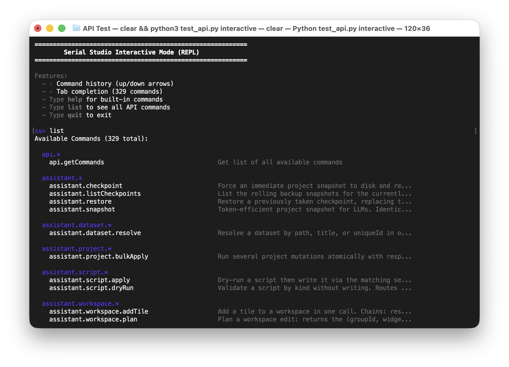

# Serial Studio API Client

**Difficulty:** 🟡 Intermediate | **Time:** ~10 minutes | **License:** GPL / Pro

A Python client for the Serial Studio API that lets external programs control and configure Serial Studio over a TCP connection. It provides an interactive REPL, a command-line interface, and automated testing.



## What is this?

The Serial Studio API exposes a TCP server on port 7777 (default) that allows external programs to:
- Read and modify Serial Studio configuration (UART settings, network settings, etc.)
- Query connection status and available devices
- Control the I/O manager (connect, disconnect, pause)
- Send data to connected devices
- Configure device drivers (UART, Network, BLE, Modbus, CAN Bus, MQTT)
- Control export modules (CSV, MDF4)

This Python client provides:

1. **Interactive REPL**: Explore the API with autocomplete-like features
2. **CLI Client**: Send single commands or batches from the terminal
3. **Test Suite**: Automated testing to verify API functionality

## Quick Start

### Prerequisites

1. **Serial Studio** running with API Server enabled
   - Open Serial Studio
   - Open **Preferences**, **General** tab, **Advanced** section
   - Toggle **Enable API Server (Port 7777)**
   - The server listens on port 7777

2. **Python 3.8 or later** (no additional dependencies required)

### Test the Connection

```bash
cd "examples/API Test"
python test_api.py send io.getStatus
```

Expected output:
```json
{
  "isConnected": false,
  "paused": false,
  "busType": 0,
  "configurationOk": false
}
```

## Live Monitor Mode

Monitor Serial Studio in real-time with automatic status updates:

```bash
# Start live monitor (default 1 second updates)
python test_api.py monitor

# Fast updates (every 500ms)
python test_api.py monitor --interval 500

# Compact mode (append instead of clearing screen)
python test_api.py monitor --compact
```

### Monitor Display

The live monitor shows:
- **Connection Status**: Real-time connection state with visual indicators
- **Bus Configuration**: Current I/O interface and settings
- **Driver Details**: Port, baud rate, IP address, etc. (based on active driver)
- **Export Status**: CSV/MDF4 export activity
- **Change Notifications**: Alerts when connection or pause state changes
- **Update Statistics**: Frame count and update interval

Press `Ctrl+C` to exit the monitor.

## Interactive Mode (REPL)

The interactive mode provides an easy way to explore and experiment with the API with a full-featured shell:

```bash
python test_api.py interactive
```

### Features

- **Command History**: Use ↑/↓ arrow keys to navigate through previous commands (requires readline)
- **Tab Completion**: Press Tab to autocomplete command names
- **Colored Output**: Syntax-highlighted responses and error messages
- **Persistent History**: Commands are saved between sessions in `~/.serial_studio_api_history`

### REPL Commands

Inside the REPL, you can use these special commands:

| Command | Description |
|---------|-------------|
| `help` | Show help and available commands |
| `list` | List all API commands with descriptions |
| `clear` | Clear the screen |
| `quit` / `exit` | Exit the REPL |

### Example REPL Session

```bash
$ python test_api.py interactive

Connecting to 127.0.0.1:7777...
Connected!

==========================================================
        Serial Studio Interactive Mode (REPL)
==========================================================

ss> io.getStatus
{
  "isConnected": false,
  "paused": false,
  "busType": 0,
  "configurationOk": false,
  "readOnly": false,
  "readWrite": false,
  "busTypeName": "Serial Port"
}

ss> io.uart.setBaudRate {"baudRate": 115200}
{
  "baudRate": 115200
}

ss> io.uart.getConfig
{
  "port": "",
  "baudRate": 115200,
  "dataBits": 8,
  "parity": "None",
  "stopBits": 1,
  "flowControl": "None"
}

ss> list
Available Commands (...):

  api.*
    api.getCommands       Get list of all available commands

  io.*
    io.connect            Open the configured connection
    io.disconnect         Close the current connection
    io.getStatus          Get connection state and bus type
  ...

ss> quit
Goodbye!
```

## Command-Line Usage

### Send Single Commands

```bash
# Query connection status
python test_api.py send io.getStatus

# Set UART baud rate (key=value format - works on all shells)
python test_api.py send io.uart.setBaudRate -p baudRate=115200

# Set network address
python test_api.py send io.network.setRemoteAddress -p address=192.168.1.100

# Multiple parameters
python test_api.py send io.modbus.addRegisterGroup -p type=0 startAddress=0 count=10

# Boolean parameters
python test_api.py send io.setPaused -p paused=true

# JSON format (alternative)
python test_api.py send io.uart.setBaudRate --params '{"baudRate": 115200}'
```

### List Available Commands

```bash
# Show all API commands with descriptions
python test_api.py list

# Output as JSON (for scripting); --json goes before the mode
python test_api.py --json list
```

### Batch Commands from File

Execute multiple commands from a JSON file:

```bash
python test_api.py batch commands.json
```

Example `commands.json`:
```json
[
  {
    "command": "io.setBusType",
    "id": "set-bus",
    "params": {"busType": 0}
  },
  {
    "command": "io.uart.setBaudRate",
    "id": "set-baud",
    "params": {"baudRate": 115200}
  },
  {
    "command": "io.uart.getConfig",
    "id": "get-config"
  }
]
```

### Live Monitor

```bash
# Monitor connection status in real-time
python test_api.py monitor

# Fast updates (500ms)
python test_api.py monitor --interval 500

# Compact output (no screen clearing)
python test_api.py monitor --compact
```

### Run Smoke Tests

The `test` mode is a small smoke suite, not a per-command verifier. It
introspects the live server with `api.getCommands`, then exercises:

- protocol invariants (unknown command -> structured error, response IDs
  match request IDs, batch order is preserved);
- one read-only command per scope (`io.getStatus`, `dashboard.getStatus`,
  `project.exportJson`, `console.getConfig`, ...), skipped automatically
  when the command isn't registered (GPL build, feature off, missing Pro
  tier);
- error-shape behavior (missing required param and type-mismatched param
  both come back as structured errors).

```bash
# Run smoke tests
python test_api.py test

# Verbose output (logs each request/response); --verbose goes before the mode
python test_api.py --verbose test
```

If a command vanishes from the C++ registry, the corresponding line in
the suite reports it as `not registered` -- which is the right signal
without needing per-handler test code that constantly drifts. For
exhaustive end-to-end coverage of every command, see the integration
test suite under `tests/integration/`.

## Available API Commands

Use `python test_api.py list` to see all commands, or run `python test_api.py interactive` and type `list` in the REPL.

### Core API (GPL)
- `io.*` - I/O manager (`connect`, `disconnect`, `setPaused`, `setBusType`, `writeData`, `getStatus`, `listBuses`)
- `io.uart.*` - UART/Serial driver
- `io.network.*` - Network (TCP/UDP) driver
- `io.ble.*` - Bluetooth Low Energy driver
- `console.*` - Console/terminal control
- `dashboard.*` - Dashboard introspection
- `project.*` - Project model & editor
  - `project.exportJson`, `project.validate`, `project.template.list`, `project.template.apply`
  - `project.source.*` - Multi-source list/add/update/delete
  - `project.group.*` - Group add/list/update/delete/duplicate
  - `project.dataset.*` - Dataset add/list/update/delete/duplicate/setOption
  - `project.action.*` - Action add/list/update/delete
  - `project.workspace.*` - Workspace add/list/update/delete
  - `project.frameParser.*` - Frame parser get/set/dryRun
- `extensions.*` - Extension repository management
- `notifications.*` - Notification center
- `ui.window.*` - Dashboard window layout
- `licensing.*` - License inspection (mutations are AI-blocked)
- `scripts.*` - Read-only script asset access

### Pro Features (Commercial License Required)
- `io.modbus.*` - Modbus RTU/TCP driver
- `io.canbus.*` - CAN Bus driver
- `io.audio.*` - Audio input/output driver
- `io.usb.*` - Raw USB driver
- `io.hid.*` - HID driver
- `io.process.*` - Process I/O driver
- `project.mqtt.publisher.*` / `project.mqtt.subscriber.*` - MQTT publisher/subscriber configuration (`getConfig`, `setConfig`, `getStatus`)
- `sessions.*` - Session database browse/replay/export

For the full reference with parameters and examples, see [API-Reference.md](../../doc/help/API-Reference.md).

## Common Usage Examples

### Example 1: Configure UART Connection

```bash
# Interactive mode
python test_api.py interactive

ss> io.setBusType {"busType": 0}
ss> io.uart.setBaudRate {"baudRate": 115200}
ss> io.uart.setParity {"parityIndex": 0}
ss> io.uart.setDataBits {"dataBitsIndex": 3}
ss> io.uart.setStopBits {"stopBitsIndex": 0}
ss> io.uart.listPorts
ss> io.uart.setPortIndex {"portIndex": 0}
ss> io.connect
```

### Example 2: Configure Network (TCP) Connection

```bash
# Command-line mode
python test_api.py send io.setBusType -p busType=1
python test_api.py send io.network.setSocketType -p socketTypeIndex=0
python test_api.py send io.network.setRemoteAddress -p address=192.168.1.100
python test_api.py send io.network.setTcpPort -p port=8080
python test_api.py send io.connect
```

### Example 3: Configure Bluetooth LE

```bash
# Interactive mode for easier device discovery
python test_api.py interactive

ss> io.setBusType {"busType": 2}
ss> io.ble.getStatus
ss> io.ble.startDiscovery
# Wait a few seconds...
ss> io.ble.listDevices
ss> io.ble.selectDevice {"deviceIndex": 0}
ss> io.ble.listServices
ss> io.ble.selectService {"serviceIndex": 0}
ss> io.ble.listCharacteristics
ss> io.ble.setCharacteristicIndex {"characteristicIndex": 0}
ss> io.connect
```

### Example 4: Configure Modbus TCP (Pro)

```bash
python test_api.py send io.setBusType -p busType=4
python test_api.py send io.modbus.setProtocolIndex -p protocolIndex=1
python test_api.py send io.modbus.setHost -p host=192.168.1.50
python test_api.py send io.modbus.setPort -p port=502
python test_api.py send io.modbus.setSlaveAddress -p address=1
python test_api.py send io.modbus.setPollInterval -p intervalMs=1000
python test_api.py send io.modbus.addRegisterGroup -p type=2 startAddress=0 count=10
python test_api.py send io.connect
```

### Example 5: Send Data to Connected Device

```bash
# Data must be Base64 encoded
echo -n "Hello World" | base64  # SGVsbG8gV29ybGQ=

python test_api.py send io.writeData -p data=SGVsbG8gV29ybGQ=
```

### Example 6: Control CSV Export

```bash
python test_api.py send csvExport.setEnabled -p enabled=true
python test_api.py send csvExport.getStatus
python test_api.py send csvExport.close
python test_api.py send csvExport.setEnabled -p enabled=false
```

### Example 7: Configure Dashboard Settings

```bash
# Get current dashboard configuration
python test_api.py send dashboard.getStatus

# Set operation mode (0=ProjectFile, 1=ConsoleOnly, 2=QuickPlot)
python test_api.py send dashboard.setOperationMode -p mode=2

# Set visualization refresh rate (FPS)
python test_api.py send dashboard.setFps -p fps=60

# Set the visible plot time window (seconds)
python test_api.py send dashboard.setTimeRange -p seconds=10

# Query individual settings
python test_api.py send dashboard.getOperationMode
python test_api.py send dashboard.getFps
python test_api.py send dashboard.getTimeRange
```

## API Protocol Reference

### Message Format

All messages are JSON objects terminated by a newline (`\n`).

#### Command Request
```json
{
  "type": "command",
  "id": "unique-request-id",
  "command": "io.getStatus",
  "params": {"paused": true}
}
```

#### Success Response
```json
{
  "type": "response",
  "id": "unique-request-id",
  "success": true,
  "result": {
    "isConnected": false,
    "paused": false
  }
}
```

#### Error Response
```json
{
  "type": "response",
  "id": "unique-request-id",
  "success": false,
  "error": {
    "code": "INVALID_PARAM",
    "message": "Invalid port: 70000. Valid range: 1-65535"
  }
}
```

### Error Codes

- `INVALID_JSON`: Malformed JSON message
- `INVALID_MESSAGE_TYPE`: Unknown or missing message type
- `UNKNOWN_COMMAND`: Command not recognized
- `INVALID_PARAM`: Parameter value out of range or invalid
- `MISSING_PARAM`: Required parameter not provided
- `EXECUTION_ERROR`: Command failed during execution
- `OPERATION_FAILED`: Operation could not be completed

### Bus Types (for `io.setBusType`)

| Index | Name | License |
|-------|------|---------|
| 0 | UART (Serial) | GPL/Pro |
| 1 | Network (TCP/UDP) | GPL/Pro |
| 2 | Bluetooth LE | GPL/Pro |
| 3 | Audio | Pro |
| 4 | Modbus (RTU/TCP) | Pro |
| 5 | CAN Bus | Pro |
| 6 | USB (raw, libusb) | Pro |
| 7 | HID (hidapi) | Pro |
| 8 | Process I/O | Pro |
| 9 | MQTT Subscriber | Pro |

Use `io.listBuses` to discover the bus types your build supports.

### Operation Modes (for `dashboard.setOperationMode`)

| Index | Name | Description |
|-------|------|-------------|
| 0 | ProjectFile | Uses a project file to define dashboard structure and data parsing |
| 1 | ConsoleOnly | No parsing. Raw bytes flow only to the terminal, no dashboard |
| 2 | QuickPlot | Automatically detects and plots CSV-formatted data |

## Troubleshooting

### Connection Issues

**Problem:** `Connection refused` or `Connection timed out`

**Solutions:**
1. Verify Serial Studio is running
2. Check API Server is enabled (Preferences → General → Advanced)
3. Confirm port number (default: 7777)
4. Try specifying host/port explicitly:
   ```bash
   python test_api.py --host 127.0.0.1 --port 7777 send io.getStatus
   ```

### Parameter Format Issues

**Problem:** "Invalid JSON parameters" error

**Solutions:**
1. Use key=value format (easier on all shells):
   ```bash
   python test_api.py send io.uart.setBaudRate -p baudRate=115200
   ```

2. On Windows PowerShell, escape JSON quotes carefully:
   ```powershell
   python test_api.py send io.uart.setBaudRate --params '{\"baudRate\": 115200}'
   ```

3. Use interactive mode for complex commands

### Command Not Found

**Problem:** `UNKNOWN_COMMAND` error

**Solutions:**
1. List all available commands:
   ```bash
   python test_api.py list
   ```

2. Check if the command requires a Pro license ([API-Reference.md](../../doc/help/API-Reference.md))

3. Verify command spelling and case (commands are case-sensitive)

## Advanced Usage

### Scripting with JSON Output

```bash
# Get status and extract specific field (--json goes before the mode)
STATUS=$(python test_api.py --json send io.getStatus)
IS_CONNECTED=$(echo $STATUS | jq -r '.result.isConnected')

if [ "$IS_CONNECTED" = "true" ]; then
    echo "Already connected"
else
    python test_api.py --json send io.connect
fi
```

### Automation Scripts

```bash
#!/bin/bash
# Example: Create a script to configure and connect to your device

python test_api.py send io.setBusType -p busType=0
python test_api.py send io.uart.setBaudRate -p baudRate=115200
python test_api.py send io.uart.setPortIndex -p portIndex=0
python test_api.py send csvExport.setEnabled -p enabled=true
python test_api.py send io.connect

echo "Setup complete! Device connected and logging to CSV."
```

### Custom Integration

```python
#!/usr/bin/env python3
# Example: Create your own Python wrapper for the Serial Studio API
import socket
import json

def send_command(command, params=None):
    """Send a command to Serial Studio API and return the response."""
    sock = socket.socket(socket.AF_INET, socket.SOCK_STREAM)
    sock.connect(("127.0.0.1", 7777))

    msg = {
        "type": "command",
        "id": "custom-1",
        "command": command
    }
    if params:
        msg["params"] = params

    sock.sendall((json.dumps(msg) + "\n").encode())
    response = json.loads(sock.recv(65536).decode())
    sock.close()

    return response

# Example usage
status = send_command("io.getStatus")
print(f"Connected: {status['result']['isConnected']}")

send_command("io.uart.setBaudRate", {"baudRate": 115200})

# Add your application logic here
```

## Security Considerations

1. **Localhost Only**: The API Server binds to localhost (127.0.0.1) by default and is not accessible from the network

2. **No Authentication**: The API does not require authentication - anyone with local access can control Serial Studio

3. **Firewall**: Ensure your firewall blocks external access to port 7777

4. **Production Use**: Do not expose the API Server to untrusted networks

## Files in This Example

- `test_api.py` - Main Python client (CLI, REPL, tests)
- `README.md` - This documentation file
- `doc/screenshot.png` - Screenshot used in this README

The complete API command reference lives at [doc/help/API-Reference.md](../../doc/help/API-Reference.md).

## License

This example is dual-licensed:
- **GPL-3.0-only**: For use with Serial Studio GPL builds
- **LicenseRef-SerialStudio-Commercial**: For use with Serial Studio Pro

See the main LICENSE file in the repository root for details.

## More Information

- **Serial Studio Wiki**: https://github.com/Serial-Studio/Serial-Studio/wiki
- **API Documentation**: https://github.com/Serial-Studio/Serial-Studio/wiki/API-Reference
- **Issue Tracker**: https://github.com/Serial-Studio/Serial-Studio/issues

## Contributing

Found a bug or have a suggestion? Please report it on the [GitHub issue tracker](https://github.com/Serial-Studio/Serial-Studio/issues).
