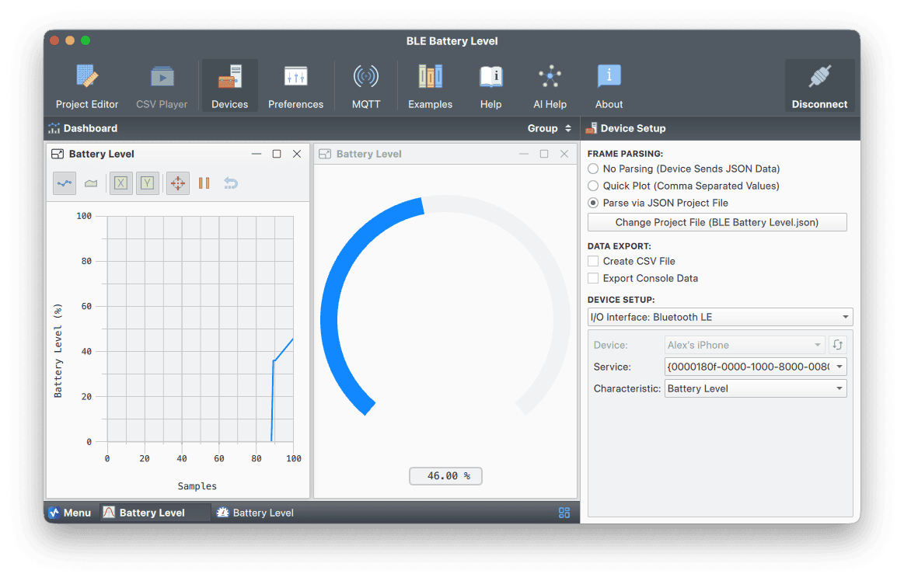

# BLE Battery Level Monitor

This [Serial Studio](https://github.com/Serial-Studio/Serial-Studio) project visualizes the **battery level from BLE devices**, like iPhones, by connecting directly over [Bluetooth Low Energy](https://en.wikipedia.org/wiki/Bluetooth_Low_Energy).



## What It Does

- Connects directly to BLE devices using Serial Studio's native BLE support.
- Subscribes to the Battery Level characteristic (0x2A19).
- Displays the battery percentage (0–100%) using a real-time gauge and a plot.
- Parses raw binary data with no need for delimiters or framing

Works with any device that exposes the standard BLE Battery Service.

## BLE Battery Service Overview

Bluetooth Low Energy defines a standard Battery Service:

- **Service UUID**: `0x180F`
- **Characteristic UUID**: `0x2A19` — Battery Level (`uint8`, `0–100`)

Most BLE-enabled phones and peripherals support this. Serial Studio connects directly to this characteristic and decodes the raw value with a 1-byte binary read.

## Project Configuration

| Setting             | Value            |
|---------------------|------------------|
| Data Conversion     | Binary (Direct)  |
| Frame Detection     | No Delimiters    |
| Checksum            | None             |
| Dataset Index       | 1                |
| Value Range         | 0–100            |
| Widget              | Gauge, Plot      |
| Units               | %                |
| Title               | Battery Level    |

**Parser logic**:

```js
/**
 * @brief Converts a byte-like iterable into an array of numbers.
 * 
 * @param frame An iterable containing byte values (0–255).
 * @return Array of numeric byte values.
 */
function parse(frame) {
    return Array.from(frame);
}
```

### Setup
1. Select Bluetooth LE as the input source.
2. Choose your BLE device (e.g. your iPhone) and click Connect.
3. Select the Battery Service (0x180F).
4. Select the Battery Level characteristic (0x2A19).
5. Watch the gauge display the battery level in real time.
