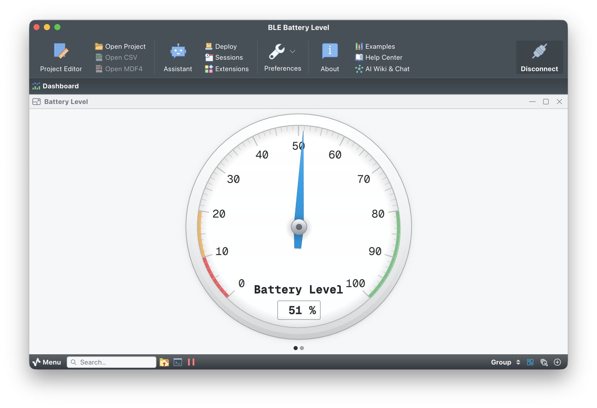

# BLE Battery Level Monitor

This [Serial Studio](https://github.com/Serial-Studio/Serial-Studio) project visualizes the battery level from BLE devices (like iPhones) over [Bluetooth Low Energy](https://en.wikipedia.org/wiki/Bluetooth_Low_Energy).



## What it does

- Connects to BLE devices using Serial Studio's native BLE support.
- Subscribes to the Battery Level characteristic (0x2A19).
- Shows the battery percentage (0 to 100) on a live gauge and a plot.
- Parses raw binary data with no delimiters or framing.

Works with any device that exposes the standard BLE Battery Service.

## BLE Battery Service

Bluetooth Low Energy defines a standard Battery Service:

- **Service UUID:** `0x180F`.
- **Characteristic UUID:** `0x2A19`. Battery Level (`uint8`, 0 to 100).

Most BLE-enabled phones and peripherals support it. Serial Studio connects to the characteristic and decodes the raw value with a 1-byte binary read.

## Project configuration

| Setting           | Value           |
|-------------------|-----------------|
| Data Conversion   | Binary (Direct) |
| Frame Detection   | No Delimiters   |
| Checksum          | None            |
| Dataset Index     | 1               |
| Value Range       | 0 to 100        |
| Widget            | Gauge, Plot     |
| Units             | %               |
| Title             | Battery Level   |

**Parser:**

```js
/**
 * @brief Converts a byte-like iterable into an array of numbers.
 *
 * @param frame An iterable containing byte values (0 to 255).
 * @return Array of numeric byte values.
 */
function parse(frame) {
    return Array.from(frame);
}
```

### Setup

1. Select Bluetooth LE as the input source.
2. Pick your BLE device (for example your iPhone) and click Connect.
3. Pick the Battery Service (0x180F).
4. Pick the Battery Level characteristic (0x2A19).
5. Watch the gauge update in real time.
