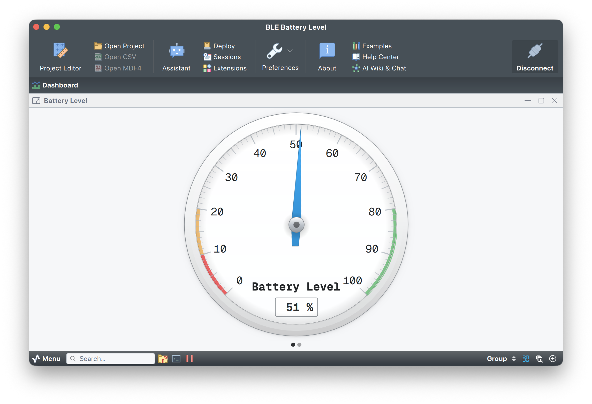

# BLE Battery Level Monitor

This [Serial Studio](https://github.com/Serial-Studio/Serial-Studio) project visualizes the battery level from BLE devices (like iPhones) over [Bluetooth Low Energy](https://en.wikipedia.org/wiki/Bluetooth_Low_Energy).



## What it does

- Connects to BLE devices using Serial Studio's native BLE support.
- Reads the Battery Level characteristic (0x2A19).
- Shows the battery percentage (0 to 100) on a live gauge.
- Parses raw binary data with no delimiters or framing.

The project includes a control loop that selects the service and characteristic for you on connect.

## BLE service

Bluetooth Low Energy exposes battery level through the Battery Level characteristic, `0x2A19` (`uint8`, 0 to 100):

- **Service UUID:** `0x180F` (Battery Service), the standard service most BLE devices expose battery data under. Exception: an iPhone under test advertises its battery characteristic under the Device Information Service, `0x180A`, instead; if you're connecting to one, change `BATTERY_SERVICE_UUID` in the control loop (and the project's stored service UUID) to `0x180A`.
- **Characteristic UUID:** `0x2A19`. Battery Level (`uint8`, 0 to 100).

The bundled control loop picks the configured service, selects its first characteristic, subscribes to notifications, and independently polls the characteristic once per second regardless of subscription status. The frame parser and project settings decode the resulting 1-byte value.

## Project configuration

| Setting           | Value           |
|-------------------|-----------------|
| Data Conversion   | Binary (Direct) |
| Frame Detection   | No Delimiters   |
| Checksum          | None            |
| Frame Index       | 1               |
| Value Range       | 0 to 100        |
| Widget            | Gauge           |
| Units             | %               |
| Title             | Battery Level   |

**Parser:**

```js
/**
 * @brief Converts a byte-like iterable into an array of numbers.
 *
 * @param frame An iterable containing byte values (0–255).
 * @return Array of numeric byte values.
 */
function parse(frame) {
    return Array.from(frame);
}
```

### Setup

1. Open Serial Studio and load `BLE Battery Level.ssproj`.
2. Select Bluetooth LE as the input source.
3. Pick your BLE device (for example your iPhone) and click Connect.
4. The control loop selects the service (`0x180F` as shipped) and its battery characteristic (`0x2A19`) automatically. Connecting to an iPhone? See the note above about switching to `0x180A`.
5. Watch the gauge update in real time.
