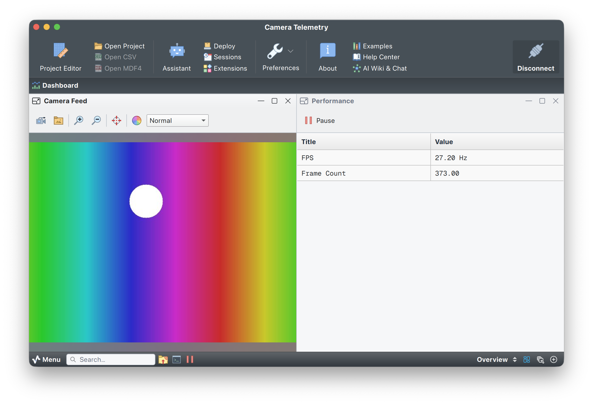

# Camera telemetry

## Overview

Streams live camera video to Serial Studio over UDP as fast as possible. Only FPS and frame count are sent alongside the image.

No microcontroller needed. A standard webcam or built-in laptop camera is all you need. A synthetic test pattern is available when no camera is connected (`--no-camera`).



---

## What it streams

### Image data (Image View widget)

Raw JPEG frames sent directly over UDP. The Image View widget uses **autodetect** mode: it finds frames by their `FF D8 FF` magic bytes and `FF D9` end-of-image marker, independently of the CSV telemetry parser.

### Telemetry (Performance group)

| Index | Metric      | Description                        |
|-------|-------------|------------------------------------|
| 1     | FPS         | Actual stream frame rate           |
| 2     | Frame Count | Total frames sent since start      |

---

## Frame format

Two types of data share the same UDP byte stream:

**JPEG image frame.** Raw bytes, no extra framing. Autodetected by magic bytes.

**CSV telemetry frame.** Wrapped in a 3-byte start sentinel and 2-byte end sentinel:

```
AB CD EF  fps,frame_count  FE ED
```

Example (hex):

```
AB CD EF 32 39 2E 38 2C 31 30 32 34 FE ED
         2  9  .  8  ,  1  0  2  4
```

The sentinels are chosen so they're statistically impossible to occur in JPEG, PNG, BMP, or WebP compressed data. `AB CD EF` isn't a valid JPEG marker sequence and doesn't arise from JPEG byte-stuffing rules. The FrameReader extracts only bytes between the two sentinels. The ImageFrameReader ignores ASCII telemetry packets since they carry no image magic bytes.

---

## How to run

### Step 1: install dependencies

```bash
pip install opencv-python
```

### Step 2: start the script

```bash
python3 camera_telemetry.py
```

**Options:**

| Option           | Default | Description                       |
|------------------|---------|-----------------------------------|
| `--camera INDEX` | `0`     | Camera device index               |
| `--port PORT`    | `9000`  | UDP destination port              |
| `--fps FPS`      | `30`    | Target frame rate                 |
| `--quality Q`    | `85`    | JPEG quality (1 to 100)           |
| `--no-camera`    | off     | Use a synthetic test pattern      |

```bash
python3 camera_telemetry.py --no-camera          # no hardware needed
python3 camera_telemetry.py --camera 1           # secondary camera
python3 camera_telemetry.py --fps 60             # push a higher rate
python3 camera_telemetry.py --quality 60         # smaller packets
```

### Step 3: configure Serial Studio

1. Open Serial Studio and load `Camera Telemetry.ssproj`.
2. In the **Setup** panel, set **Bus Type** → **Network Socket**, **Socket Type** → **UDP**.
3. Set **Port** to `9000` (or whatever `--port` you used).
4. Click **Connect**.

---

## Performance tips

- Lowering `--quality` cuts JPEG size and UDP fragmentation pressure. Quality 60 to 75 is usually enough for 640x480 preview.
- Frames wider than 640 px are automatically downscaled before encoding.
- The synthetic pattern (`--no-camera`) animates a color gradient with a moving circle. Useful for testing without any camera hardware.

---

## Dependencies

- Python 3.8 or later.
- [`opencv-python`](https://pypi.org/project/opencv-python/). `pip install opencv-python`.

---

## License

Copyright (C) 2020-2025 Alex Spataru
SPDX-License-Identifier: GPL-3.0-only OR LicenseRef-SerialStudio-Commercial
