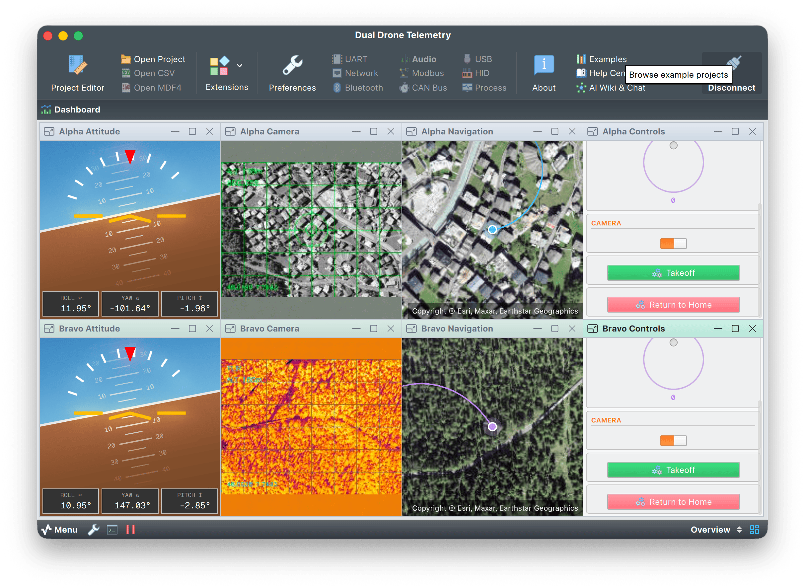

# Dual Drone Telemetry

Multi-source drone telemetry simulator demonstrating Serial Studio's ability to receive and visualize data from two independent devices simultaneously, each with its own camera feed, GPS coordinates, flight dynamics, and battery monitoring.



## Overview

Two simulated drones fly completely different flight profiles over the Swiss Alps near Zermatt, each transmitting telemetry and synthetic camera imagery over separate TCP connections:

| Drone | Port | Flight Pattern | Altitude | Camera Style |
|-------|------|---------------|----------|-------------|
| **Alpha** | 9001 | Circular patrol (~330 m radius) | 120 m AGL | Satellite imagery + green HUD |
| **Bravo** | 9002 | Figure-8 survey (~550 m radius) | 200 m AGL | Thermal/IR remap (iron-bow palette) |

### Camera Feeds

Camera images are fetched from ArcGIS World Imagery satellite tiles (free, no API key required) and cached locally. Each drone's view is centered on its GPS position and rotated to match heading.

**Alpha Satellite** — photorealistic satellite camera view:
- Real satellite imagery centered on drone position, rotated to heading
- Green military-style HUD overlay with altitude, heading, and GPS coordinates

**Bravo Thermal** — thermal/IR remap of satellite imagery:
- Same satellite data remapped to iron-bow thermal palette
- Iron-bow color palette via OpenCV COLORMAP_INFERNO
- Amber FLIR-style HUD overlay with altitude, heading, and GPS coordinates

### Output Controls

Each drone has an output control panel on the dashboard with four interactive widgets that send commands back to the simulator:

| Control | Widget Type | Range | Command Sent |
|---------|------------|-------|-------------|
| **Throttle** | Slider | 0-100% | `THR <value>\r\n` |
| **Heading** | Knob | -180° to +180° | `HDG <value>\r\n` |
| **Camera** | Toggle | ON/OFF | `CAM ON\r\n` or `CAM OFF\r\n` |
| **Takeoff** | Button | — | `TKO\r\n` |
| **Return to Home** | Button | — | `RTH\r\n` |

**Throttle** scales the drone's airspeed — 50% is normal cruise, 0% is idle, 100% is full speed. **Heading** applies a rotational offset to the flight path. **Camera** enables or disables the synthetic JPEG feed (telemetry keeps streaming). **Takeoff** launches from the helipad (only when grounded). **RTH** triggers return-to-home, landing, and automatic battery recharge.

### Telemetry per drone (11 fields)

| Field | Units | Description |
|-------|-------|-------------|
| Latitude | deg | GPS latitude |
| Longitude | deg | GPS longitude |
| Heading | deg | Compass heading (0-360) |
| Altitude | m | Altitude above ground |
| Airspeed | m/s | Forward speed |
| Vertical Speed | m/s | Climb/descent rate |
| Roll | deg | Bank angle |
| Pitch | deg | Nose up/down angle |
| Battery Voltage | V | 6S LiPo (18-25.2 V) |
| Current Draw | A | Motor + avionics current |
| Battery % | % | Remaining charge (drains over time) |

## Quick Start

1. Run the simulator (starts two TCP servers on ports 9001 and 9002):

```bash
pip install opencv-python numpy   # for camera imagery
python3 dual_drone_telemetry.py
```

2. Open `Dual Drone Telemetry.ssproj` in Serial Studio
3. Connect both TCP sources — each will connect to the simulator's TCP server

The simulator works without opencv -- you just won't get camera images.

## Command-Line Options

| Flag | Default | Description |
|------|---------|-------------|
| `--fps` | 10 | Update rate in Hz (telemetry + camera) |
| `--host` | 127.0.0.1 | TCP listen address |

## Protocol Details

Both drones use hexadecimal frame delimiters with JPEG images interleaved in the same byte stream:

- **Alpha**: `A1 01 A1 01` (start) / `A1 02 A1 02` (end)
- **Bravo**: `B2 03 B2 03` (start) / `B2 04 B2 04` (end)

Each cycle sends a delimited JPEG camera frame, then a delimited CSV telemetry frame. Image delimiters are separate from the CSV delimiters:

- **Alpha images**: `A1 CA FE 01` (start) / `A1 FE ED 01` (end)
- **Bravo images**: `B2 CA FE 02` (start) / `B2 FE ED 02` (end)

## Command Protocol

Serial Studio sends commands back to the simulator over the same TCP connection. Each command is a text line terminated by `\r\n`:

| Command | Arguments | Effect |
|---------|-----------|--------|
| `THR` | `0`-`100` | Set throttle (scales airspeed; 50 = normal cruise) |
| `HDG` | `-180`-`180` | Apply heading offset in degrees |
| `CAM` | `ON` or `OFF` | Enable/disable camera image transmission |
| `TKO` | — | Launch from helipad (only when grounded) |
| `RTH` | — | Return to helipad, land, and recharge battery |

Commands are parsed on each simulation tick. Multiple commands can arrive per tick and are applied in order.

## Dashboard Widgets

Each drone has six widget groups on the dashboard:

| Widget | Type | Description |
|--------|------|-------------|
| Camera | Image View | Live satellite (Alpha) or thermal/IR (Bravo) camera feed |
| Position | Map | GPS track on interactive map |
| Heading | Compass | Compass heading indicator |
| Attitude | Gyroscope | Roll, pitch, and yaw (heading) visualization |
| Flight | Gauges + Bars | Airspeed, altitude, and vertical speed |
| Power | Gauges + Bars | Battery voltage, current draw, and charge level |
| Controls | Output Panel | Throttle, heading, camera toggle, and RTH per drone |

## Flight Models

Both drones start grounded at their helipads near Zermatt. Send `TKO` to launch — takeoff is intentionally very fast (reaching cruise altitude in ~2 seconds) so that dashboard changes are immediately visible during demos.

**Drone Alpha** — Zermatt village helipad (46.0207°N, 7.7491°E):
- Circular patrol at 120 m AGL
- Constant mild bank angle (~12 deg)
- Slow altitude oscillation (+/- 8 m)
- Battery drain: ~0.15%/sec in cruise

**Drone Bravo** — Trockener Steg plateau (46.0035°N, 7.7465°E):
- Figure-8 survey at 200 m AGL
- Dynamic banking (up to +/- 40 deg)
- Higher altitude variation (+/- 15 m)
- Faster speed, higher current draw
- Battery drain: ~0.18%/sec in cruise

Both drones have low-battery alarms configured at 20% charge and 21V. Send `RTH` to return, land, and automatically recharge for another flight.

## Requirements

- Python 3.6+
- `opencv-python` and `numpy` (optional, for camera imagery)
- Serial Studio Pro (multi-source + Image View + Output Controls features)

<!--
  SPDX-License-Identifier: GPL-3.0-only OR LicenseRef-SerialStudio-Commercial
-->
