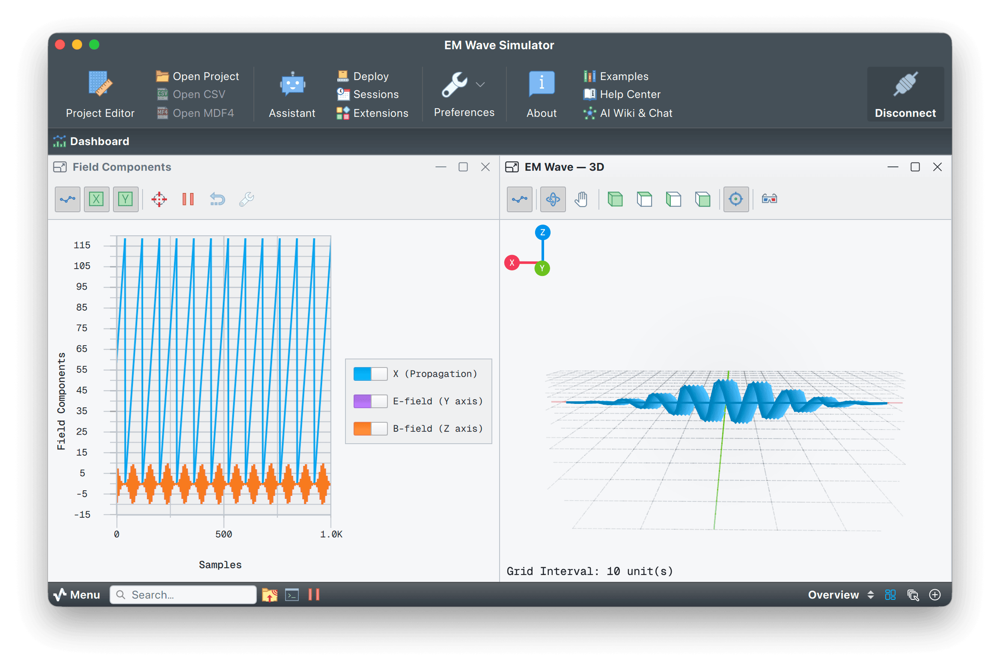

# EM wave simulator

A Python script that simulates a propagating electromagnetic plane wave (photon wave packet) and streams the field data over UDP for real-time 3D visualization in Serial Studio.



## Overview

This example visualizes a Gaussian-enveloped linearly polarized electromagnetic wave packet described by Maxwell's equations:

$$
E(x,t) = E_0 \, \exp\!\Bigl(-\frac{(x - x_0 - ct)^2}{2\sigma^2}\Bigr) \sin\bigl(k(x - ct)\bigr)
$$

$$
B(x,t) = B_0 \, \exp\!\Bigl(-\frac{(x - x_0 - ct)^2}{2\sigma^2}\Bigr) \sin\bigl(k(x - ct)\bigr)
$$

The electric field oscillates along the Y axis, the magnetic field along the Z axis, and the wave propagates along the X axis. All three are mutually perpendicular, as Maxwell's equations require. The Gaussian envelope localizes the wave into a packet that travels at speed $c$, loops back after exiting the view, and repeats.

## Widgets exercised

| Widget type  | Group              | Datasets                                                   |
|--------------|--------------------|------------------------------------------------------------|
| 3D Plot      | `EM Wave — 3D`     | `X (Propagation)`, `E-field (Y axis)`, `B-field (Z axis)`  |
| Multi-Plot   | `Field Components` | the same three datasets plotted against sample index       |

## Usage

### 1. Start the simulator

The project includes a control loop that launches `em_wave_udp.py` automatically when you connect, so you normally just open the project and click **Connect**. Run it by hand only if you want custom options:

```bash
python3 em_wave_udp.py
```

**Optional arguments:**

- `--host HOST`. UDP destination (default: `127.0.0.1`).
- `--port PORT`. UDP port (default: `9000`).
- `--wavelength WAVELENGTH`. Carrier wavelength in arbitrary units (default: `12.0`).
- `--speed SPEED`. Wave propagation speed, units/s (default: `20.0`).
- `--amplitude AMPLITUDE`. E-field peak amplitude (default: `10.0`).
- `--sigma SIGMA`. Gaussian envelope width / spatial std dev (default: `20.0`).
- `--samples SAMPLES`. Spatial sample points per frame (default: `80`).
- `--interval INTERVAL`. Time between frames in seconds (default: `0.025`).

**Example:**

```bash
# Tighter wave packet with higher frequency
python3 em_wave_udp.py --wavelength 6.0 --sigma 10.0 --samples 120
```

### 2. Configure Serial Studio

1. Open Serial Studio and load `EMWaveSimulator.ssproj` as the project file.
2. Confirm the I/O source is **UDP** on local port **9000** (the project file stores this configuration).
3. Click **Connect**.

### 3. Observe

- The 3D Plot widget shows the E-field and B-field vectors oscillating in perpendicular planes as the wave packet propagates along the X axis.
- The Multi-Plot widget shows the X, E-field, and B-field waveforms over the sample window.
- The wave packet enters from the left, travels through the view, exits on the right, then loops back.

## How it works

On every frame, the simulator samples the spatial window at `--samples` evenly spaced points. For each point, it computes the Gaussian-modulated sinusoidal carrier for the E-field and B-field, then sends a CSV line:

```
x,ey,bz\n
```

Serial Studio receives one line per spatial sample (80 per frame with the default `--samples`). The 3D Plot uses the custom X-axis feature so the propagation position (`x`) drives the horizontal axis and the field amplitudes run along their respective perpendicular axes. The Multi-Plot draws the same three datasets against the sample index, giving a side view of the packet as it sweeps through the window.

## Frame format

CSV over UDP, newline-delimited:

```
x_position,e_field_y,b_field_z\n
```

## Requirements

- Python 3.6+ (no external dependencies).
