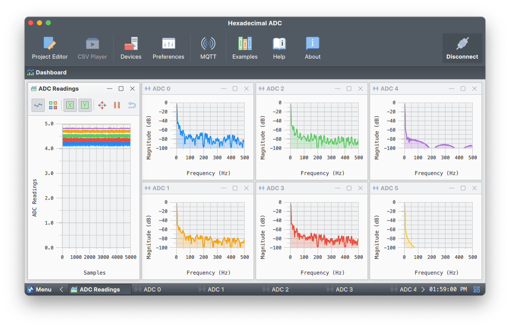

# Command-Based ADC Sampling with Timers, Actions & CRC Integrity

## Overview

This project showcases how to integrate **binary data parsing**, **custom serial actions**, **timed execution**, and **checksum validation** in a Serial Studio workflow using Arduino. It provides a complete example of how to build a robust, command-driven interface for sensor data acquisition, suitable for real-time plotting and FFT analysis.

The Arduino collects analog readings from six input channels (A0 to A5), processes the values, wraps them in a binary protocol frame with a **CRC-16-CCITT** checksum, and only sends data when explicitly commanded using a custom `"poll-data"` action. Serial Studio triggers this action either manually or via timer modes like auto-start or toggle-on-trigger.

## Key Features

- **Binary Data Parsing**: Efficient, low-overhead serial communication
- **CRC-16 Checksums**: Ensures data integrity on each frame
- **Action System**: Serial Studio dashboard buttons that send predefined commands
- **Timer Modes**: AutoStart, Toggle, and Triggered transmission
- **FFT Visualization**: Analyze analog noise or sensor signals in the frequency domain

### Compatibility

Works with any Arduino board featuring analog input pins. No external components required—floating analog pins generate natural noise, ideal for FFT demonstrations.



## Hardware Setup

### Connections

- Leave A0–A5 unconnected to capture environmental noise.
- Alternatively, attach sensors or function generators for signal injection.

## Step-by-Step Guide

### 1. Arduino Sketch ([`HexadecimalADC.ino`](HexadecimalADC.ino))

This sketch configures the ADC, listens for serial commands like `"poll-data"`, reads analog values, computes a CRC, and sends data over serial **only when asked**.

**Frame Format:**
- Start delimiter: `0xC0 0xDE`
- Sensor data: 6 bytes (mapped 10-bit → 8-bit)
- CRC-16-CCITT (2 bytes, big-endian)

**Baud Rate:** `115200`

**Trigger via Serial Studio Actions**:
- `poll-data`: Read and transmit 1 data frame
- `enable-pull-up`: Enable pull-ups on A0–A5
- `disable-pull-up`: Set A0–A5 to normal input mode

### 2. Serial Studio Configuration

#### Frame Format
- **Mode**: `Binary (direct)`
- **Start Sequence**: `0xC0 0xDE`
- **Checksum**: `CRC-16-CCITT`

#### Actions

You can define custom actions in your `.json` project to send:
- `"poll-data"` on button press or toggle
- `"poll-data"` automatically using timer
- Other configuration commands on connect

#### JavaScript Frame Parser

```javascript
/**
 * Convert each byte (0–255) into a voltage between 0 and 5V.
 */
function parse(frame) {
    let dataArray = [];

    for (let i = 0; i < frame.length; ++i) {
        let byte = frame[i];
        dataArray.push(byte * 5.0 / 255);
    }

    return dataArray;
}
```

For help on the parser function, see the [Serial Studio documentation](https://github.com/Serial-Studio/Serial-Studio/wiki/Project-Editor#frame-parser-function-view).

### 3. Visualize with FFT

1. Start Serial Studio.
2. Select the serial port.
3. Set baud to **115200**.
4. Click your `"poll-data"` action.
5. Use the **FFT widget** to inspect signal frequency.

## Troubleshooting

- **No output**: Ensure `poll-data` is being sent.
- **Noisy values**: Normal for floating pins; connect sensors for better control.
- **Invalid frames**: Check CRC settings and delimiters.
- **Slow updates**: Increase timer rate or switch to manual polling.
