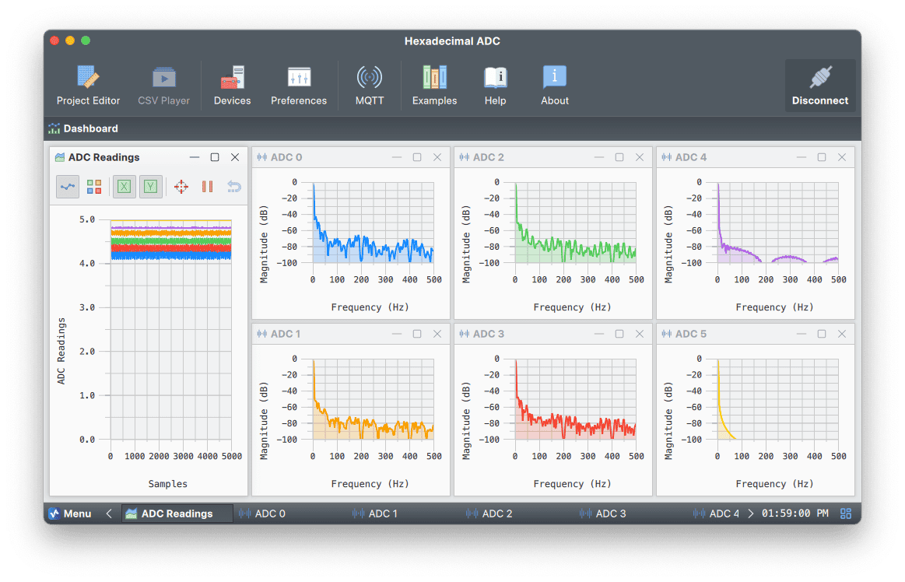

# Command-based ADC sampling with timers, actions, and CRC integrity

## Overview

This project shows how to combine binary data parsing, custom serial actions, timed execution, and checksum validation in a Serial Studio workflow with Arduino. It's a full example of a command-driven interface for sensor data acquisition, ready for real-time plotting and FFT analysis.

The Arduino reads analog values from six input channels (A0 to A5), processes them, wraps the result in a binary protocol frame with a CRC-16-CCITT checksum, and only sends data when asked via a custom `poll-data` action. Serial Studio triggers the action manually or via timer modes like auto-start or toggle-on-trigger.

## Key features

- **Binary data parsing.** Efficient, low-overhead serial communication.
- **CRC-16 checksums.** Integrity check on each frame.
- **Actions.** Dashboard buttons that send predefined commands.
- **Timer modes.** AutoStart, Toggle, and Triggered transmission.
- **FFT visualization.** Analyze analog noise or sensor signals in the frequency domain.

### Compatibility

Works with any Arduino board that has analog input pins. No external components needed: floating analog pins produce natural noise, which is ideal for FFT demos.



## Hardware setup

### Connections

- Leave A0 to A5 unconnected to capture environmental noise.
- Or attach sensors or a function generator for signal injection.

## Step by step

### 1. Arduino sketch ([`HexadecimalADC.ino`](HexadecimalADC.ino))

This sketch configures the ADC, listens for serial commands like `poll-data`, reads analog values, computes a CRC, and sends data over serial only when asked.

**Frame format:**

- Start delimiter: `0xC0 0xDE`.
- Sensor data: 6 bytes (mapped 10-bit to 8-bit).
- CRC-16-CCITT (2 bytes, big-endian).

**Baud rate:** `115200`.

**Triggers via Serial Studio actions:**

- `poll-data`: read and transmit 1 data frame.
- `enable-pull-up`: enable pull-ups on A0 to A5.
- `disable-pull-up`: set A0 to A5 to normal input mode.

### 2. Serial Studio configuration

**Frame format:**

- **Mode:** `Binary (direct)`.
- **Start sequence:** `0xC0 0xDE`.
- **Checksum:** `CRC-16-CCITT`.

**Actions.** You can define custom actions in your `.json` project to send:

- `poll-data` on button press or toggle.
- `poll-data` on a timer.
- Other configuration commands on connect.

**JavaScript frame parser:**

```javascript
/**
 * Convert each byte (0 to 255) into a voltage between 0 and 5 V.
 */
function parse(frame) {
    let dataArray = [];

    for (let i = 0; i < frame.length; ++i) {
        let byte = frame[i];
        dataArray.push(byte * 5.0 / 255);
    }

    return dataArray;
}
```

For help on the parser function, see the [Serial Studio documentation](https://github.com/Serial-Studio/Serial-Studio/wiki/Project-Editor#frame-parser-function-view).

### 3. Visualize with FFT

1. Start Serial Studio.
2. Pick the serial port.
3. Set the baud rate to 115200.
4. Click your `poll-data` action.
5. Use the FFT widget to inspect signal frequency.

## Troubleshooting

- **No output.** Make sure `poll-data` is being sent.
- **Noisy values.** Normal for floating pins. Connect sensors for more control.
- **Invalid frames.** Check CRC settings and delimiters.
- **Slow updates.** Increase the timer rate or switch to manual polling.
