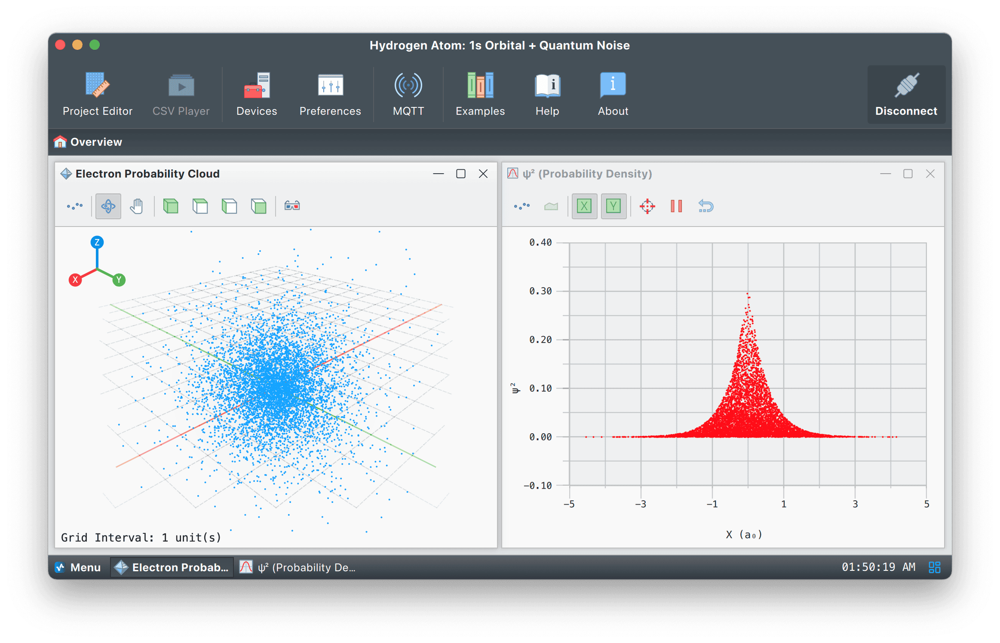

# **Hydrogen Atom: 1s Orbital**

## **Overview**

This project simulates the electron probability distribution of a hydrogen atom’s 1s orbital using Monte Carlo sampling. The data is streamed over UDP for real-time visualization in Serial Studio.

This is not a classical orbit model. Instead, it displays probabilistic electron positions derived from quantum mechanics, visualized as a dynamic 3D cloud.

**Note:** This project uses features available only under a paid license. Visit [serial-studio.com](https://serial-studio.com/) for more information.

## **Simulation Model**

The electron's radial distance from the nucleus, denoted by `r`, is sampled using the probability distribution for the 1s orbital:

$$
P(r) \propto r^2 \cdot e^{-2r / a_0}
$$

Where:  
- $$r$$: Radial distance from the nucleus.
- $$a_0$$: Bohr radius (normalized to 1.0).

Electron positions are computed in spherical coordinates, then converted to Cartesian $$(x, y, z)$$.

## **Project Features**

- Real-time 3D visualization of the electron cloud.
- Plot of probability density along the X-axis.
- 1 kHz data stream for smooth visual updates.

## **Data Format**

Each UDP frame contains five comma-separated values:

`x, y, z, psi2, r`

Where:  
- `x, y, z`: Electron position in Cartesian coordinates (in units of $$a_0$$).
- `psi2`: Probability density $$\psi^2(r) = |\psi(r)|^2$$.
- `r`: Radial distance from the nucleus (in units of $$a_0$$).

**Example:**  
`-0.283291,0.453772,0.125448,0.038142,0.621987`

## **How to Run**

1. Run the simulation:

   `python3 hydrogen.py`

2. In Serial Studio:
   - Open the `hydrogen.json` project file.
   - Set the input source to UDP, port `9000`.
   - Click **Connect**.

## **Serial Studio Visualizations**

- **3D Plot**: Displays the real-time electron cloud in space.
- **XY Plot**: Plots $$psi^2$$ vs. $$x$$, showing spatial density.

## **Files Included**

- `hydrogen.py`: Python script for simulation and UDP streaming.
- `hydrogen.json`: Serial Studio project file.
- `README.md`: Project documentation.  
- `doc/screenshot.png`: Screenshot of the visualization.

## **Notes**

- This simulation does not numerically solve the Schrödinger equation; it samples from the known analytical 1s solution.
- All spatial values are in normalized Bohr units $$a_0 = 1$$.
