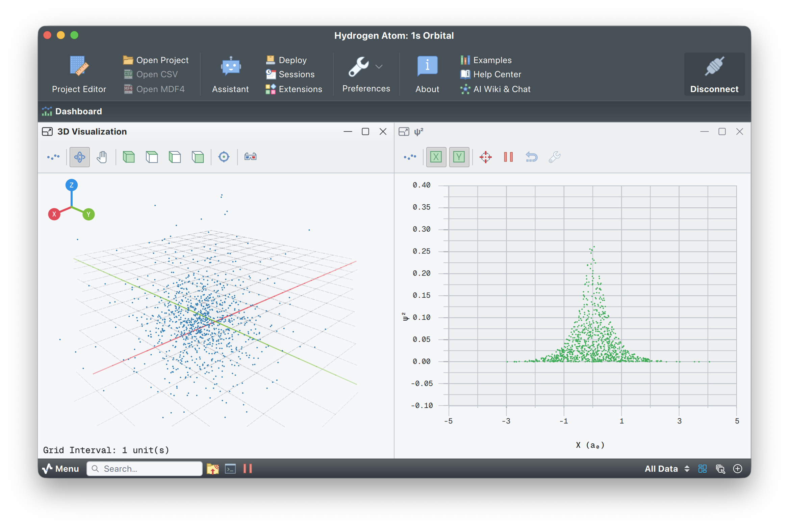

# Hydrogen atom: 1s orbital

## Overview

This project simulates the electron probability distribution of a hydrogen atom's 1s orbital using Monte Carlo sampling. The data streams over UDP for real-time visualization in Serial Studio.

It's not a classical orbit model. Instead, it shows probabilistic electron positions derived from quantum mechanics, as a dynamic 3D cloud.

> This project uses features that need a paid license. See [serial-studio.com](https://serial-studio.com/) for details.

## Simulation model

The electron's radial distance from the nucleus, `r`, is sampled from the 1s orbital probability distribution:

$$
P(r) \propto r^2 \cdot e^{-2r / a_0}
$$

Where:

- $$r$$: radial distance from the nucleus.
- $$a_0$$: Bohr radius (normalized to 1.0).

Electron positions are computed in spherical coordinates, then converted to Cartesian $$(x, y, z)$$.

## Project features

- Real-time 3D visualization of the electron cloud.
- Plot of probability density along the X-axis.
- 1 kHz data stream for smooth updates.

## Data format

Each UDP frame contains five comma-separated values:

`x, y, z, psi2, r`

Where:

- `x, y, z`: electron position in Cartesian coordinates (in units of $$a_0$$).
- `psi2`: probability density $$\psi^2(r) = |\psi(r)|^2$$.
- `r`: radial distance from the nucleus (in units of $$a_0$$). The project maps only the first four columns; `r` provides spatial context.

Example:

`-0.283291,0.453772,0.125448,0.038142,0.621987`

## How to run

The script needs Python 3.6 or later and uses only the standard library.

1. Open the `Hydrogen.ssproj` project file in Serial Studio.
2. Click **Connect**.

The project includes a control script that launches `hydrogen.py` automatically when you connect, so there is nothing to start by hand. The input source is preconfigured as UDP on local port `9000`. To run the generator yourself instead, start `python3 hydrogen.py` before connecting.

## Visualizations

- **3D Plot (`3D Visualization`).** The live electron cloud in space, driven by the `X`, `Y`, and `Z` datasets.
- **Plot (`Probability Density`).** The `ψ²` dataset plotted against `X`, showing spatial density.

## Files included

- `hydrogen.py`: Python script for simulation and UDP streaming.
- `Hydrogen.ssproj`: Serial Studio project file.
- `README.md`: project documentation.
- `doc/screenshot.png`: screenshot of the visualization.

## Notes

- This simulation doesn't numerically solve the Schrödinger equation. It samples from the known analytical 1s solution.
- All spatial values are in normalized Bohr units $$a_0 = 1$$.
- For a clearer point cloud, enable the scatter plot style instead of interpolated line plots.
