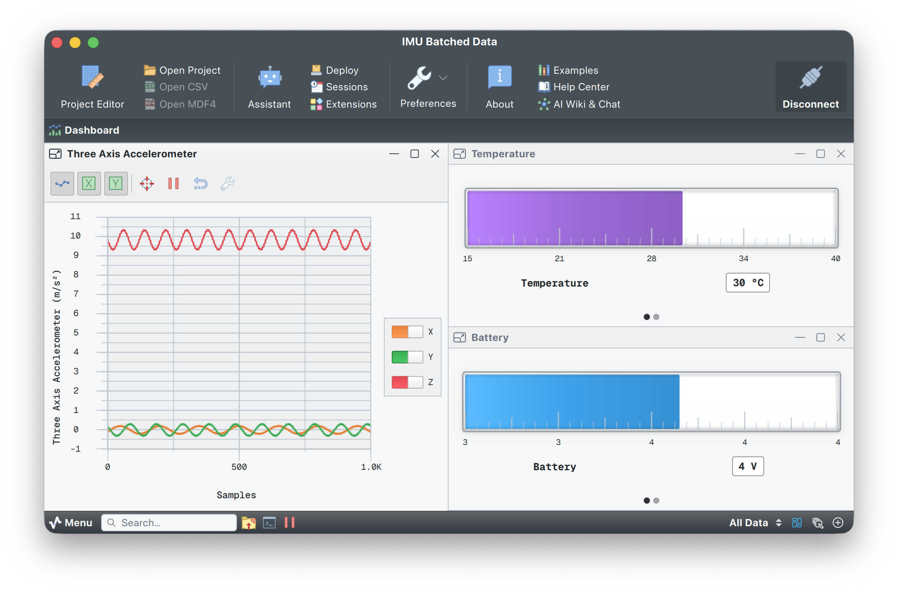

# IMU batched data simulator

This example shows off Serial Studio's **multi-frame parsing** feature, which automatically expands batched sensor data into individual frames for smooth visualization.



## Use case

Many devices batch high-frequency sensor readings before transmission to cut communication overhead. For example:

- **Wearable IMU.** Samples accelerometer at 120 Hz, transmits packets at 1 Hz.
- **Environmental sensors.** Batch temperature/humidity readings.
- **Audio devices.** Send chunks of audio samples.

Without multi-frame parsing, you'd need to manually duplicate scalar values (battery, temperature) for each sample in JavaScript. With this feature, Serial Studio handles it for you.

## How it works

### Input packet (sent once per second)

```json
{
  "battery": 3.75,
  "temperature": 25.5,
  "accel_x": [0.12, 0.15, ..., 0.08],  // 120 samples
  "accel_y": [0.23, 0.21, ..., 0.19],  // 120 samples
  "accel_z": [9.81, 9.79, ..., 9.82]   // 120 samples
}
```

### JavaScript parser

```javascript
function parse(frame) {
    if (frame.length > 0) {
        var data = JSON.parse(frame);
    
        // Return mixed scalar/vector array
        return [
            data.battery,      // Scalar: repeated across frames
            data.temperature,  // Scalar: repeated across frames
            data.accel_x,      // Vector: unzipped element-by-element
            data.accel_y,      // Vector: unzipped element-by-element
            data.accel_z       // Vector: unzipped element-by-element
        ];
    }

    return [];
}
```

### Output: 120 frames generated automatically

```
Frame 1: [3.75, 25.5, 0.12, 0.23, 9.81]
Frame 2: [3.75, 25.5, 0.15, 0.21, 9.79]
...
Frame 120: [3.75, 25.5, 0.08, 0.19, 9.82]
```

The scalars (battery, temperature) are repeated automatically, and the vectors are unzipped element-by-element.

## Running the example

### 1. Start the simulator

```bash
python3 imu_simulator.py
```

**Optional arguments:**

- `--host HOST`. UDP destination (default: 127.0.0.1).
- `--port PORT`. UDP port (default: 9000).
- `--sample-rate RATE`. Samples per packet (default: 120).
- `--packet-rate RATE`. Packets per second (default: 1.0).
- `--duration SECONDS`. Run duration (default: infinite).

**Example:**

```bash
# Send 240 samples per packet at 2 Hz
python3 imu_simulator.py --sample-rate 240 --packet-rate 2.0
```

### 2. Configure Serial Studio

1. **Bus type:** UDP Client.
2. **Host:** 127.0.0.1.
3. **Port:** 9000.
4. **Project:** load `imu_batched.ssproj`.
5. Click **Connect**.

### 3. Observe

- 1 packet per second generates 120 frames per second automatically.
- Battery and temperature values are constant within each batch.
- Accelerometer plots show smooth high-frequency motion.
- The dashboard reports 120 frames received per second from 1 packet.

## Key features

### Mixed scalar/vector parsing

Scalars (battery, temp) + vectors (accel arrays) in a single return value.

### Automatic scalar repetition

No need to manually duplicate battery or temperature 120 times in JavaScript.

### Vector unzipping

Three 120-element arrays are transposed into 120 frames automatically.

### Efficient protocol

Transmit 1 packet instead of 120 individual frames.

### Smooth visualization

High-frequency data (120 Hz) visualized smoothly despite a low transmission rate (1 Hz).

## Customization

### Different sensor types

**GPS with batched position samples:**

```javascript
function parse(frame) {
    var data = JSON.parse(frame);
    return [
        data.fix_quality,    // Scalar
        data.satellites,     // Scalar
        data.latitudes,      // Vector of lat samples
        data.longitudes,     // Vector of lon samples
        data.altitudes       // Vector of alt samples
    ];
}
```

**Environmental sensor with hourly batches:**

```javascript
function parse(frame) {
    var data = JSON.parse(frame);
    return [
        data.sensor_id,           // Scalar
        data.battery,             // Scalar
        data.temperatures,        // Vector of 60 samples (1 per minute)
        data.humidities,          // Vector of 60 samples
        data.pressures            // Vector of 60 samples
    ];
}
```

## Technical details

### Frame expansion algorithm

1. **Detect array type.** Mixed scalar/vector.
2. **Find the longest vector.** 120 elements.
3. **Extend shorter vectors.** Repeat the last value if needed.
4. **Generate frames.** Transpose into 120 frames with scalars repeated.

### Performance

- **Parsing overhead.** Single JavaScript call per packet.
- **Memory.** One allocation for the multi-frame list.
- **Dashboard updates.** Zero-copy via const reference (preserved).
- **Throughput.** Tested with 120 samples/packet at 10 Hz = 1200 frames/sec.

## License

Copyright (C) 2020-2025 Alex Spataru
SPDX-License-Identifier: GPL-3.0-only OR LicenseRef-SerialStudio-Commercial
