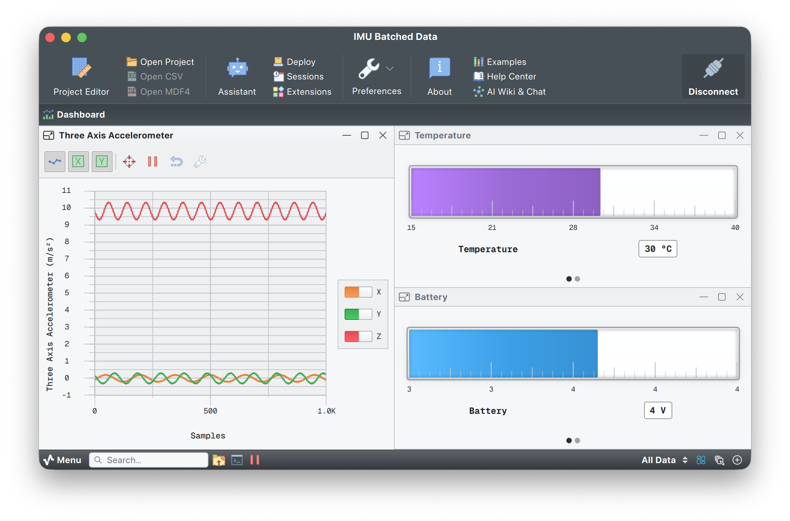

# IMU batched data simulator

This example shows off Serial Studio's **multi-frame parsing** feature, which automatically expands batched sensor data into individual frames for smooth visualization.



## Use case

Many devices batch high-frequency sensor readings before transmission to cut communication
overhead: a wearable IMU that samples its accelerometer at 120 Hz but only transmits packets at
1 Hz, an environmental sensor batching temperature and humidity readings, or an audio device
sending chunks of samples. Without multi-frame parsing, each of these needs the scalar values
(battery, temperature) manually duplicated for every sample in JavaScript; Serial Studio handles
that duplication automatically.

## How it works

### Input packet (sent once per second)

```json
{
  "timestamp": 1718200000,
  "battery": 3.75,
  "temperature": 25.5,
  "accel_x": [0.12, 0.15, ..., 0.08],  // 120 samples
  "accel_y": [0.23, 0.21, ..., 0.19],  // 120 samples
  "accel_z": [9.81, 9.79, ..., 9.82]   // 120 samples
}
```

The simulator wraps each packet in `/*` and `*/` delimiters, which match the start/end frame
detection sequences configured in `imu_batched.ssproj`. The `timestamp` field is transmitted
but ignored by the parser.

### JavaScript parser

This is the parser stored in `imu_batched.ssproj`. The two scalars are repeated across frames;
the three arrays are unzipped element-by-element:

```javascript
function parse(frame) {
    if (frame.length > 0) {
        let data = JSON.parse(frame);
        return [
            data.battery,
            data.temperature,
            data.accel_x,
            data.accel_y,
            data.accel_z
        ];
    }

    return [];
}
```

### Output: 120 frames generated automatically

```
Frame 1: [3.75, 25.5, 0.12, 0.23, 9.81]
Frame 2: [3.75, 25.5, 0.15, 0.21, 9.79]
...
Frame 120: [3.75, 25.5, 0.08, 0.19, 9.82]
```

The scalars (battery, temperature) are repeated automatically, and the vectors are unzipped element-by-element.

## Running the example

### 1. Start the simulator

The project includes a control loop that launches `imu_simulator.py` automatically when you connect, so you normally just open the project and click **Connect**. Run it by hand only if you want custom options:

```bash
python3 imu_simulator.py
```

**Optional arguments:**

- `--host HOST`. UDP destination (default: 127.0.0.1).
- `--port PORT`. UDP port (default: 9000).
- `--sample-rate RATE`. Accelerometer sample rate in Hz, which is also the number of samples per packet (default: 120).
- `--packet-rate RATE`. Packets per second (default: 1.0).
- `--duration SECONDS`. Run duration (default: infinite).

**Example:**

```bash
# Send 240 samples per packet at 2 Hz
python3 imu_simulator.py --sample-rate 240 --packet-rate 2.0
```

### 2. Configure Serial Studio

1. **I/O Interface:** Network Socket.
2. **Socket Type:** UDP.
3. **Local Port:** 9000.
4. **Project:** load `imu_batched.ssproj`.
5. Click **Connect**.

### 3. Observe

- 1 packet per second generates 120 frames per second automatically.
- Battery and temperature values are constant within each batch.
- Accelerometer plots show smooth high-frequency motion.
- The dashboard reports 120 frames received per second from 1 packet.

## Key features

The parser's return value mixes scalars (`battery`, `temperature`) with vectors (`accel_x`,
`accel_y`, `accel_z`) in one array. Serial Studio finds the longest vector, repeats the scalars
across it, and transposes the result into one frame per sample, so the simulator only needs to
send a single packet instead of 120 individual frames.

## Customization

### Different sensor types

**GPS with batched position samples:**

```javascript
function parse(frame) {
    var data = JSON.parse(frame);
    return [
        data.fix_quality,    // Scalar
        data.satellites,     // Scalar
        data.latitudes,      // Vector of lat samples
        data.longitudes,     // Vector of lon samples
        data.altitudes       // Vector of alt samples
    ];
}
```

**Environmental sensor with hourly batches:**

```javascript
function parse(frame) {
    var data = JSON.parse(frame);
    return [
        data.sensor_id,           // Scalar
        data.battery,             // Scalar
        data.temperatures,        // Vector of 60 samples (1 per minute)
        data.humidities,          // Vector of 60 samples
        data.pressures            // Vector of 60 samples
    ];
}
```

## Technical details

### Frame expansion algorithm

The expansion distinguishes scalar entries from vector entries in the parser's return value,
finds the longest vector (120 elements for this example), extends any shorter vector by
repeating its last value, then transposes the result into 120 frames with the scalars repeated
across each one.

### Performance

Parsing costs a single JavaScript call per packet, and the multi-frame list needs one allocation
regardless of how many frames it expands to; the dashboard reads it by const reference with no
further copies. At a 10 Hz packet rate, this scales to 120 x 10 = 1200 frames/sec.

## License

Copyright (C) 2020-2025 Alex Spataru
SPDX-License-Identifier: GPL-3.0-or-later OR LicenseRef-SerialStudio-Commercial
