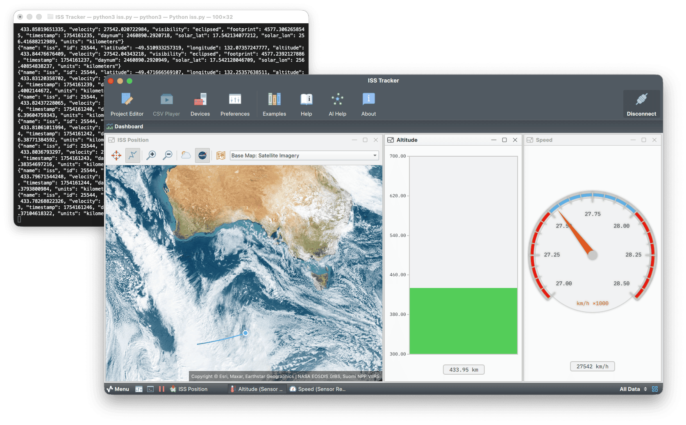

# **ISS Tracker**

## **Overview**

This project visualizes the real-time position and velocity of the International Space Station (ISS) using Serial Studio. Telemetry data is fetched from a public API and streamed over UDP. Serial Studio parses this data and displays it on interactive widgets including a map and gauges.

This project showcases real-time satellite tracking and requires **no additional hardware**, only Python, Serial Studio and an internet connection.

**Note:** Some Serial Studio features may require a paid license. Visit [serial-studio.com](https://serial-studio.com/) for more details.



## **Telemetry Source**

ISS data is retrieved from [Where the ISS at?](https://wheretheiss.at/) API, which provides accurate, regularly updated satellite telemetry. The following fields are extracted:

- `latitude`: Geographic latitude in degrees.
- `longitude`: Geographic longitude in degrees.
- `altitude`: Altitude above Earth in kilometers.
- `velocity`: Orbital velocity in kilometers per hour.

## **Project Features**

- Real-time map tracking of the ISS position.
- Altitude bar graph with configurable alarms.
- Velocity gauge with alarm thresholds.
- UDP-based telemetry stream using simple JSON format.
- Visual layout configured entirely via Serial Studio’s project editor.

## **Data Format**

Each UDP frame is a newline-delimited JSON object:

```json
{
  "latitude": 29.35,
  "longitude": -94.98,
  "altitude": 419.75,
  "velocity": 27650.0
}
```

Serial Studio parses the JSON into an array:
```json
[29.35, -94.98, 419.75, 27650.0]
```

The widgets are then mapped to array indices:
- `Latitude`: index 1
- `Longitude`: index 2
- `Altitude (m)`: index 3 (first group)
- `Altitude (km)`: index 3 (second group)
- `Speed`: index 4

## **How to Run**

1. **Start the telemetry stream**:
   ```bash
   python3 iss-tracker.py
   ```

   This Python script:
   - Pulls ISS data every second.
   - Sends it via UDP to `127.0.0.1:9000`.

2. **Open Serial Studio**:
   - Load `iss-tracker.ssproj` (provided project file).
   - Set **input source** to **Network Socket**, and select **UDP** as socket type.
   - Use port **9000**.
   - Click **Connect** to start visualizing.

## **Serial Studio Visualizations**

- **Map Widget**: Displays live ISS position using latitude and longitude.
- **Bar Graph**: Shows altitude in kilometers, with min/max alarms.
- **Gauge**: Displays orbital speed, with low/high alarm threshold zones.

## **Files Included**

- `iss-tracker.py`: Python script that fetches and streams ISS data via UDP.
- `iss-tracker.ssproj`: Serial Studio project file (preconfigured).
- `README.md`: Project documentation.
- `doc/screenshot.png`: Visualization screenshot.

## **Dependencies**

- Python 3.x
- `requests` module (install via `pip install requests`)

## **Notes**

- The API occasionally returns incomplete or missing fields. The parser assumes valid JSON is always received; you can add error handling if needed.
- The default port (`9000`) can be changed in both the Python script and Serial Studio, if needed.