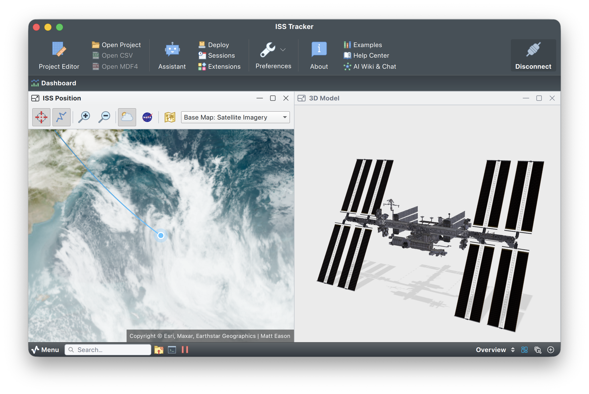

# ISS Tracker

## Overview

This project visualizes the real-time position and velocity of the International Space Station (ISS) in Serial Studio. Telemetry data is fetched from a public API and streamed over UDP. Serial Studio parses the data and shows it on interactive widgets, including a map and gauges.

Real-time satellite tracking with no extra hardware. You only need Python, Serial Studio, and an internet connection.

> Some Serial Studio features need a paid license. See [serial-studio.com](https://serial-studio.com/) for details.



## Telemetry source

ISS data is pulled from the [Where the ISS at?](https://wheretheiss.at/) API, which provides regularly updated satellite telemetry. The following fields are extracted:

- `latitude`: geographic latitude in degrees.
- `longitude`: geographic longitude in degrees.
- `altitude`: altitude above Earth in kilometers.
- `velocity`: orbital velocity in kilometers per hour.

## Project features

- Real-time map tracking of the ISS.
- Altitude bar graph scaled from 300 to 700 km.
- Velocity gauge scaled from 27,000 to 28,500 km/h.
- UDP-based telemetry stream using a simple JSON format.
- Visual layout configured entirely in Serial Studio's project editor.

## Data format

Each UDP frame is a newline-terminated JSON object. The script forwards the full API
response; the frame parser reads these four fields:

```json
{
  "latitude": 29.35,
  "longitude": -94.98,
  "altitude": 419.75,
  "velocity": 27650.0
}
```

Serial Studio parses the JSON into an array:

```json
[29.35, -94.98, 419.75, 27650.0]
```

The widgets then map to array indices:

- `Latitude`: index 1.
- `Longitude`: index 2.
- `Altitude`: index 3, used twice (the `ISS Position` map group and the `Sensor Readings` bar graph).
- `Speed`: index 4.

## How to run

1. **Start the telemetry stream:**

   ```bash
   python3 iss-tracker.py
   ```

   The Python script:
   - Pulls ISS data every second.
   - Sends it via UDP to `127.0.0.1:9000`.

2. **Open Serial Studio:**
   - Load `iss-tracker.ssproj` (project file included).
   - Set the input source to **Network Socket**, and pick **UDP** as the socket type.
   - Use port **9000**.
   - Click **Connect** to start visualizing.

## Visualizations

- **Map widget.** Live ISS position by latitude and longitude.
- **Bar graph.** Altitude in kilometers, on a 300 to 700 km scale.
- **Gauge.** Orbital speed, on a 27,000 to 28,500 km/h scale.

## Files

- `iss-tracker.py`: Python script that fetches and streams ISS data via UDP.
- `iss-tracker.ssproj`: Serial Studio project file (pre-configured).
- `README.md`: project documentation.
- `doc/screenshot.png`: visualization screenshot.

## Dependencies

- Python 3.x.
- `requests` module (install via `pip install requests`).

## Notes

- The API occasionally returns incomplete or missing fields. The parser assumes valid JSON is always received. Add error handling if needed.
- The default port (`9000`) can be changed in both the Python script and Serial Studio.
