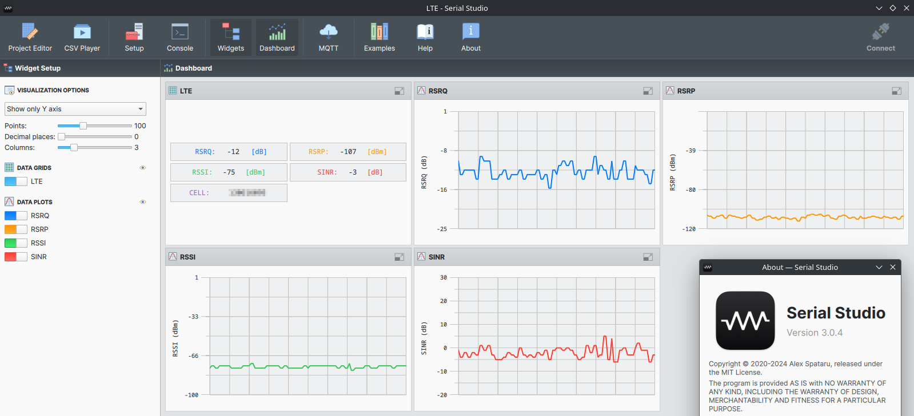

# LTE modem HUAWEI K5161H + Serial Studio Example

## Overview

This project demonstrates how to use Serial Studio and MQTT to visualize data from a **LTE modem HUAWEI K5161H**.

## Using in this example

- OS **Archlinux**
- **Mosquitto**: MQTT broker
- **Python**
- **paho**: Python client library for MQTT

## Step-by-Step Guide

### 1. MQTT broker Mosquitto
To install MQTT Broker **Mosquitto** run in terminal:  
`sudo pacman -S mosquitto`

To run MQTT Broker **Mosquitto** with default settings run in terminal:  
`mosquitto --verbose`

### 2. Parse data from LTE modem API
For simple cases, you can send data frame to MQTT from terminal, e.g.:  
`mosquitto_pub -m "100,50,75,89" -t "lte"`

For complex situations, you can use Python (or another language for your choice) to retrieve and form the data frame.  
An example script is contained in the file [lte_mqtt.py](lte_mqtt.py)

Install **paho** - Python client library for MQTT:  
`sudo pacman -S python-paho-mqtt`

Run in terminal:  
`python lte_mqtt.py`

Data frame will send to MQTT every 5 seconds.

### 3. Serial Studio Configuration
1. **Download and Install Serial Studio**:

   Visit [Serial Studio's official website](https://serial-studio.github.io/) to download and install the software.

2. **Open Serial Studio and configure MQTT**:

   - Set the **Host**: 127.0.0.1
   - Set the **Port**: 1883
   - Set the **Topic**: lte
   - Set the **Mode**: Subscriber
   - Set the **Keep Alive**: 600
   - Click **Connect**  

3. After get first frame of data Serial-Studio will automatic open dashboard with plots.  

4. Use **Project editor** to configure dashboard.  

## UDP Socket
Solution with UDP Socket looks much simpler than MQTT.

Run in terminal:  
`python lte_udp.py`

### Serial Studio Configuration for UDP Socket

   - Set the **DEVICE SETUP**: I/O Interface: Network Socket
   - Set the **Socket type**: UDP
   - Set the **Remote address**: 127.0.0.1
   - Set the **Local port**: 5005
   - Set the **Ignore data delimeters**: True
   - Click **Connect**  

