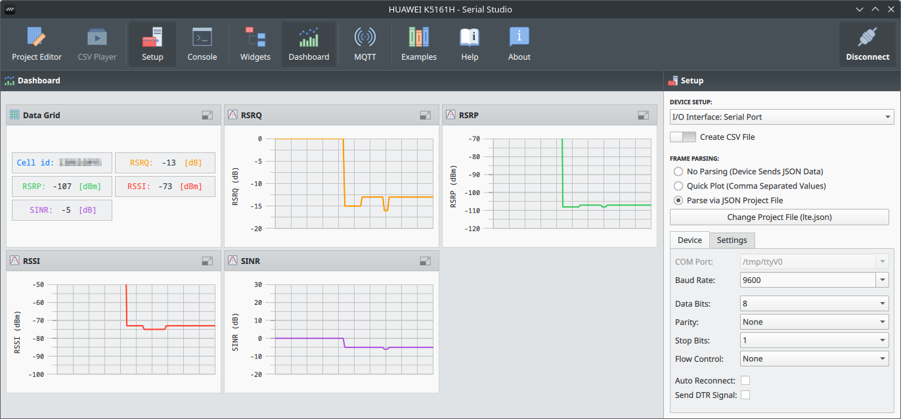
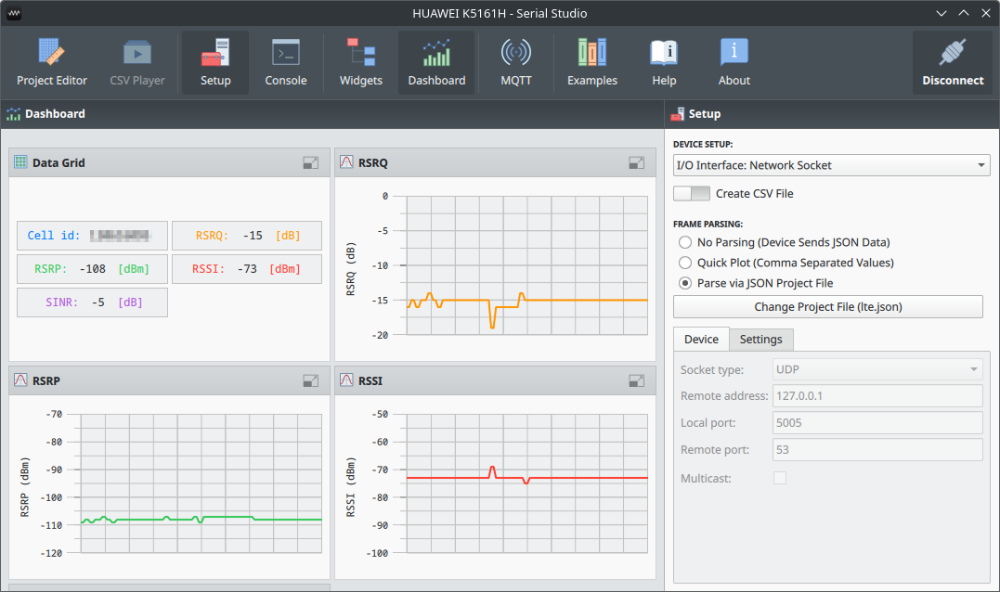

# Serial Studio and LTE modem HUAWEI K5161H

## Overview

This project demonstrates how to use **Serial Studio** to visualize signal quality data from a **LTE modem HUAWEI K5161H**.


Three methods of sending data are described:
- [Virtual Serial Port](#method_1)
- [MQTT](#method_2)
- [UDP Socket](#method_3)


The examples are implemented on OS [Archlinux](https://archlinux.org/), in which **Serial Studio** can be:
- run from [AppImage](https://github.com/serial-studio/serial-studio/releases/latest)
- installed from [Arch User Repository](https://aur.archlinux.org/packages/serial-studio-bin) (AUR) [manually](https://wiki.archlinux.org/title/Arch_User_Repository#Installing_and_upgrading_packages) or by AUR helper, e.g. `yay`
    ```
    yay -S serial-studio-bin
    ```
- compiled by [cmake](/#development)

Data from HUAWEI K5161H can be get by url API `http://192.168.9.1/api/device/signal`  
Python was used to receive, process and generate data frames.  

---

<a name="method_1"></a>
## Method 1 - Virtual Serial Port 

### Create Virtual Serial Port
1. Install [socat](http://www.dest-unreach.org/socat/)
    ```
    sudo pacman -S socat
    ```
2. Create a linked pair of virtual serial ports, ttyV0 for listening and ttyV1 for sending data
    ```
    socat -d -d pty,rawer,echo=0,link=/tmp/ttyV0,b9600 pty,rawer,echo=0,link=/tmp/ttyV1,b9600
    ```
3. You can check the operation of the virtul serial ports by reading the file `/tmp/ttyV0`
    ```
    cat /tmp/ttyV0
    ```
    and writing data to the file `/tmp/ttyV1`
    ```
    echo 100 > /tmp/ttyV1
    ```
5. Install `python-pyserial`
    ```
    sudo pacman -S python-pyserial
    ```
6. Run a Python script `lte_serial.py` to process data and send it to the virtual serial port `/tmp/ttyV1`
    ```
    python lte_serial.py
    ```

### Serial Studio configuration for Virtual Serial Port
- Run **Serial Studio**
- Select **DEVICE SETUP** &rarr; I/O Interface: Serial Port
- Select **FRAME PARSING** &rarr; Parse via JSON Project File
- Select **Project file** &rarr; `lte.json`
- Manually enter **COM Port** &rarr; `/tmp/ttyV0` and press Enter
- Select **Baud Rate** &rarr; 9600
- Click **Connect** in upper right corner  

After get first frame of data **Serial Studio** will automatic open dashboard with plots.  



---

<a name="method_2"></a>
## Method 2 - MQTT

### Prepare MQTT broker
1. Install MQTT broker [Mosquitto](https://mosquitto.org/)
    ```
    sudo pacman -S mosquitto
    ```
2. Run MQTT broker with default settings
    ```
    mosquitto --verbose
    ```
3. You can check MQTT broker by sending data
    ```
    mosquitto_pub -m "abcd,100,50,75,89" -t "lte"
    ```
4. Install Python client library for MQTT - **paho**
    ```
    sudo pacman -S python-paho-mqtt
    ```
5. Run a Python script `lte_mqtt.py` to process and send data to the MQTT broker
    ```
    python lte_mqtt.py
    ```

### Serial Studio Configuration for MQTT

- Run **Serial Studio**
- Select **FRAME PARSING** &rarr; Parse via JSON Project File
- Select **Project file** &rarr; `lte.json`
- Click **MQTT** in the top bar
- Set **Host** &rarr; 127.0.0.1
- Set **Port** &rarr; 1883
- Set **Topic** &rarr; lte
- Select **Mode** &rarr; Subscriber
- Set **Keep Alive** &rarr; 600
- Click **Connect**  

After get first frame of data **Serial Studio** will automatic open dashboard with plots.  


---

<a name="method_3"></a>
## Method 3 - UDP Socket
Solution with UDP Socket looks much simpler than other.

Run a Python script `lte_udp.py` to process data and send it to the UDP Socket
```
python lte_udp.py
```

### Serial Studio Configuration for UDP Socket

- Run **Serial Studio**
- Select **DEVICE SETUP** &rarr; I/O Interface: Network Socket
- Select **FRAME PARSING** &rarr; Parse via JSON Project File
- Select **Project file** &rarr; `lte.json`
- Select **Socket type** &rarr; UDP
- Set **Remote address** &rarr; 127.0.0.1
- Set **Local port** &rarr; 5005
- Click **Connect** in upper right corner  

After get first frame of data **Serial Studio** will automatic open dashboard with plots.  



