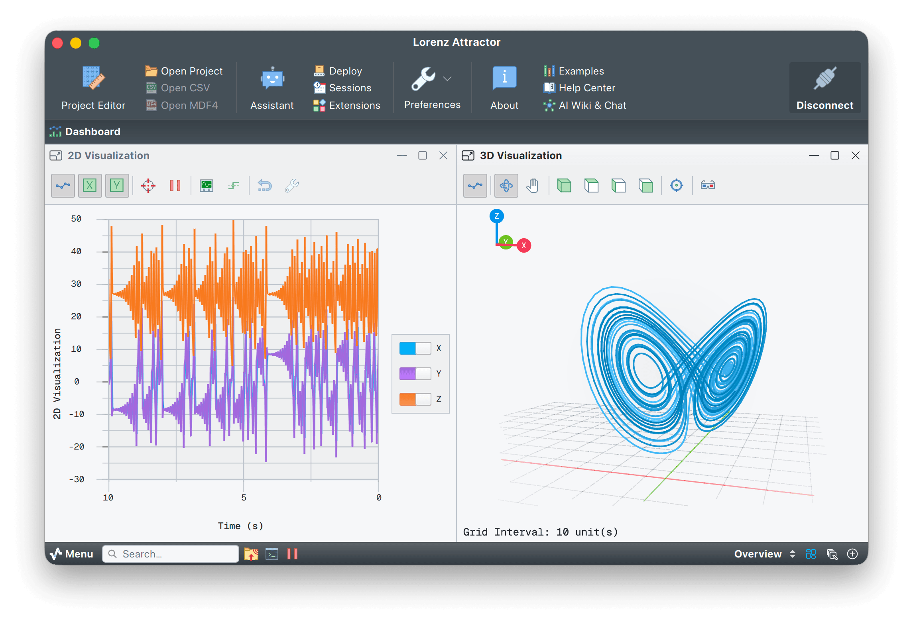
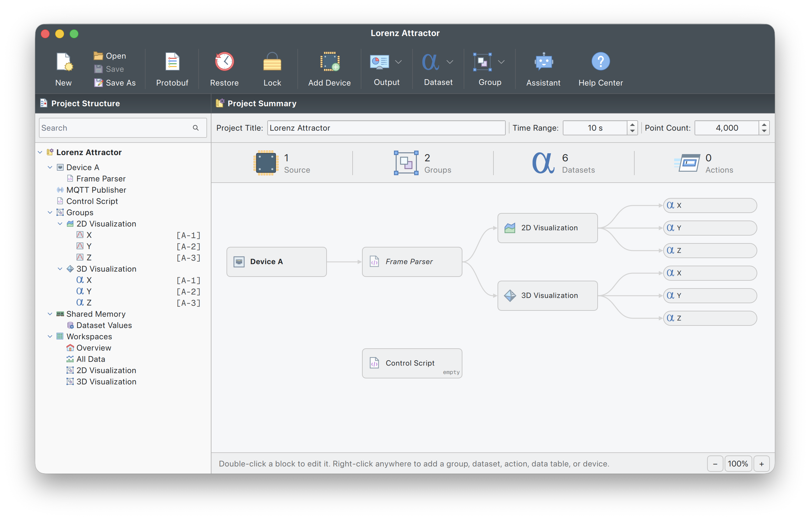

# Lorenz attractor + Serial Studio

## Overview

This project simulates and visualizes the Lorenz attractor, a chaotic system of differential equations, entirely inside [Serial Studio](https://serial-studio.github.io/). There is no external generator: a JavaScript control loop integrates the Lorenz trajectory in real time, writes the ($x$, $y$, $z$) values into a data table, and ticks the dashboard so the plots render. No data ever arrives from the network.

The Lorenz system, introduced by Edward Lorenz in 1963, is a set of three coupled differential equations commonly used to model atmospheric convection. Its iconic butterfly-shaped attractor is a symbol of chaos theory. For more, see [this article](https://marksmath.org/visualization/LorenzExperiment/).

> This project uses features available only with a paid license. See [serial-studio.com](https://serial-studio.com/) for details.

## Lorenz system basics

The system is governed by:

$$
\frac{dx}{dt} = \sigma (y - x)
$$
$$
\frac{dy}{dt} = x (\rho - z) - y
$$
$$
\frac{dz}{dt} = x y - \beta z
$$

Where:

- $\sigma$ (sigma): rate of rotation (set to $10.0$).
- $\rho$ (rho): height of the attractor (set to $28.0$).
- $\beta$ (beta): damping factor (set to $\frac{8}{3}$).

The control loop uses the Euler method for numerical integration to evolve the system over time.

## How it works

The whole example runs from the control script, with no helper process to launch:

- **`setup()`** seeds the clock and posts a notification.
- **`loop()`** advances the Lorenz state one Euler step, writes `x`, `y` and `z` into the `Lorenz` data table with `tableSet()`, then calls `dashboardTick()` to force a render.
- The three datasets are **virtual**: their Lua transforms read the matching register from the `Lorenz` table, so the dashboard is fed straight from the control loop.
- The UDP source is a **dummy**, kept only so a connection can be opened. Its Lua frame parser returns `{}` (no frame); no bytes are ever parsed, and the control loop's `dashboardTick()` drives both the dashboard and the exports.

Because the loop free-runs (the worker re-arms it about once per millisecond), this project also doubles as a control-loop benchmark. `loop()` advances `STEPS_PER_TICK` integration steps per dashboard refresh, and every `STATS_EVERY` steps it reports the measured step rate as a notification, so you can see how fast and how steadily the control loop runs. Raise `STEPS_PER_TICK` to push raw integration throughput past the refresh rate.

> `dashboardTick()` also fans the synthesized frame out to whatever export sinks are enabled, so a control-script simulation like this one can be recorded to CSV/MDF4/Session-database/MQTT just like real device data. (`refreshDashboard()`, by contrast, only refreshes the view.)

## Project features

- **Self-contained.** No Python, no external process, no real data source.
- **Real-time visualization.** Watch the Lorenz attractor's chaotic motion as it happens.
- **Custom X-axis.** Use Serial Studio's project editor to pick any dataset as the X-axis source.
- **Dynamic visualization.** Plot $x$, $y$, and $z$ on 2D or 3D graphs.

## Requirements

- **Serial Studio.** Download the latest version from [here](https://serial-studio.github.io/).

## Running the example

Open `LorenzAttractor.ssproj` in Serial Studio and click **Connect**. That is all. The control loop starts with the connection and stops again when you disconnect, switch projects, or quit.

## Serial Studio configuration

The bundled project is already set up: its data source is a dummy UDP socket on local port **9000**, and it contains both visualizations, a Multi-Plot group (`2D Visualization`) and a 3D plot group (`3D Visualization`). The X/Y/Z values come from the `Lorenz` data table that the control loop writes; the frame parser is a Lua stub that returns `{}`.

Here is how the project editor should look:

### Custom X-axis example

Serial Studio's custom X-axis feature lets you map any dataset to serve as the X-axis source for plots. It is particularly useful for:

- Plotting values against elapsed time or packet numbers.
- Advanced visualizations like the Lorenz attractor.

In the bundled project the three datasets cross-reference each other ($x$ against $y$, $y$ against $z$, $z$ against $x$) to draw the attractor.

## Troubleshooting

- **No plot appears.**
  - Make sure you clicked **Connect**; the control loop only runs while connected.
  - Confirm the project still contains the `Lorenz` data table and that the X/Y/Z datasets are marked virtual.
- **Want a faster (or slower) trace.**
  - Adjust `STEPS_PER_TICK` (integration steps per refresh) or `DT` (Euler step size) at the top of the control script.
