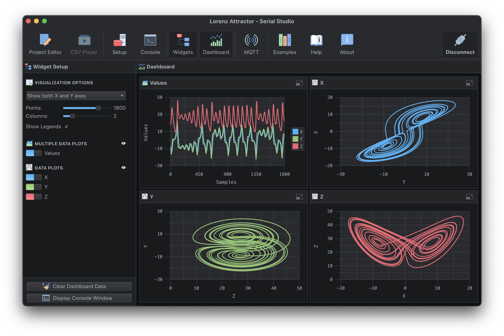
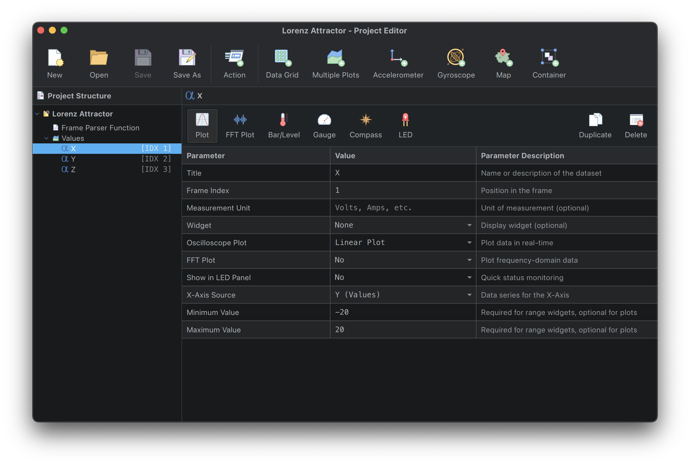

# **Lorenz Attractor + Serial Studio**

## **Overview**

This project demonstrates how to simulate and visualize the Lorenz attractor, a chaotic system of differential equations, using an Arduino board and [Serial Studio](https://serial-studio.github.io/). The Arduino program calculates the Lorenz system's chaotic trajectory in real-time and sends the resulting data ($x$, $y$, $z$) to Serial Studio for plotting.

The Lorenz system, introduced by Edward Lorenz in 1963, is a set of three coupled differential equations commonly used to model atmospheric convection. Its iconic "butterfly-shaped" attractor has become a symbol of chaos theory. For more information on the Lorenz system, visit [this article](https://marksmath.org/visualization/LorenzExperiment/).



**Note:** This project makes use of features that are only available under a paid license. Please visit [serial-studio.com](https://serial-studio.com/) for more information.

## **Lorenz System Basics**

The system is governed by the following equations:

$$
\frac{dx}{dt} = \sigma (y - x)
$$
$$
\frac{dy}{dt} = x (\rho - z) - y
$$
$$
\frac{dz}{dt} = x y - \beta z
$$

Where:
- $\sigma$ (sigma): Rate of rotation (set to $10.0$)
- $\rho$ (rho): Height of the attractor (set to $28.0$)
- $\beta$ (beta): Damping factor (set to $\frac{8}{3}$)

The Arduino program uses the **Euler method** for numerical integration to calculate the system's state over time.

## **Project Features**

- **Real-Time Visualization**: View the Lorenz attractor's chaotic motion in real time.
- **Custom X-Axis Configuration**: Use Serial Studio's project editor to select datasets as X-axis sources.
- **Dynamic Visualization**: Plot $x$, $y$, and $z$ values on 2D or 3D graphs using Serial Studio.

## **Hardware Setup**

### **Requirements**
- **Arduino Board**: Uno, Mega, Nano, or compatible.
- **Serial Studio**: Download the latest version from [here](https://serial-studio.github.io/).

### **Connections**
No additional hardware is required beyond the Arduino. Ensure the Arduino is connected to your computer via USB.

## **Arduino Sketch**

The provided Arduino code simulates the Lorenz attractor and transmits the calculated values $x$, $y$ and $z$ to Serial Studio. Here's the complete code:

```cpp
//
// Lorenz Attractor Data Generator
//
// Author: Alex Spataru
//

// Parameters for the Lorenz system
float sigma = 10.0;     // σ: rate of rotation
float rho = 28.0;       // ρ: height of attractor
float beta = 8.0 / 3.0; // β: damping factor

// Initial conditions
float x = 0.1;  // Initial X value
float y = 0.0;  // Initial Y value
float z = 0.0;  // Initial Z value

// Time step
float dt = 0.01; // Time increment for numerical integration

// Interval between data transmissions (milliseconds)
unsigned long transmissionInterval = 1;
unsigned long lastTransmissionTime = 0;

void setup() {
  Serial.begin(115200);
  while (!Serial)
    ;
}

void loop() {
  // Calculate the derivatives
  float dx = sigma * (y - x) * dt;
  float dy = (x * (rho - z) - y) * dt;
  float dz = (x * y - beta * z) * dt;

  // Update the state
  x += dx;
  y += dy;
  z += dz;

  // Transmit data at regular intervals
  if (millis() - lastTransmissionTime >= transmissionInterval) {
    lastTransmissionTime = millis();
    Serial.print(x, 6);
    Serial.print(",");
    Serial.print(y, 6);
    Serial.print(",");
    Serial.println(z, 6);
  }
}
```

## **Serial Studio Configuration**

### **1. Setting Up the Project**

1. Open Serial Studio and click the **Project Editor**.
2. Create a new project or import the provided `LorenzAttractor.json` file.
4. Add three datasets for $\(x\)$, $\(y\)$, and $\(z\)$, specifying their respective configurations:
   - Dataset $x$: Use $y$ as the X-axis source.
   - Dataset $y$: Use $z$ as the X-axis source.
   - Dataset $z$: Use $x$ as the X-axis source.

### **2. Plotting the Lorenz Attractor**

1. Open the project in Serial Studio.
2. Connect to the Arduino using the correct serial port and set the baud rate to **115200**.
3. Add a **Multi-Plot Widget** to visualize the attractor.

Here’s how your project editor should look:



## **Custom X-Axis Example**

With Serial Studio's new custom X-axis feature, you can map any dataset to serve as the X-axis source for plots. This is particularly useful for:
- Plotting values against elapsed time or packet numbers.
- Creating advanced visualizations like the Lorenz attractor.

## **Troubleshooting**

- **No Data Appears**:
  - Ensure the Arduino sketch is uploaded correctly.
  - Check the serial port and baud rate in Serial Studio.
- **Chaotic Output**:
  - Ensure the `transmissionInterval` in the Arduino sketch is suitable for your system.
