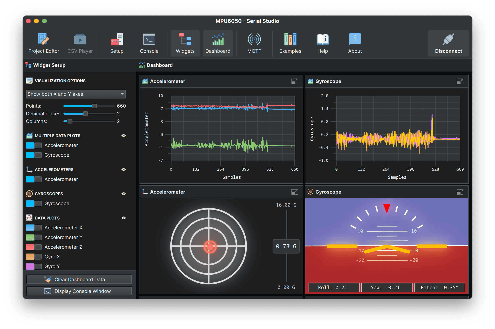
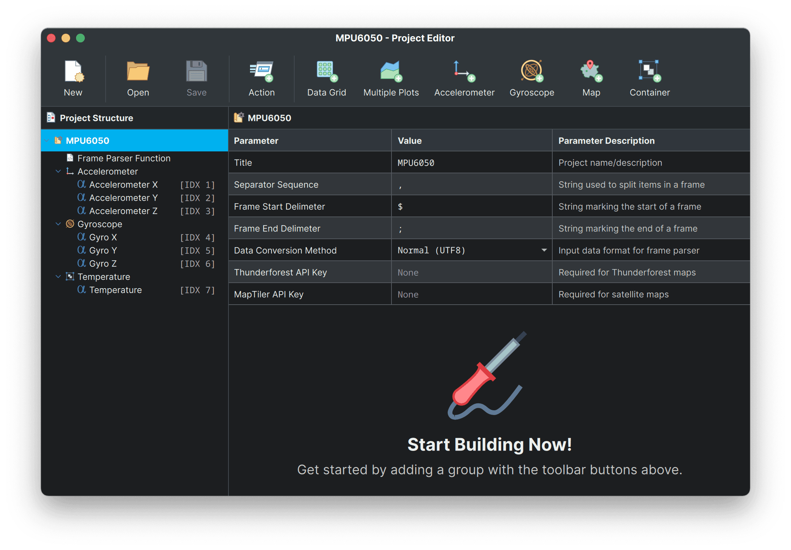

# MPU6050 + Serial Studio Example

## Overview

This project demonstrates how to use Serial Studio to visualize motion and orientation data from an MPU6050 accelerometer and gyroscope sensor connected to an Arduino. The Arduino program reads processed acceleration, gyroscope, and temperature data from the MPU6050 sensor and sends it to Serial Studio via serial communication for real-time display on widgets, such as a g-meter or an attitude indicator.



**Compatibility**: This project is compatible with any MPU6050 module connected via I2C communication. Adjust connections as needed if using a different Arduino board, such as the Uno or Nano.

## Hardware Setup

To get started, you will need an MPU6050 sensor module and an Arduino. Connect the **SDA** and **SCL** pins of the MPU6050 to the corresponding **A4** (SDA) and **A5** (SCL) pins on the Arduino. The code initializes the MPU6050 and configures it with specific accelerometer and gyroscope ranges to ensure accurate data output.

For boards like the Uno or Nano, make sure the default I2C pins are used for communication.

## Step-by-Step Guide

### 1. Arduino Sketch (`MPU6050.ino`)

Begin by installing the **Adafruit MPU6050** and **Adafruit Sensor** libraries:

- Open the Arduino IDE, navigate to **Sketch > Include Library > Manage Libraries**, then search for "Adafruit MPU6050" and install it, along with the "Adafruit Sensor" library.

Once the libraries are installed, open the `MPU6050.ino` sketch, connect the MPU6050 sensor, and upload the code to your Arduino. The MPU6050 data will be transmitted as a data frame, formatted with specific delimiters:

- **Start Delimiter (`$`)**: Indicates the start of a data frame.
- **End Delimiter (`;`)**: Marks the end of the frame.
- **Separator (`,`)**: Separates individual data fields (acceleration, gyroscope, temperature).

The data frame looks like this:

```
$accel_x,accel_y,accel_z,gyro_x,gyro_y,gyro_z,temperature;
```

**Note:**
- Expected measurement units for `accel_x`, `accel_y`, `accel_z` are in **m/s²**.
- Expected measurement units for `gyro_x`, `gyro_y`, `gyro_z` are in **deg/s**. Serial Studio automatically integrates these values to obtain pitch, yaw, and roll angles in degrees for the attitude indicator (AI) widget.

### 2. Serial Studio Configuration

To visualize the data, Serial Studio needs to be configured to parse the incoming sensor data correctly:

1. **Download and Install Serial Studio**:

   Visit [Serial Studio's official website](https://serial-studio.github.io/) to download and install the software.

2. **Open Serial Studio and Import `MPU6050.json`**:

   Launch Serial Studio and load the `MPU6050.json` file included in this project using the **Project Editor**. This file contains all necessary configurations for interpreting the data transmitted by the Arduino.

#### To Create the Project from Scratch:

Set up Serial Studio to interpret the MPU6050 data by configuring the following settings in a new project:

- **Frame Start Sequence**: `$`
- **Frame End Sequence**: `;`
- **Data Separator**: `,`

This setup instructs Serial Studio on how to parse the data sent by the Arduino. Once configured, you can add widgets to display real-time acceleration and gyroscope data, as well as temperature. These widgets are useful for observing orientation and movement, and the temperature data can be recorded in a CSV file for later analysis.



### 3. Viewing MPU6050 Data in Serial Studio

After setting up Serial Studio:

- Connect to the Arduino by selecting the correct serial port and setting the baud rate to **115200** (as configured in the Arduino sketch).
- Once connected, you will see real-time motion data displayed on the g-meter, attitude indicator, or other widgets in Serial Studio. The temperature data can also be logged in a CSV file for future analysis.

### Troubleshooting Tips

- **No Data Displayed**: Ensure that the correct port and baud rate are selected in Serial Studio, and that the MPU6050 is correctly connected to the Arduino.
- **Incorrect Data Parsing**: Double-check that the **Frame Start Sequence** (`$`), **End Sequence** (`;`), and **Separator** (`,`) are correctly set in Serial Studio's project settings.
