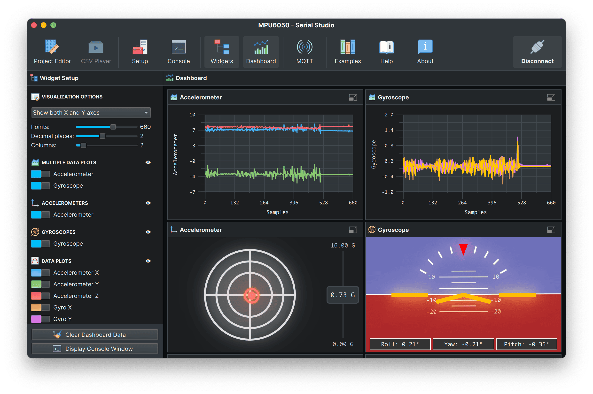
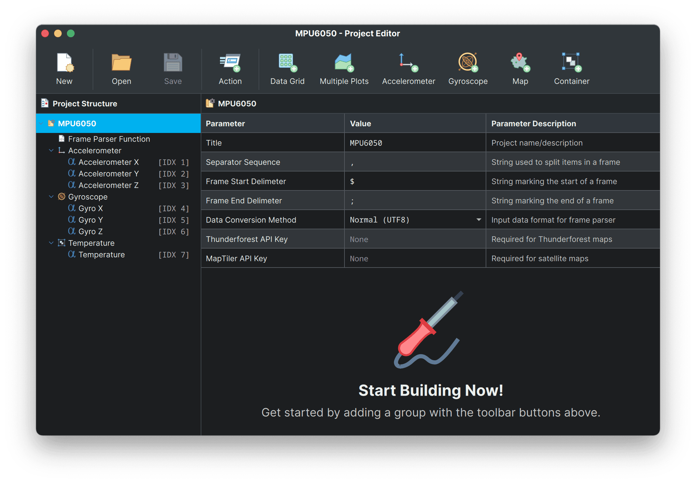

# MPU6050 + Serial Studio example

## Overview

This project shows how to use Serial Studio to visualize motion and orientation data from an MPU6050 accelerometer and gyroscope connected to an Arduino. The Arduino sketch reads processed acceleration, gyroscope, and temperature data from the MPU6050 and sends it to Serial Studio over serial for real-time display on widgets like a g-meter or attitude indicator.



**Compatibility.** Works with any MPU6050 module connected via I2C. Adjust the wiring if your board exposes I2C on pins other than A4 and A5.

## Hardware setup

You need an MPU6050 sensor module and an Arduino. Connect the SDA and SCL pins of the MPU6050 to A4 (SDA) and A5 (SCL) on the Arduino. The sketch initializes the MPU6050 with an accelerometer range of ±8 g, a gyroscope range of ±500 deg/s, and a 21 Hz low-pass filter bandwidth.

A4 and A5 are the default I2C pins on Uno and Nano boards.

## Step by step

### 1. Arduino sketch (`MPU6050.ino`)

Install the **Adafruit MPU6050** and **Adafruit Unified Sensor** libraries:

- Open the Arduino IDE, go to **Sketch > Include Library > Manage Libraries**, then search for "Adafruit MPU6050" and install it, along with "Adafruit Unified Sensor".

Once the libraries are installed, open the `MPU6050.ino` sketch, connect the MPU6050 sensor, and upload the code to your Arduino. The MPU6050 data is transmitted with specific delimiters:

- **Start delimiter (`$`).** Marks the start of a data frame.
- **End delimiter (`;`).** Marks the end of the frame.
- **Separator (`,`).** Separates fields (acceleration, gyroscope, temperature).

The frame looks like this:

```
$accel_x,accel_y,accel_z,gyro_x,gyro_y,gyro_z,temperature;
```

Notes:

- `accel_x`, `accel_y`, `accel_z` are in m/s².
- `gyro_x`, `gyro_y`, `gyro_z` are in deg/s. Serial Studio integrates these to pitch, yaw, and roll in degrees for the attitude indicator widget.

### 2. Serial Studio configuration

Serial Studio needs to know how to parse the incoming sensor data.

1. **Download and install Serial Studio.** Visit [Serial Studio's website](https://serial-studio.github.io/) to download and install.
2. **Open Serial Studio and load `MPU6050.ssproj`.** Launch Serial Studio, go to **FRAME PARSING** → Parse via Project File, and select the `MPU6050.ssproj` file from this project. It has everything you need to interpret the Arduino's data.

#### Building the project from scratch

If you want to configure it yourself:

- **Frame start sequence:** `$`.
- **Frame end sequence:** `;`.
- **Frame parser:** split each frame on commas:

  ```js
  function parse(frame) {
      return frame.split(',');
  }
  ```

Add widgets to display real-time acceleration and gyroscope data, plus temperature. The bundled project groups the datasets as **Accelerometer** (`Accelerometer X/Y/Z` in m/s²), **Gyroscope** (`Gyro X/Y/Z` in deg/s), and **Temperature** (a bar widget with an alarm at 40 ℃).



### 3. Viewing MPU6050 data

Once Serial Studio is configured:

- Connect to the Arduino by picking the correct serial port and setting the baud rate to 115200 (matching the Arduino sketch).
- You'll see real-time motion data on the g-meter, attitude indicator, and other widgets. Temperature can also be logged to CSV.

### Troubleshooting

- **No data shown.** Make sure the correct port and baud rate are selected in Serial Studio, and that the MPU6050 is wired correctly.
- **Incorrect parsing.** Double-check that the start sequence (`$`) and end sequence (`;`) are set correctly in the project settings, and that the frame parser splits on commas.
