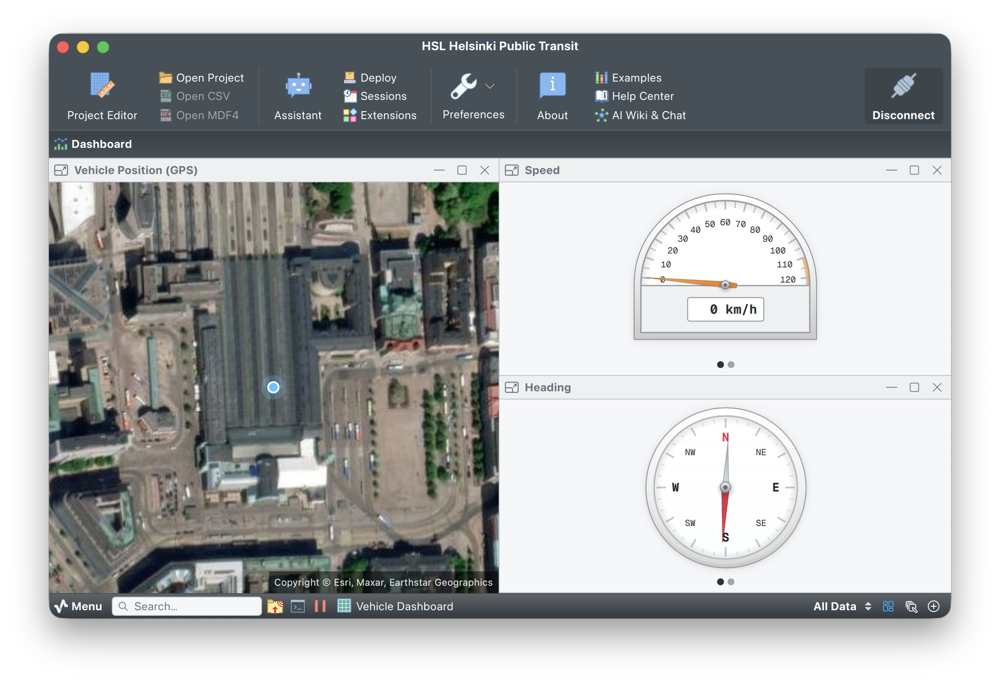

# HSL Helsinki Public Transit

## Overview

This project subscribes to Helsinki Regional Transport's (HSL) public MQTT feed and visualizes the live position of a single vehicle (bus, tram, or commuter train) in Serial Studio. Around 1,500 vehicles publish position updates roughly once per second, so the JS parser filters the stream down to one target vehicle and converts each `VP` payload into a dashboard row.

Live, real-world telemetry with no extra hardware. You only need Serial Studio and an internet connection.



## Telemetry source

HSL exposes its high-frequency positioning feed at `mqtt.hsl.fi:1883` under the [HFP v2 specification](https://digitransit.fi/en/developers/apis/4-realtime-api/vehicle-positions/). Anonymous access is allowed; the project connects without credentials.

| Setting        | Value                              |
|----------------|------------------------------------|
| Host           | `mqtt.hsl.fi`                      |
| Port           | `1883`                             |
| Username       | (empty)                            |
| Password       | (empty)                            |
| Topic filter   | `/hfp/v2/journey/ongoing/vp/#`     |
| Mode           | Subscriber                         |

Each MQTT message wraps a Vehicle Position object under the `VP` key:

```json
{
  "VP": {
    "veh": "6314",
    "desi": "550",
    "dir": "1",
    "lat": 60.21472,
    "long": 24.93021,
    "spd": 12.4,
    "hdg": 188,
    "tst": "2026-05-15T07:31:42.000Z"
  }
}
```

## Project features

- Live map widget tracking the chosen vehicle by latitude and longitude.
- Speed meter with an in-project value transform that converts m/s to km/h.
- Data grid showing route designation, direction, timestamp, and heading.
- Pure JavaScript MQTT stream parser, no native code required.

## How the parser works

The MQTT driver delivers a byte stream, not pre-split JSON objects. The parser keeps an internal buffer, locates `{` ... `}` boundaries while respecting string escapes and nested braces, and emits one dashboard row per complete `VP` message. A `TARGET_VEHICLE` constant filters the firehose down to a single vehicle:

```js
const TARGET_VEHICLE = "6314";
```

Change this string to track a different bus, tram, or train. The vehicle ID format is `NNNN` where the first digit roughly corresponds to the operator (HSL's published [Vehicle Identifiers documentation](https://digitransit.fi/en/developers/apis/4-realtime-api/vehicle-positions/) has the full mapping).

The speed dataset additionally carries a per-dataset transform that converts the native m/s reading to km/h:

```js
function transform(value) {
  const speedKmh = (value || 0) * 3.6;
  return Math.round(speedKmh * 10) / 10;
}
```

## How to run

- Open Serial Studio.
- **File → Open Project File**, pick `HSL Helsinki Public Transit.ssproj`.
- The MQTT source is preconfigured. Hit **Connect**.

After the first matching message arrives (a second or two while the broker pushes the next position update for your target vehicle), the dashboard opens with the map zoomed to the vehicle's current location.

## Visualizations

- **Map widget.** Live position of the target vehicle by latitude and longitude.
- **Speed meter.** Instantaneous velocity in km/h.
- **Data grid.** Vehicle ID, route designation, direction, timestamp, speed, and heading.

## Files

- `HSL Helsinki Public Transit.ssproj`: Serial Studio project file (pre-configured).
- `README.md`: project documentation.
- `doc/screenshot.png`: visualization screenshot.

## Notes

- HSL's broker is a public best-effort service and may rate-limit or drop noisy clients. The project file carries a pregenerated `clientId`; if two machines run the same project at once, give one of them a different ID.
- If the dashboard stays empty for more than a few seconds, the target vehicle is probably out of service. Pick another vehicle ID and re-open the project.
- The transit feed is timestamped in UTC. Helsinki is UTC+2 (UTC+3 with summer time).
