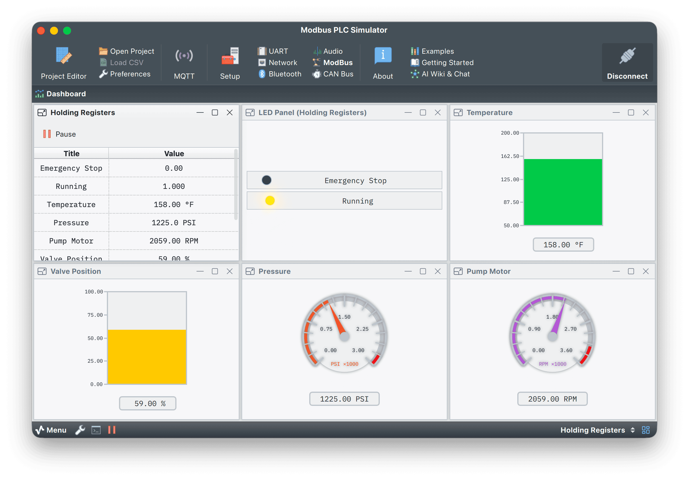

# Modbus PLC Simulator

## Overview

This project demonstrates Serial Studio's Modbus TCP/RTU connectivity using a physics-based hydraulic test stand simulator. The simulator acts as a Modbus TCP server, providing realistic industrial telemetry data with automatic failure modes and recovery sequences.

This example showcases Serial Studio's **Pro feature** for Modbus protocol support, including real-time data acquisition, custom frame parsing, and industrial dashboard visualization.

**Note:** Modbus support requires a Serial Studio Pro license. Visit [serial-studio.com](https://serial-studio.com/) for more details.



## Simulated System

The simulator models a **50HP hydraulic power unit** with the following components:

### Hardware Model
- **Motor**: 50HP VFD-controlled induction motor (0-3600 RPM)
- **Pump**: 45cc/rev 9-piston axial pump with realistic efficiency curves
- **Control Valve**: Proportional valve with first-order lag response
- **Sensors**: Temperature, pressure, flow, vibration, and motor load monitoring

### Physics Simulation
- **VFD Soft-Start**: S-curve ramp from 0 to 1800 RPM over 10 seconds
- **PID Pressure Control**: Maintains target pressure of 1500 PSI
- **Thermodynamic Model**: Oil heating from pump inefficiency and valve throttling
- **Vibration Analysis**: ISO 10816-compliant vibration monitoring
- **Realistic Noise**: Ornstein-Uhlenbeck sensor noise on all measurements

### Operational Phases
The simulator automatically cycles through realistic test sequences:

1. **STARTUP**: VFD soft-start with smooth S-curve acceleration
2. **RUNNING**: Normal operation with PID pressure control and load cycling
3. **PRESSURE_TEST**: High-pressure stress test every 60 seconds
4. **FAILURE**: Random pump cavitation with RPM/pressure instability (~0.02% probability)
5. **SHUTDOWN**: Emergency stop with controlled motor coast-down
6. **RESTART_WAIT**: E-STOP hold period before automatic restart

## Modbus Register Map

The simulator provides **9 holding registers** (function code 0x03) starting at address 0:

| Address | Name | Range | Units | Description |
|---------|------|-------|-------|-------------|
| HR[0] | E-Stop | 0-1 | - | Emergency stop status (0=Normal, 1=E-Stop) |
| HR[1] | Start LED | 0-1 | - | Motor running indicator (0=Off, 1=Running) |
| HR[2] | Temperature | 72-180 | °F | Hydraulic oil temperature |
| HR[3] | Pressure | 0-3000 | PSI | System pressure (alarm at 2800 PSI) |
| HR[4] | Motor RPM | 0-3600 | RPM | Motor speed |
| HR[5] | Valve Position | 0-100 | % | Control valve opening percentage |
| HR[6] | Flow Rate | 0-500 | GPM×10 | Pump flow rate (divide by 10) |
| HR[7] | Motor Load | 0-100 | % | Motor load percentage |
| HR[8] | Vibration | 0-150 | mm/s×10 | Vibration velocity RMS (divide by 10) |

## Requirements

### Python Dependencies
```bash
pip install pymodbus
```

The simulator supports both pymodbus 3.x and 4.x automatically.

### Serial Studio
- Serial Studio Pro (for Modbus support)
- Compatible with both Modbus TCP and Modbus RTU modes

## How to Run

### 1. Start the PLC Simulator

Run the Python script to start the Modbus TCP server:

```bash
python3 plc_simulator.py
```

**Expected output:**
```
======================================================================
  HYDRAULIC TEST STAND SIMULATOR
======================================================================
  Server: 0.0.0.0:5020  |  Update: 50ms (20Hz)

  Registers (FC03 Holding):
    0:E-Stop  1:Start  2:Temp(°F)  3:PSI  4:RPM  5:Valve(%)
    6:GPM(÷10)  7:Load(%)  8:Vibration(÷10 mm/s)

  Phases: STARTUP → RUNNING → PRESSURE_TEST → (FAILURE → SHUTDOWN)
  Flags:  E=E-Stop  A=Alarm(>2800PSI)  F=Failure
======================================================================

[STARTUP ] -   R:   0 P:  14 F: 0.0 L: 0 V:0.1 T: 72
[STARTUP ] -   R: 180 P: 110 F: 4.8 L:17 V:1.8 T: 72
...
```

### 2. Configure Serial Studio

1. **Load the project file**:
   - Open Serial Studio
   - File → Open → Select `Modbus PLC Simulator.ssproj`

2. **Configure Modbus connection**:
   - **I/O Interface**: `Modbus`
   - **Protocol**: `Modbus TCP`
   - **Host**: `127.0.0.1` (or the IP address of the machine running the simulator)
   - **Port**: `5020`
   - **Slave Address**: `1`
   - **Register Type**: `Holding Registers (0x03)`
   - **Start Address**: `0`
   - **Register Count**: `9`
   - **Poll Interval**: `100 ms` (recommended)

3. **Connect**:
   - Click **Connect** in Serial Studio
   - The dashboard will begin displaying live telemetry

## Serial Studio Visualizations

The included project file (`Modbus PLC Simulator.ssproj`) provides:

- **Status LEDs**: Emergency Stop and Running indicators
- **Temperature Bar**: Oil temperature with alarm thresholds
- **Pressure Gauge**: System pressure with high alarm at 2800 PSI
- **RPM Gauge**: Motor speed with color-coded zones
- **Valve Position Bar**: Control valve opening percentage
- **Flow Rate Graph**: Real-time pump flow monitoring
- **Motor Load Gauge**: Motor load percentage
- **Vibration Graph**: ISO 10816 vibration monitoring
- **Time-Series Plots**: Trend visualization for all parameters

## Frame Parser

The project includes a comprehensive JavaScript frame parser that:

- Handles all Modbus function codes (0x01, 0x02, 0x03, 0x04, 0x05, 0x06, 0x10)
- Parses both register and coil/discrete input responses
- Applies scaling factors (Flow Rate and Vibration are divided by 10)
- Handles Modbus exception responses (0x80+)
- Maintains last known good values on errors

The parser is embedded in the `.ssproj` file and requires **Binary (Direct)** decoder mode.

## Files Included

- **plc_simulator.py**: Physics-based hydraulic test stand simulator with Modbus TCP server
- **Modbus PLC Simulator.ssproj**: Serial Studio project file with dashboard configuration
- **README.md**: This documentation
- **doc/screenshot.png**: Dashboard screenshot (to be added)

## Observing Failure Modes

The simulator includes realistic failure sequences that occur randomly (~0.02% probability per update):

1. **Cavitation Detection**: Watch for rapid RPM oscillations (±30-50 RPM)
2. **Pressure Spike**: Pressure rises toward relief valve setting (3000 PSI)
3. **High Pressure Alarm**: Triggers at 2800 PSI
4. **Vibration Spike**: Cavitation causes vibration to exceed 11 mm/s (unacceptable zone)
5. **E-Stop Activation**: Automatic emergency stop after 3 seconds of instability
6. **Controlled Shutdown**: Motor coast-down and pressure bleed
7. **Auto-Restart**: System restarts after 3-second safety delay

To force a failure for testing, modify the `FAILURE_PROBABILITY` constant in `plc_simulator.py` (set to `0.1` for ~10% chance).

## Technical Details

### Update Rate
- Simulator runs at **20 Hz** (50ms update interval)
- Recommended Serial Studio poll interval: **100ms** to avoid overwhelming the interface

### Network Configuration
- **Default Port**: 5020 (can be changed in `SERVER_PORT` constant)
- **Binding**: 0.0.0.0 (accepts connections from any network interface)
- **Protocol**: Modbus TCP (application protocol)

### Modbus Compatibility
- Fully compliant with Modbus TCP specification
- Compatible with any Modbus client (not limited to Serial Studio)
- Supports concurrent connections (standard Modbus TCP server)

## Advanced Usage

### Custom Register Groups

Serial Studio supports **multi-group mode** for polling non-contiguous register ranges. To poll specific registers:

1. Enable **Multi-Group Mode** in the Modbus setup pane
2. Add register groups with specific start addresses and counts
3. Configure custom frame parsing for mixed data types

### Integration with Real PLCs

This simulator can be used as a template for connecting to real industrial PLCs:

1. Modify the register map to match your PLC's register layout
2. Update the frame parser scaling factors as needed
3. Adjust polling intervals based on PLC response times
4. Configure Modbus RTU for serial-connected PLCs (RS-485)

## Troubleshooting

**Problem**: Serial Studio shows "Connection Failed"
- Verify the simulator is running (`python3 plc_simulator.py`)
- Check firewall settings allow TCP port 5020
- Confirm the host IP address is correct

**Problem**: No data updates in Serial Studio
- Verify poll interval is set (recommended: 100ms)
- Check that register count is 9 and start address is 0
- Review frame parser for errors in the JavaScript console

**Problem**: Erratic readings or NaN values
- Ensure decoder mode is set to **Binary (Direct)**
- Verify the frame parser is properly embedded in the project file
- Check for Modbus exception responses in the simulator log

## License

This example is dual-licensed under GPL-3.0 and the Serial Studio Commercial License.

For more information about Serial Studio and Modbus integration, visit the [Serial Studio documentation](https://github.com/Serial-Studio/Serial-Studio/wiki).
