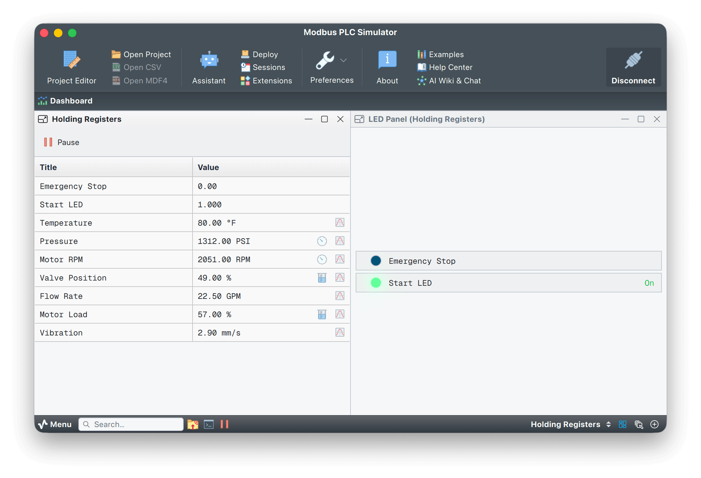

# Modbus PLC simulator

## Overview

This project exercises Serial Studio's Modbus TCP/RTU support with a physics-based hydraulic test stand simulator. The simulator acts as a Modbus TCP server and produces realistic industrial telemetry, with automatic failure modes and recovery sequences.

It's a good demo of Serial Studio's Pro Modbus protocol support: real-time data acquisition, custom frame parsing, and an industrial dashboard.

> Modbus support needs a Serial Studio Pro license. See [serial-studio.com](https://serial-studio.com/) for details.



## Simulated system

The simulator models a 50HP hydraulic power unit.

### Hardware model

- **Motor.** 50HP VFD-controlled induction motor (0 to 3600 RPM).
- **Pump.** 45cc/rev 9-piston axial pump with realistic efficiency curves.
- **Control valve.** Proportional valve with first-order lag response.
- **Sensors.** Temperature, pressure, flow, vibration, and motor load monitoring.

### Physics simulation

- **VFD soft-start.** S-curve ramp from 0 to 1800 RPM over 10 seconds.
- **PID pressure control.** Holds target pressure at 1500 PSI.
- **Thermodynamic model.** Oil heating from pump inefficiency and valve throttling.
- **Vibration analysis.** ISO 10816-compliant vibration monitoring.
- **Realistic noise.** Ornstein-Uhlenbeck sensor noise on every measurement.

### Operational phases

The simulator cycles through realistic test sequences:

1. **STARTUP.** VFD soft-start with smooth S-curve acceleration.
2. **RUNNING.** Normal operation with PID pressure control and load cycling.
3. **PRESSURE_TEST.** High-pressure stress test every 60 seconds.
4. **FAILURE.** Random pump cavitation with RPM/pressure instability (~0.02% probability).
5. **SHUTDOWN.** Emergency stop with controlled motor coast-down.
6. **RESTART_WAIT.** E-STOP hold period before automatic restart.

## Modbus register map

The simulator exposes 9 holding registers (function code 0x03) starting at address 0.

| Address | Name            | Range   | Units      | Description |
|---------|-----------------|---------|------------|-------------|
| HR[0]   | E-Stop          | 0-1     |            | Emergency stop status (0 = normal, 1 = e-stop) |
| HR[1]   | Start LED       | 0-1     |            | Motor running indicator (0 = off, 1 = running) |
| HR[2]   | Temperature     | 72-180  | °F         | Hydraulic oil temperature |
| HR[3]   | Pressure        | 0-3000  | PSI        | System pressure (alarm at 2800 PSI) |
| HR[4]   | Motor RPM       | 0-3600  | RPM        | Motor speed |
| HR[5]   | Valve Position  | 0-100   | %          | Control valve opening percentage |
| HR[6]   | Flow Rate       | 0-500   | GPM × 10   | Pump flow rate (divide by 10) |
| HR[7]   | Motor Load      | 0-100   | %          | Motor load percentage |
| HR[8]   | Vibration       | 0-150   | mm/s × 10  | Vibration velocity RMS (divide by 10) |

## Requirements

### Python dependencies

```bash
pip install pymodbus
```

The simulator supports pymodbus 3.x and 4.x automatically.

### Serial Studio

- Serial Studio Pro (for Modbus support).
- Compatible with both Modbus TCP and Modbus RTU.

## How to run

### 1. Start the PLC simulator

Run the Python script to start the Modbus TCP server:

```bash
python3 plc_simulator.py
```

**Expected output:**

```
======================================================================
  HYDRAULIC TEST STAND SIMULATOR
======================================================================
  Server: 0.0.0.0:5020  |  Update: 50ms (20Hz)

  Registers (FC03 Holding):
    0:E-Stop  1:Start  2:Temp(°F)  3:PSI  4:RPM  5:Valve(%)
    6:GPM(÷10)  7:Load(%)  8:Vibration(÷10 mm/s)

  Phases: STARTUP → RUNNING → PRESSURE_TEST → (FAILURE → SHUTDOWN)
  Flags:  E=E-Stop  A=Alarm(>2800PSI)  F=Failure
======================================================================

[STARTUP ] -   R:   0 P:  14 F: 0.0 L: 0 V:0.1 T: 72
[STARTUP ] -   R: 180 P: 110 F: 4.8 L:17 V:1.8 T: 72
...
```

### 2. Configure Serial Studio

1. **Load the project file:**
   - Open Serial Studio.
   - File → Open → pick `Modbus PLC Simulator.ssproj`.
2. **Configure the Modbus connection:**
   - **I/O Interface:** `Modbus`.
   - **Protocol:** `Modbus TCP`.
   - **Host:** `127.0.0.1` (or the IP address of the machine running the simulator).
   - **Port:** `5020`.
   - **Slave Address:** `1`.
   - **Register Type:** `Holding Registers (0x03)`.
   - **Start Address:** `0`.
   - **Register Count:** `9`.
   - **Poll Interval:** `100 ms` (recommended).
3. **Connect.** Click **Connect** in Serial Studio. The dashboard starts showing live telemetry.

## Visualizations

The included project file (`Modbus PLC Simulator.ssproj`) provides:

- **Status LEDs.** Emergency Stop and Running indicators.
- **Temperature bar.** Oil temperature with alarm thresholds.
- **Pressure gauge.** System pressure with high alarm at 2800 PSI.
- **RPM gauge.** Motor speed with color-coded zones.
- **Valve position bar.** Control valve opening percentage.
- **Flow rate graph.** Real-time pump flow monitoring.
- **Motor load gauge.** Motor load percentage.
- **Vibration graph.** ISO 10816 vibration monitoring.
- **Time-series plots.** Trend visualization for every parameter.

## Modbus register map CSV

The included `modbus_plc_simulator.csv` file defines the register map in a format that Serial Studio's **Modbus Map Importer** can read directly. That means you can auto-generate a project file from a register map definition instead of configuring registers manually.

CSV columns: `address`, `name`, `type`, `dataType`, `units`, `min`, `max`, `scale`, `offset`, `description`.

To import:

1. Open Serial Studio and pick **Modbus** as the I/O interface.
2. Click **Import Register Map**.
3. Pick `modbus_plc_simulator.csv`.
4. Review the register preview and click **Create Project**.

## Frame parser

Serial Studio auto-generates a JavaScript frame parser based on the register map. The parser:

- Handles all Modbus function codes (0x01, 0x02, 0x03, 0x04, 0x05, 0x06, 0x10).
- Parses both register and coil/discrete input responses.
- Applies scaling factors (Flow Rate and Vibration are divided by 10).
- Handles Modbus exception responses (0x80+).
- Keeps the last known good values on errors.

## Files

- **plc_simulator.py.** Physics-based hydraulic test stand simulator with Modbus TCP server.
- **Modbus PLC Simulator.ssproj.** Serial Studio project file with dashboard configuration.
- **modbus_plc_simulator.csv.** Register map definition for the Modbus Map Importer.
- **README.md.** This documentation.
- **doc/screenshot.png.** Dashboard screenshot.

## Observing failure modes

The simulator includes realistic failure sequences that happen randomly (~0.02% probability per update):

1. **Cavitation detection.** Watch for rapid RPM oscillations (±30 to 50 RPM).
2. **Pressure spike.** Pressure rises toward the relief valve setting (3000 PSI).
3. **High pressure alarm.** Triggers at 2800 PSI.
4. **Vibration spike.** Cavitation pushes vibration above 11 mm/s (unacceptable zone).
5. **E-Stop activation.** Automatic emergency stop after 3 seconds of instability.
6. **Controlled shutdown.** Motor coast-down and pressure bleed.
7. **Auto-restart.** System restarts after a 3-second safety delay.

To force a failure for testing, change the `FAILURE_PROBABILITY` constant in `plc_simulator.py` (set to `0.1` for ~10% chance).

## Technical details

### Update rate

- Simulator runs at 20 Hz (50 ms update interval).
- Recommended Serial Studio poll interval: 100 ms to avoid overwhelming the interface.

### Network configuration

- **Default port:** 5020 (change via `SERVER_PORT`).
- **Binding:** 0.0.0.0 (accepts connections from any interface).
- **Protocol:** Modbus TCP (application protocol).

### Modbus compatibility

- Fully compliant with the Modbus TCP specification.
- Works with any Modbus client, not just Serial Studio.
- Supports concurrent connections (standard Modbus TCP server).

## Advanced usage

### Custom register groups

Serial Studio supports multi-group mode for polling non-contiguous register ranges. To poll specific registers:

1. Enable **Multi-Group Mode** in the Modbus setup pane.
2. Add register groups with specific start addresses and counts.
3. Configure custom frame parsing for mixed data types.

### Integration with real PLCs

This simulator can double as a template for connecting to real industrial PLCs:

1. Change the register map to match your PLC's register layout.
2. Update the frame parser scaling factors as needed.
3. Adjust polling intervals based on PLC response times.
4. Configure Modbus RTU for serial-connected PLCs (RS-485).

## Troubleshooting

**Problem: Serial Studio shows "Connection Failed".**

- Make sure the simulator is running (`python3 plc_simulator.py`).
- Check that the firewall allows TCP port 5020.
- Double-check the host IP address.

**Problem: No data updates in Serial Studio.**

- Make sure a poll interval is set (100 ms is a good default).
- Check that register count is 9 and start address is 0.
- Look at the JavaScript console for frame parser errors.

**Problem: Erratic readings or NaN values.**

- Make sure the decoder mode is set to Binary (Direct).
- Check that the frame parser is embedded in the project file.
- Look for Modbus exception responses in the simulator log.

## License

This example is dual-licensed under GPL-3.0 and the Serial Studio Commercial License.

For more about Serial Studio and Modbus integration, see the [Serial Studio documentation](https://github.com/Serial-Studio/Serial-Studio/wiki).
