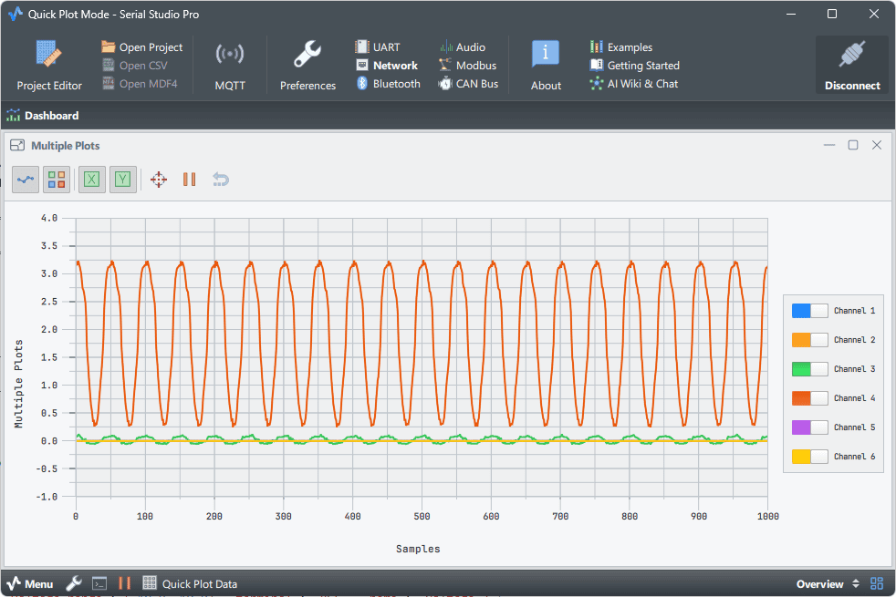

# DAQBridge - NI DAQmx Data Acquisition to UDP

High-performance Python bridge that streams real-time data from NI DAQ devices to Serial Studio (or any UDP listener) in CSV format. Works with any NI DAQ hardware supporting analog input.



## Features

- **Universal NI DAQ Support**: Works with USB-600x, USB-621x, PCIe-6xxx, and other DAQmx-compatible devices
- **Voltage & Current** measurement (current via shunt resistor)
- **Real-time UDP streaming** in CSV format (one packet per sample)
- **Configurable** sample rates, voltage ranges, and terminal configurations
- **Custom processing** function for user-defined calculations
- **Low latency** single-sample acquisition mode

## Requirements

- Python 3.8+
- NumPy
- NI-DAQmx driver (from National Instruments)
- Any NI DAQ device with analog input channels

```bash
pip install numpy nidaqmx
```

## Serial Studio Setup

1. **Configure Connection**:
   - Enable *Quick Plot Mode* in Serial Studio settings.
   - Go to **Setup** → **I/O Interface** → **Network Socket**
   - Set **Socket Type** to `UDP`
   - Set **Host** to `127.0.0.1`
   - Set **Port** to `9000`

3. **Connect** and run DAQBridge:
   ```bash
   python daqbridge.py
   ```

## Configuration

Edit the top of `daqbridge.py`:

### Device Settings

```python
DEVICE_NAME = "Dev1"          # Check NI MAX for your device name
SAMPLE_RATE = 3000.0          # Check your device specs for max rate
SAMPLES_PER_READ = 1          # 1 = lowest latency
```

> **Note**: Use NI MAX (Measurement & Automation Explorer) to find your device name and verify supported sample rates.

### Channel Configuration

```python
CHANNEL_CONFIG = [
    # Voltage measurement
    {"channel": "ai0", "type": "voltage", "voltage_range": (-10.0, 10.0), "terminal": "RSE", "name": "Voltage_0"},

    # Current measurement (I = V / shunt_resistor)
    {"channel": "ai2", "type": "current", "voltage_range": (-10.0, 10.0), "terminal": "RSE", "name": "Current_0", "shunt_resistor": 0.1},
]
```

| Parameter | Values | Description |
|-----------|--------|-------------|
| `channel` | `ai0`, `ai1`, ... | Physical channel (device-dependent) |
| `type` | `voltage`, `current` | Measurement type |
| `voltage_range` | `(-10,10)`, `(-5,5)`, etc. | Input range (device-dependent) |
| `terminal` | `RSE`, `DIFF` | RSE=single-ended, DIFF=differential |
| `shunt_resistor` | ohms | For current type only |

### UDP Settings

```python
UDP_HOST = "127.0.0.1"
UDP_PORT = 9000
```

## Sample Rate Guidelines

Sample rate limits vary by device. Check your device specifications in NI MAX.

**Example - USB-6001** (20 kS/s aggregate):
| Channels | Max Rate/Channel |
|----------|------------------|
| 1 | 20,000 Hz |
| 4 | 5,000 Hz |
| 8 | 2,500 Hz |

**Example - USB-6210** (250 kS/s aggregate):
| Channels | Max Rate/Channel |
|----------|------------------|
| 1 | 250,000 Hz |
| 8 | 31,250 Hz |
| 16 | 15,625 Hz |

## Custom Processing

Edit `process_readings()` in `daqbridge.py` to add your own calculations:

```python
def process_readings(raw_data: np.ndarray, channel_config: list) -> np.ndarray:
    output = raw_data.copy()

    # Default: convert current channels (I = V / R)
    for ch_idx, ch_cfg in enumerate(channel_config):
        if ch_cfg.get("type") == "current":
            shunt = ch_cfg.get("shunt_resistor", 1.0)
            output[ch_idx, :] = raw_data[ch_idx, :] / shunt

    # ADD YOUR CUSTOM PROCESSING HERE
    # output[0, :] = raw_data[0, :] * 1.0234        # Calibration factor
    # output[1, :] = raw_data[1, :] - 0.0125        # Offset correction
    # output[4, :] = output[0, :] * output[2, :]   # Power = V × I

    return output
```

## Current Measurement Circuit

```
    Load
      │
      ├───[Rshunt]───┬─── AI channel
      │              │
     GND            GND

    Current = V_measured / Rshunt
```

## Troubleshooting

| Error | Solution |
|-------|----------|
| Device identifier is invalid | Check device name in NI MAX |
| Sample rate exceeds maximum | Reduce `SAMPLE_RATE` or number of channels |
| No data in Serial Studio | Verify UDP port 9000, check firewall |
| Resource is reserved | Close NI MAX or other DAQ applications |
| Specified route cannot be satisfied | Check terminal config (RSE/DIFF) supported by your device |

## Supported Devices

Any NI DAQ device compatible with NI-DAQmx, including:

- **USB Series**: USB-6000, USB-6001, USB-6002, USB-6003, USB-6008, USB-6009, USB-6210, USB-6211, USB-6215, USB-6218, USB-6229, USB-6341, USB-6343, USB-6361, USB-6363
- **PCIe Series**: PCIe-6320, PCIe-6321, PCIe-6323, PCIe-6341, PCIe-6343, PCIe-6351, PCIe-6353, PCIe-6361, PCIe-6363
- **PXI Series**: PXI-6221, PXI-6229, PXI-6251, PXI-6259, PXI-6281, PXI-6289
- **CompactDAQ**: NI-9201, NI-9205, NI-9215, NI-9220, NI-9222, NI-9223, NI-9229