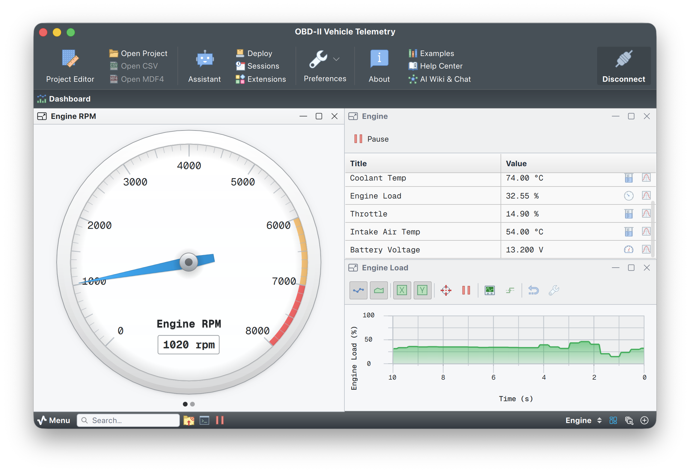

# OBD-II Vehicle Telemetry

## Overview

This project reads live engine data from any OBD-II compliant vehicle and shows it on a Serial Studio dashboard. A built-in control script polls an ELM327-compatible adapter (such as the OBDLink EX) over a serial connection, so there is no companion program to run. Engine RPM, vehicle speed, coolant temperature, calculated load, intake air temperature, throttle position and adapter battery voltage appear on live gauges.

Real-time car telemetry with nothing but Serial Studio and a cheap OBD-II adapter.

> Some Serial Studio features need a paid license. See [serial-studio.com](https://serial-studio.com/) for details.

## Telemetry source

OBD-II data is read from an ELM327-compatible adapter plugged into the vehicle's diagnostic port and connected to the computer as a serial (UART) device. The project's control script drives the whole exchange:

- `setup()` initializes the adapter once: reset, echo/linefeed/space off, and automatic protocol detection (`ATSP0`) so the same script works on CAN, ISO and PWM vehicles.
- `loop()` polls six Mode-01 PIDs in round-robin and decodes each reply inline, and periodically reads the adapter's own battery-voltage measurement with the `AT RV` command (which has no PID header and is parsed separately).

These are all standard SAE J1979 Mode-01 PIDs, so no vehicle-specific configuration is required. The OBD-II standard does not require a car to support every PID, though: it only guarantees the protocol handshake and the bitmask (PID `00`) that lists which PIDs the car implements. In practice the core three (RPM, speed, coolant) are answered by almost every OBD-II car (US 1996+, EU petrol 2001+, EU diesel 2004+), while load, intake air temperature and throttle position are widely but not universally supported (EVs/hybrids and some diesels may omit them). `AT RV` always works because the adapter measures it directly and never asks the vehicle.

| PID     | Quantity            | Formula                  | Availability                          |
|---------|---------------------|--------------------------|---------------------------------------|
| `010C`  | Engine RPM          | `((A * 256) + B) / 4`    | Core, near-universal                  |
| `010D`  | Vehicle speed       | `A` (km/h)               | Core, near-universal                  |
| `0105`  | Coolant temperature | `A - 40` (degrees C)     | Core, near-universal                  |
| `0104`  | Calculated load     | `A * 100 / 255` (%)      | Common, not universal                 |
| `010F`  | Intake air temp     | `A - 40` (degrees C)     | Common; some EVs/diesels omit it      |
| `0111`  | Throttle position   | `A * 100 / 255` (%)      | Common, not universal                 |
| `AT RV` | Battery voltage     | adapter reading (volts)  | Always (measured by the adapter)      |

Any PID the car does not support comes back as `NO DATA`; the script skips that write and the gauge reads "No data" rather than showing a wrong value, so an unsupported metric never breaks the others.

All requests are plain ASCII (the hex PID digits, or the letters `AT` for adapter commands) terminated by a carriage return, and every reply ends with the ELM327 `>` prompt. The full command set and reply formats are in the [ELM327 datasheet](https://cdn.sparkfun.com/assets/learn_tutorials/8/3/ELM327DS.pdf).

## How it works

This example shows the request/response pattern that OBD-II needs, which differs from a normal telemetry stream where the device pushes data on its own. Three Serial Studio features carry it:

- **`deviceWriteAndWait(data, timeout, until, source?)`** sends a command and blocks the control-script worker (never the UI) until the adapter's `>` prompt arrives or the timeout elapses, then returns the reply. This turns the fire-and-forget serial link into a clean request/response call. It mirrors `deviceWrite`'s data-first shape; `source` is optional and defaults to 0.
- **The `OBD` data table** holds the decoded values. The control script writes it with `tableSet("OBD", "rpm", value)` after each reply; the registers are declared as `computed` so they are writable.
- **Virtual datasets** drive the gauges. Each gauge is a virtual dataset whose transform reads its table register (`tableGet("OBD", "rpm")`) and returns the value, so nothing needs a frame parser.

After writing the table, the script calls **`dashboardTick()`**, which forces the dashboard to re-run the dataset transforms and render the fresh values, even though the adapter only speaks when polled. The project's frame parser is a stub that returns an empty frame.

## Project features

- Live gauges for engine RPM, vehicle speed, coolant temperature, calculated load, intake air temperature, throttle position and adapter battery voltage (any PID the vehicle does not support reads "No data").
- Request/response polling driven entirely by an in-project control script, no external program.
- Works with any OBD-II compliant vehicle through the standard ELM327 command set; the core RPM/speed/coolant gauges populate on almost every car.
- Serial (UART) source configured in Serial Studio's project editor (115200 baud, the OBDLink EX power-up rate; classic ELM327 clones default to 38400).

## Hardware setup

1. Plug an ELM327-compatible adapter (e.g. OBDLink EX) into the vehicle's OBD-II port.
2. Connect the adapter to your computer so it appears as a serial port.
3. In Serial Studio, open this project, select the adapter's serial port on the OBD-II Adapter source, and connect.
4. Turn the ignition to ON (engine running for live RPM and coolant readings).

## Files

- `OBD-II.ssproj`: the Serial Studio project; it embeds the source, data table, gauges, the OBD-II poller control script, and a stub frame parser.
- `doc/screenshot.png`: dashboard screenshot.

## Reference

- [ELM327 datasheet](https://cdn.sparkfun.com/assets/learn_tutorials/8/3/ELM327DS.pdf): AT command set, OBD command format, reply parsing and serial defaults.
