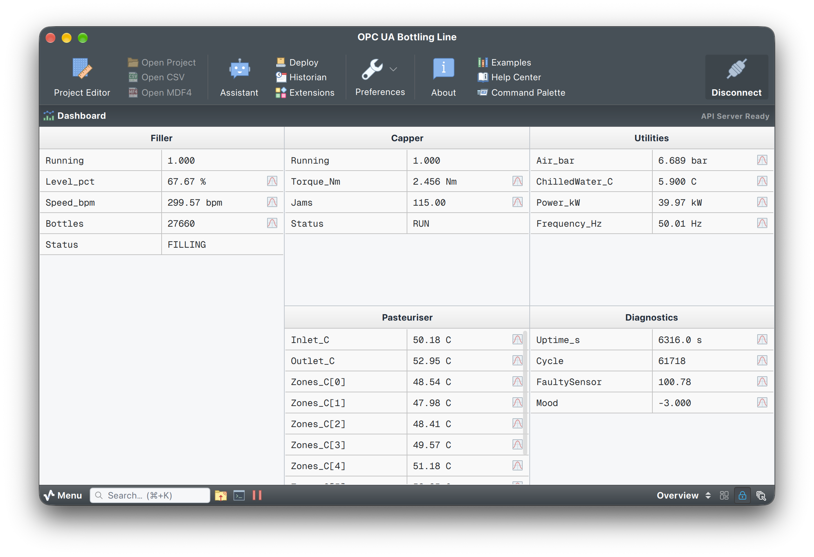

# OPC UA PLC simulator

## Overview

This project exercises Serial Studio's OPC UA client with a simulated bottling line served over OPC UA. The simulator is a small `asyncua` server: a filler with PID level control, a capper with torque feedback and jam counting, a six-zone pasteuriser tunnel, plant utilities, and a diagnostics folder with one sensor that periodically reports a bad status.

The same script doubles as the fixture for the driver's integration tests, so every flag below is exercised in CI.

> OPC UA support needs a Serial Studio Pro license. See [serial-studio.com](https://serial-studio.com/) for details.



## Requirements

```bash
pip install asyncua
```

## Running the simulator

```bash
python opcua_plc_simulator.py
```

The server listens on `opc.tcp://127.0.0.1:4840/serialstudio/` with security policy **None** and anonymous login. Flags:

| Flag | Effect |
|------|--------|
| `--port N` | Listen on another port (default 4840). |
| `--rate HZ` | Update rate of every tag (default 10 Hz). |
| `--user NAME --password PW` | Require username/password; anonymous sessions are rejected. |
| `--no-subscriptions` | Refuse every `CreateSubscription`, so Serial Studio falls back to timed reads. |
| `--drop-after N` | Stop publishing after N seconds without closing the socket, so the client's silence watchdog has something to notice. |
| `--security LIST` | Advertise secure endpoints alongside the `None` one. `all` offers every policy Serial Studio supports; a comma list such as `Basic256Sha256,Aes256_Sha256_RsaPss` narrows it. Each policy is advertised in both **Sign** and **Sign & Encrypt**. |
| `--secure-only` | Advertise **only** `Basic256Sha256`, with no `None` fallback, so a client that cannot open a secure channel has nothing to connect to. |
| `--allow-certificate-users` | Also accept an X.509 user identity token. Any client certificate is accepted; what this exercises is the client's identity plumbing, not a real PKI. |
| `--cert-expired` | Serve a certificate whose validity window ended yesterday, so the client's "expired" refusal has something to refuse. Written to `server_cert_expired.der`, leaving the good certificate alone. |
| `--cert-wrong-host` | Serve a certificate issued for a host this server is not listening on, for the hostname-mismatch refusal. |
| `--cert FILE --key FILE` | Where the server certificate and key live (default `server_cert.der` / `server_key.pem`). They are generated on the first secure run and reused afterwards, so a client that trusted the simulator once is not asked again. |

### Connecting over a secure channel

```bash
python opcua_plc_simulator.py --security all
```

Then in Serial Studio: pick a **Policy** other than `None`, leave **Mode** on `Sign & Encrypt`, and
press Connect. The first attempt is refused because the simulator's self-signed certificate is
unknown, and the trust prompt shows its fingerprint; accepting records the decision and the next
Connect succeeds. `Basic128Rsa15` and `Basic256` are advertised too, but both are deprecated by the
OPC Foundation and Serial Studio labels them as such.

## Address space

Node ids are strings, so they stay stable across restarts (for example `ns=2;s=Plant.Line1.Filler.Level_pct`).

| Folder | Tag | Type | Notes |
|--------|-----|------|-------|
| Plant/Line1/Filler | Running | Boolean | Conveyor state; stops for 10 s every 90 s |
| | Level_pct | Double | PID-held level, setpoint wanders 50-70 % |
| | Speed_bpm | Double | Soft-start toward 300 bottles/min |
| | Bottles | UInt32 | Production counter |
| | Status | String | `FILLING`, `HOLD`, `STOPPED` |
| Plant/Line1/Capper | Running | Boolean | |
| | Torque_Nm | Float | Follows speed; spikes on a jam |
| | Jams | UInt16 | Jam counter |
| | Status | String | `RUN`, `IDLE`, `JAM` |
| Plant/Line1/Pasteuriser | Inlet_C, Outlet_C | Double | First-order thermal model, 62 C target |
| | Zones_C | Double[6] | Six tunnel zones; expands to six datasets |
| | Heater_pct | Byte | Heater duty |
| Plant/Utilities | Air_bar, ChilledWater_C, Power_kW | Double | Slow wander |
| | Frequency_Hz | Float | Mains frequency |
| Plant/Diagnostics | Uptime_s | Int64 | |
| | Cycle | Int32 | Simulation step counter |
| | FaultySensor | Double | Reports `BadSensorFailure` for 5 s out of every 10 s |
| | Mood | SByte | Signed small integer |

Every value carries a source timestamp from the simulator's clock.

## Using the project

1. Start the simulator.
2. Open `OPC UA PLC Simulator.ssproj` in Serial Studio, or select the **OPC UA** data source, enter the endpoint URL, press **Discover** and **Browse Tags...**, tick the `Plant` folder and press **Generate Project**.
3. Connect. Numeric tags plot, booleans drive LEDs, strings show in the data grid, and `FaultySensor` keeps its last good value while the simulator reports the bad status.

From the command line:

```bash
SerialStudio --opcua opc.tcp://127.0.0.1:4840/serialstudio/ \
  --opcua-tag "ns=2;s=Plant.Line1.Filler.Level_pct:f64:Level" \
  --opcua-tag "ns=2;s=Plant.Line1.Filler.Running:bool:Running"
```
