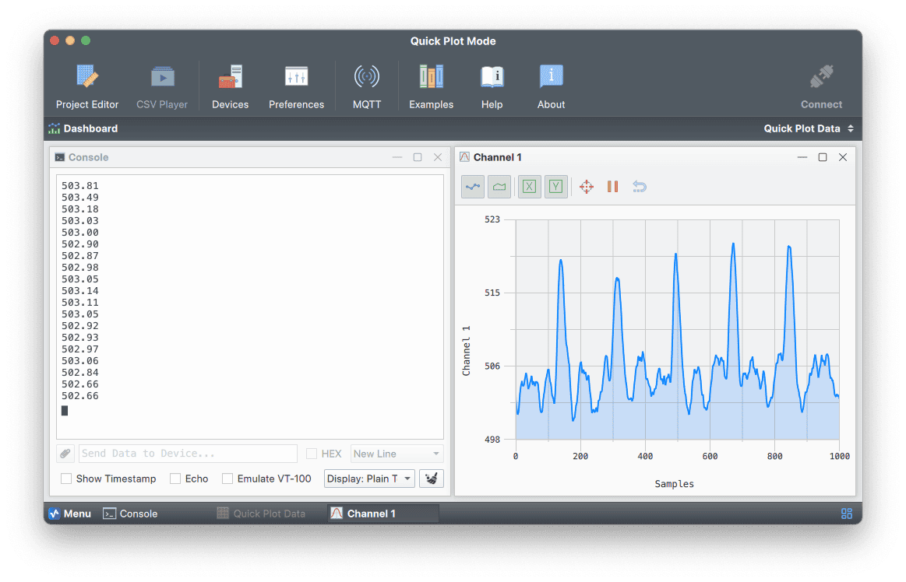
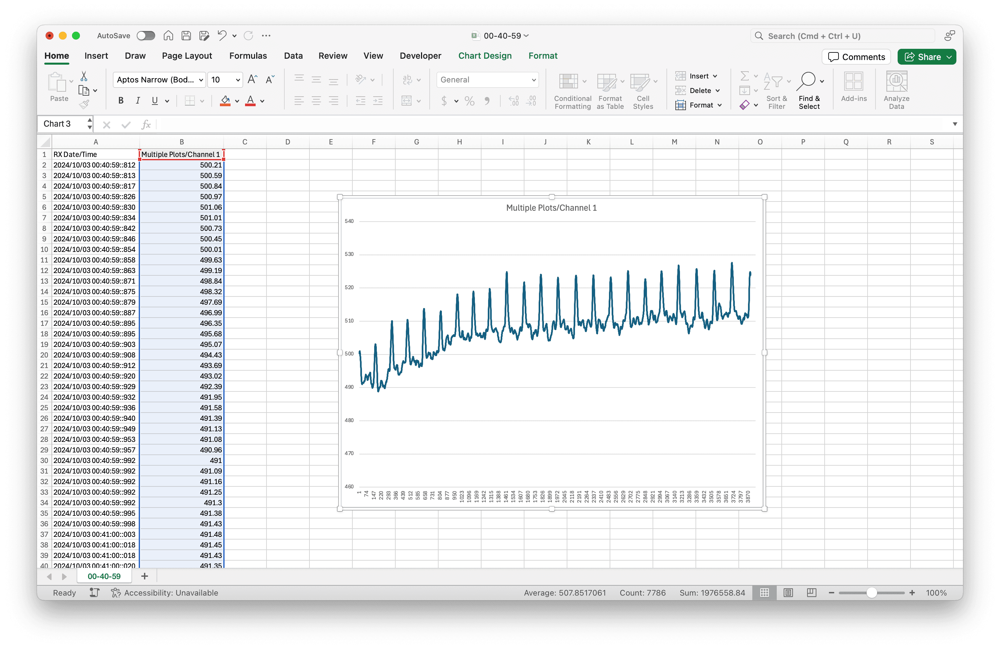

# Pulse sensor (photoplethysmogram) + Serial Studio example

## Overview

This project shows how to use Serial Studio to visualize data from a heart pulse sensor connected to an Arduino. The Arduino sketch reads raw data from the pulse sensor, applies a low-pass filter to remove high-frequency noise, and uses a moving average filter to smooth the signal further. The filtered signal is sent over serial for real-time visualization.

With Serial Studio you can use the **Quick Plot** feature to visualize the data, the same way you would with the Arduino IDE's Serial Plotter, and you can also export the data to a playable CSV for later analysis.

**Compatibility.** Works with any pulse sensor module connected to an analog pin on an Arduino. The program uses A0.

### What is a photoplethysmogram (PPG)?

A photoplethysmogram (PPG) is a signal that measures changes in blood volume in small blood vessels of the skin. It uses a light source (typically an LED) to shine light on the skin, and a phototransistor to measure how much light is reflected or passed through. When the heart beats, the amount of blood in the skin changes, which changes how much light is absorbed. The result is a waveform that shows each heartbeat as a peak.

PPG sensors are often used in pulse oximeters to measure heart rate and estimate blood oxygen. They can also provide info about breathing patterns and blood flow. The exact shape of the PPG waveform depends on where the sensor sits on the body, since tissue composition and vascular structure affect the signal.

## Hardware setup

You need a [pulse sensor](https://pulsesensor.com/) and an Arduino. Connect the sensor's signal output to A0.

### Connections

- **Pulse sensor signal output.** Connect to A0 on the Arduino.
- **Power and ground.** Connect VCC and GND of the pulse sensor to 5V and GND on the Arduino.

## Step by step

### 1. Arduino sketch (`PulseSensor.ino`)

The sketch reads the analog value from the pulse sensor, applies filtering, and sends the filtered data over the serial port.

**What it does:**

- **Low-pass filter.** Smooths out high-frequency noise from the raw readings.
- **Moving-average filter.** Further smooths the filtered signal.
- **Serial output.** The final filtered value is printed to serial at 115200 baud for Serial Studio.

**Code structure.** The sketch reads raw data from the sensor on A0, then processes it through two filtering stages:

1. Low-pass filter to reduce high-frequency noise.
2. Moving-average filter to smooth further.

The filtered signal is printed to serial so Serial Studio can visualize it.

### 2. Serial Studio configuration

**Using Quick Plot:**

1. **Download and install Serial Studio.** Visit [Serial Studio's website](https://serial-studio.github.io/) to download and install.
2. **Open Serial Studio.**
   - Connect your Arduino to the computer.
   - Launch Serial Studio and pick the right serial port.
   - Set the baud rate to 115200 to match the sketch.
3. **Enable Quick Plot.** In the Setup pane, click the **Quick Plot** radio box. It plots all numeric values it receives, line by line, like the Arduino IDE's Serial Plotter.
4. **CSV export.** Serial Studio can export a playable CSV file even if you haven't created a project. Good for offline analysis or sharing.

### 3. Viewing filtered pulse data

Once Serial Studio is set up:

- **Connect.** Pick the correct serial port and set the baud rate to 115200.
- **Visualize.** The filtered pulse signal plots in real time.
- **Log to CSV.** Save the data straight from Serial Studio for offline analysis.

### Troubleshooting

- **No data in Quick Plot.** Make sure the pulse sensor is wired correctly and the serial port and baud rate match.
- **Noise in the plot.** If the signal looks noisy, adjust the low-pass filter coefficient (`lowPassAlpha`) in the sketch.
