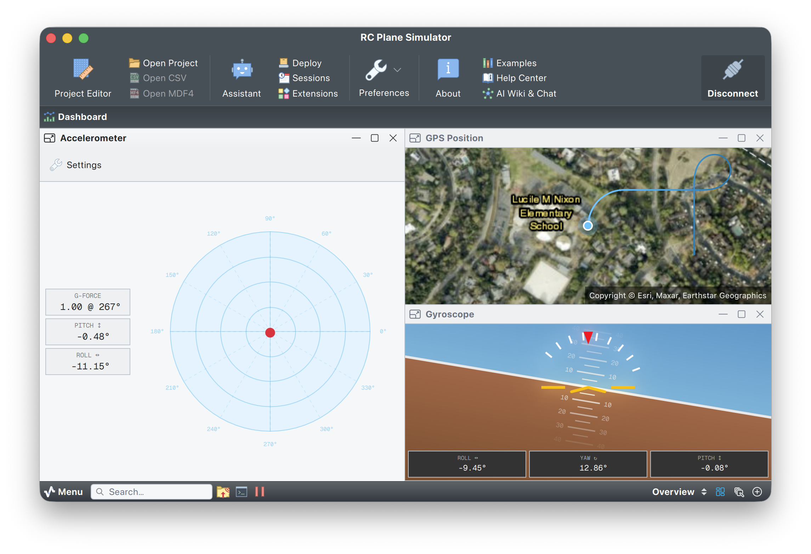

# RC plane telemetry simulator

A Python script that simulates a small RC plane flying a full flight profile, generating realistic telemetry data for Serial Studio widgets.



## Purpose

This example validates and demos Serial Studio widgets using a realistic RC plane flight profile with multiple maneuver phases.

## Widgets exercised

| Widget type    | Data source                              |
|----------------|------------------------------------------|
| Gyroscope      | Pitch, Roll, Yaw rates (°/s)             |
| Accelerometer  | X, Y, Z body-frame acceleration (m/s²)   |
| GPS Map        | Latitude, Longitude, Altitude            |
| Compass        | Heading (0 to 360°)                      |
| Gauge          | Airspeed (km/h)                          |
| Bar            | Throttle (%)                             |
| Time plots     | Altitude, Battery (V), RSSI (%), Motor Temp (°C) |

## Flight profile (~157 seconds)

```
Preflight → Engine Start → Taxi → Takeoff Roll → Liftoff → Climb →
Level Flight → Gentle Turns → Steep Turns → Figure-8 →
Loop → Aileron Roll → Knife Edge → Inverted →
Dive & Pull-up → Zero-G Push → Recovery →
Cruise Home → Approach → Flare → Rollout → Shutdown
```

## Usage

1. Open Serial Studio and load `RC Plane Simulator.ssproj` as the project file.
2. Confirm the I/O source is **Network (UDP)** on local port **9000** (the project file sets this on load).
3. Click **Connect**.

The project includes a control script that launches `rc_plane_simulator.py` automatically when you connect, so you normally don't run it by hand. Start it yourself only if you want one of the options below (in which case skip the auto-launch and run it before connecting):

```bash
python3 rc_plane_simulator.py
```

### Options

```
python3 rc_plane_simulator.py              # Continuous loop
python3 rc_plane_simulator.py --once       # Single flight
python3 rc_plane_simulator.py --fast       # 50 Hz update rate
python3 rc_plane_simulator.py --port 8000  # Custom UDP port
```

## Frame format

CSV over UDP to `127.0.0.1`, sent at 20 Hz by default, with `$` start delimiter and `;` end delimiter:

```
$gx,gy,gz,ax,ay,az,lat,lon,alt,heading,airspeed,throttle,battery,rssi,motor_temp;\n
```

## Requirements

- Python 3.6+ (no external dependencies).
