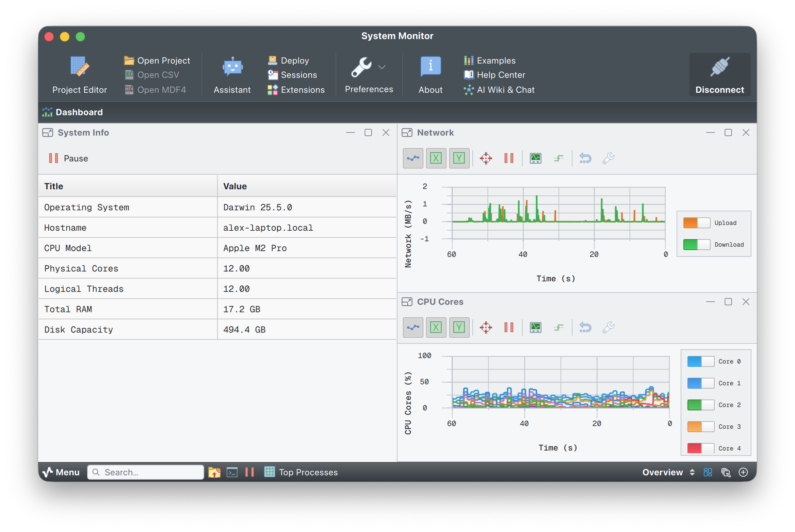

# System monitor

This example turns Serial Studio into a live system dashboard, like a minimal htop, using the **Process I/O driver** (Pro) to launch a Python script and read its `stdout` directly as a telemetry stream.



Serial Studio spawns `system-monitor.py` (or the platform launcher), and the script continuously writes metrics to `stdout` at about 30 Hz. Serial Studio parses each line as a frame and drives gauges, multiplots, bar graphs, and data grids in real time.

> The Process I/O driver needs a Serial Studio Pro license. See [serial-studio.com](https://serial-studio.com/) for details.

---

## What it monitors

| Metric                    | Widget              | Notes |
|---------------------------|---------------------|-------|
| CPU usage                 | Gauge + line plot   | Overall utilization (%) |
| CPU temperature           | Bar                 | °C; `N/A` if unavailable (for example macOS) |
| Per-core CPU              | Multiplot           | One curve per logical core. Cores beyond the machine's count are hidden via `-1` sentinel |
| RAM usage                 | Gauge + line plot   | Memory pressure (%) |
| RAM used                  | Bar                 | Absolute consumption (GB) |
| Swap used                 | Bar                 | Page-file / swap used (GB) |
| Disk usage                | Gauge + line plot   | Root partition (%) |
| Disk used                 | Bar                 | Space consumed (GB) |
| Network upload / download | Multiplot           | MB/s delta since last frame |
| Process count             | Bar                 | Total running processes |
| Top 10 processes          | Data grid           | Sorted by CPU. Format: `Name (nn.n% CPU)` |
| System info               | Data grid           | OS, hostname, CPU model, cores, RAM, disk. Static |

---

## Frame format

The script emits two types of frames to `stdout`.

### 1. Header frame (emitted once at startup)

Static system information that populates the System Info data grid:

```
$OS=Darwin 25.3.0|HOSTNAME=myhost|CPU_MODEL=Apple M2 Pro|CPU_CORES=12|CPU_THREADS=12|RAM_TOTAL=17.2 GB|DISK_TOTAL=494.4 GB
```

### 2. Live frames (emitted at ~30 Hz)

Real-time resource usage, per-core CPU, and top processes:

```
$CPU_USAGE=9.4|RAM_USAGE=62.1|RAM_USED=8.50|DISK_USAGE=18.3|DISK_USED=12.3|CPU_TEMP=N/A|SWAP_USED=1.7|NET_SENT=0.124|NET_RECV=0.871|PROCESSES=682|CORE0=17.2|CORE1=16.0|...|CORE31=-1|PROC0=WindowServer (12.5% CPU)|PROC1=python3 (8.1% CPU)|...
```

All frames use `$` as `frameStart` and `\n` as `frameEnd`.

#### Core sentinel value

The project always declares 32 core slots (`CORE0` to `CORE31`). Slots beyond the machine's actual logical core count are emitted as `-1`. The multiplot widget treats `-1` as out-of-range and hides those curves automatically.

---

## How to run

### Step 1: install dependencies

```bash
pip install psutil py-cpuinfo
```

- **`psutil`.** Cross-platform CPU, memory, disk, network, and process counters.
- **`py-cpuinfo`.** Reliable CPU brand string on all platforms (including Apple Silicon, where `platform.processor()` returns only `"arm"`).

The platform launchers (`system-monitor.sh` / `system-monitor.bat`) auto-install both packages via `pip` if they're missing.

### Step 2: configure Serial Studio

1. Open Serial Studio and load `system-monitor.ssproj`.
2. In the Setup panel, set **Bus Type** to **Process**.
3. Set **Mode** to **Launch**.
4. Set **Executable** to one of:
   - **macOS/Linux:** full path to `system-monitor.sh`.
   - **Windows:** full path to `system-monitor.bat`.
   - Or point directly to `python3` and set **Arguments** to the full path of `system-monitor.py`.
5. Leave **Working Directory** empty (the script resolves its own path).
6. Click **Connect**.

### Optional: run from the terminal

```bash
# macOS / Linux
./system-monitor.sh

# Windows
system-monitor.bat

# Direct Python (any platform)
python3 system-monitor.py --interval 0.033
```

Press `Ctrl+C` to stop.

**Arguments:**

| Argument             | Default           | Description                    |
|----------------------|-------------------|--------------------------------|
| `--interval SECONDS` | `1/30 ≈ 0.033`    | Seconds between live frames    |

---

## How the frame parser works

The JavaScript parser inside `system-monitor.ssproj` uses a persistent value array declared at module scope. Keys absent from a frame keep their last value, so the static header fields (OS, hostname, CPU model, and so on) stay visible while live metric frames keep updating the rest.

```javascript
// Module-scope globals, persist across parse() calls in QJSEngine
var _map  = { "OS": 0, "CPU_USAGE": 7, "CORE0": 17, ... };
var _vals = new Array(59).fill('');

function parse(frame) {
    var pairs = frame.split('|');
    for (var i = 0; i < pairs.length; i++) {
        var eq  = pairs[i].indexOf('=');
        var key = pairs[i].substring(0, eq).trim();
        var val = pairs[i].substring(eq + 1).trim();
        if (_map.hasOwnProperty(key))
            _vals[_map[key]] = val;
    }
    return _vals;
}
```

Dataset index `N` in the `.ssproj` maps to `_vals[N - 1]` (Serial Studio uses 1-based dataset indices, the JS array is 0-based).

---

## Index layout

| Index  | Key                        | Description                       |
|--------|----------------------------|-----------------------------------|
| 1-7    | `OS` to `DISK_TOTAL`       | Static system info                |
| 8      | `CPU_USAGE`                | Overall CPU %                     |
| 9      | `RAM_USAGE`                | RAM %                             |
| 10     | `RAM_USED`                 | RAM used (GB)                     |
| 11     | `DISK_USAGE`               | Disk %                            |
| 12     | `DISK_USED`                | Disk used (GB)                    |
| 13     | `CPU_TEMP`                 | CPU temperature (°C or `N/A`)     |
| 14     | `SWAP_USED`                | Swap/page-file used (GB)          |
| 15     | `NET_SENT`                 | Upload MB/s                       |
| 16     | `NET_RECV`                 | Download MB/s                     |
| 17     | `PROCESSES`                | Total process count               |
| 18-49  | `CORE0` to `CORE31`        | Per-core CPU % (`-1` = core absent) |
| 50-59  | `PROC0` to `PROC9`         | Top processes by CPU              |

---

## Architecture notes

- **CPU sampling** runs on a dedicated background thread using `psutil.cpu_percent(interval=1.0, percpu=True)`. That's necessary on macOS, where `interval=None` always returns `0.0` until at least one blocking measurement has completed. The main loop reads the latest snapshot non-blocking via a lock.
- **Slow metrics** (disk, temperature, process list) are refreshed at 1 Hz regardless of frame rate, to avoid I/O overhead at 30 Hz.
- **Fast metrics** (RAM, network) are sampled every frame.

---

## Dependencies

- Python 3.8 or later.
- [`psutil`](https://pypi.org/project/psutil/). `pip install psutil`.
- [`py-cpuinfo`](https://pypi.org/project/py-cpuinfo/). `pip install py-cpuinfo`.

---

## License

Copyright (C) 2020-2025 Alex Spataru
SPDX-License-Identifier: GPL-3.0-only OR LicenseRef-SerialStudio-Commercial
