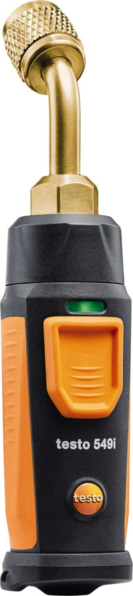

# Testo T549i Pressure Probe

This [Serial Studio](https://github.com/Serial-Studio/Serial-Studio) project turns a [Testo T549i](https://www.testo.com/en/testo-549i/p/0560-2549-02) high-pressure smart probe into a live dashboard over [Bluetooth Low Energy](https://en.wikipedia.org/wiki/Bluetooth_Low_Energy). It is a complete tour of Serial Studio's automation stack in one small project: a Control Script wakes the probe, a binary frame parser decodes the raw stream, and per-dataset Lua transforms derive the engineering units.

<div align="center"></div>

## What it does

- Restores the probe's GATT configuration from the project: service `0xFFF0`, notify characteristic `0xFFF2`, both saved by UUID.
- Sends the vendor "enable measurement" handshake to write characteristic `0xFFF1` from the project's Control Script, so the probe starts streaming without any phone app.
- Decodes the probe's binary notifications with a JavaScript frame parser that emits raw device units only: differential pressure in pascal and battery level in percent.
- Converts pascal into psi with a one-line Lua transform, and shows the result on a plot, a meter, and a battery bar.

## The BLE protocol

The probe exposes a vendor GATT service with a split read/write pair:

| Role                  | UUID     |
|-----------------------|----------|
| Service               | `0xFFF0` |
| Write characteristic  | `0xFFF1` |
| Notify characteristic | `0xFFF2` |

The probe only streams after a three-command enable sequence is written to `0xFFF1`:

```text
56 00 03 00 00 00 0C 69 02 3E 81
20 00 00 00 00 00 07 7B
11 00 00 00 00 00 03 5A
```

Measurements then arrive on `0xFFF2` as name-prefixed binary frames, interleaved with short checksum and status notifications:

| Notification        | Layout                                                                  |
|---------------------|-------------------------------------------------------------------------|
| Measurement (30 B)  | `u32` name length, ASCII name (`DifferentialPressure`), `f32` LE value in Pa, 2-byte trailer |
| Checksum (2 B)      | CRC of the preceding measurement frame                                   |
| Status (8 B)        | Periodic device status                                                   |

Battery level arrives the same way, with the field name `BatteryLevel`.

## Control Script: the wake-up handshake

The Control Script runs `setup()` once when the device connects and `loop()` while it stays connected, like an Arduino sketch. Serial Studio reports the source as connected only after the saved service and notify characteristic are wired, so the script can write immediately. The handshake, condensed from the project's script:

```js
const WRITE_UUID  = "fff1";
const ENABLE_CMDS = ["5600030000000C69023E81", "200000000000077B", "110000000000035A"];

function setup() {
  for (var i = 0; i < ENABLE_CMDS.length; ++i) {
    var r = io.ble.writeCharacteristic(WRITE_UUID, ENABLE_CMDS[i], SerialStudio.Hex);
    if (!r.ok)
      return;

    delay(100);
  }
}
```

The full script in the project keeps a sent flag and retries from `loop()` if a write fails.

## Frame parser: minimal raw decode

The parser does one job: find the field name in each notification and read the IEEE-754 float that follows it. It emits raw device units and nothing else; notifications without a marker just re-emit the held values, so every dataset updates on a steady timeline.

```text
parse(frame) -> [ pressure in Pa, battery in % ]
```

No unit conversion happens in the parser. That keeps it a pure description of the wire format, and it never needs to change when you want another unit on the dashboard.

## Engineering units with transforms

The pressure dataset reads parser channel 1 and converts pascal to psi in its Lua transform:

| Dataset        | Index | Transform                               | Units | Widget       |
|----------------|-------|-----------------------------------------|-------|--------------|
| Pressure       | 1     | `return math.max(0, value / 6894.757)` | psi   | Meter + plot |
| Battery Level  | 2     | none                                    | %     | Bar          |

Adding another unit (bar, kPa, inHg) is one more dataset with a one-line transform that reads the same channel; the parser stays untouched. The meter spans 0 to 1000 psi, and the `math.max` clamp pins negative sensor drift to zero.

## Project configuration

| Setting         | Value                       |
|-----------------|-----------------------------|
| Data Conversion | Binary (Direct)             |
| Frame Detection | No Delimiters               |
| Checksum        | None                        |
| Service         | `0xFFF0` (saved by UUID)    |
| Notify          | `0xFFF2` (saved by UUID)    |
| Control Script  | Enable handshake to `0xFFF1`|

### Setup

1. Open the project and select Bluetooth LE as the input source.
2. Power on the probe and pick it from the device list (it advertises as `T549i SN:...`).
3. Click Connect. Serial Studio restores the service and notify characteristic, the Control Script sends the enable sequence, and readings start streaming.
4. Clamp the probe on a pressure port and watch the meter. Unpressurized, it reads zero; the transform clamps negative sensor drift.
