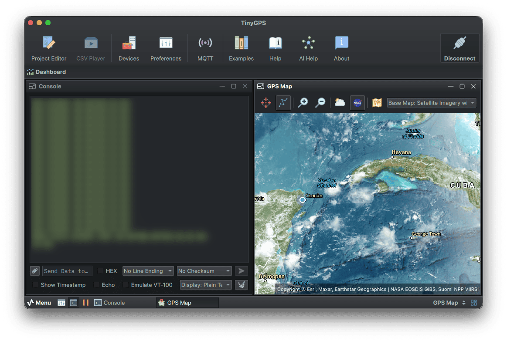
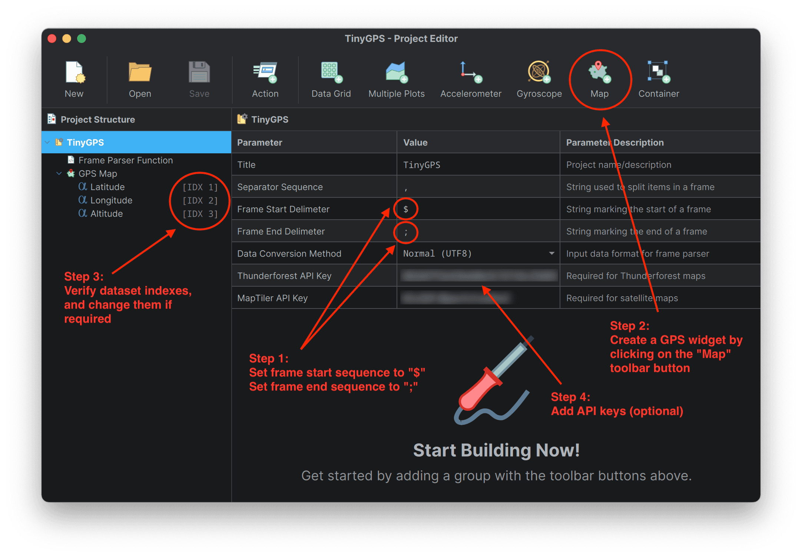

# TinyGPS + Serial Studio Example

## Overview

This project demonstrates how to use Serial Studio to visualize GPS location data from a GPS module (GY-NEO6MV2) connected to an Arduino Mega 2560. The Arduino program reads GPS data (latitude, longitude, and altitude) and sends it to Serial Studio via serial communication for display on a map.



**Compatibility**: This project is compatible with any GPS module that outputs NMEA sentences at **9600 baud**. Adjust the connections and serial port configuration accordingly if using a different Arduino board, like the Uno or Nano.

## Hardware Setup

To get started, you will need a GY-NEO6MV2 GPS module and an Arduino Mega 2560. Connect the **TX pin** of the GPS module to the **RX pin** of the Arduino Mega 2560 (`Serial1`). Ensure that the GPS module is configured to communicate at **9600 baud**, which matches the default settings in the Arduino sketch.

If you're using an Arduino Uno or Nano, which lack multiple hardware serial ports, you can use a software serial port instead. The following code can be uncommented to enable SoftwareSerial:

```cpp
// Uncomment for Uno/Nano:
// #include <SoftwareSerial.h>
// SoftwareSerial gpsSerial(2, 3); // RX, TX pins for SoftwareSerial
```

## Step-by-Step Guide

### 1. Arduino Sketch (`TinyGPS.ino`)

Begin by installing the **TinyGPS** library:

- Open the Arduino IDE, navigate to **Sketch > Include Library > Manage Libraries**, then search for "TinyGPS" and install it.

Once the library is installed, open the `TinyGPS.ino` sketch, connect the GPS module to `Serial1` on the Mega 2560, and upload the code to your Arduino. The GPS data will be transmitted as a data frame, formatted with specific delimiters:

- **Start Delimiter (`$`)**: Indicates the start of a data frame.
- **End Delimiter (`;`)**: Marks the end of the frame.
- **Separator (`,`)**: Separates individual pieces of data (latitude, longitude, altitude).

The data frame looks like this:

```
$latitude,longitude,altitude;
```

### 2. Serial Studio Configuration

To visualize the data, Serial Studio needs to be properly configured to parse the incoming GPS data:

1. **Download and Install Serial Studio**:

   Visit [Serial Studio's official website](https://serial-studio.github.io/) to download and install the software.

2. **Open Serial Studio and Import `TinyGPS.json`**:

   Launch Serial Studio and load the `TinyGPS.json` file included in this project using the **Project Editor**. This file contains all necessary configurations for interpreting the data transmitted by the Arduino.

#### To Create the Project from Scratch:

Set up Serial Studio to correctly interpret the GPS data by configuring the following in a new project:

- **Frame Start Sequence**: `$`
- **Frame End Sequence**: `;`
- **Data Separator**: `,`

This setup informs Serial Studio how to parse the data being sent by the Arduino. 

Then, click on the **Map** button within Serial Studio to create a GPS map widget automatically. The widget will use the latitude and longitude data to show the current position, while the altitude data can be logged for later analysis, which can be found in CSV logs generated by Serial Studio.



### 3. API Keys for Maps

To fully utilize the mapping features, you may need to obtain API keys for certain map styles:

- **Thunderforest API Key**: Required for some map types. You can get it from [Thunderforest's website](https://www.thunderforest.com/docs/apikeys/).
- **MapTiler API Key**: Required if you plan to use the satellite map feature. Visit [MapTiler's website](https://www.maptiler.com/cloud/) for an API key. Note that on the first use, the satellite map may take some time to download and cache images.

### 4. Viewing GPS Data in Serial Studio

After setting up Serial Studio:

- Connect to the Arduino by selecting the correct serial port and setting the baud rate to **115200** (as configured in the Arduino sketch).
- Once connected, you will see the real-time GPS location on the map widget. The altitude data can be recorded in a CSV file for any future analysis.

### Troubleshooting Tips

- **No Data on Map**: Ensure that the GPS module has a clear view of the sky to get satellite fixes. Verify that the correct port and baud rate are selected in Serial Studio.
- **Incorrect Data Parsing**: Double-check that the **Frame Start Sequence** (`$`), **End Sequence** (`;`), and **Separator** (`,`) are correctly set in Serial Studio's project settings.
