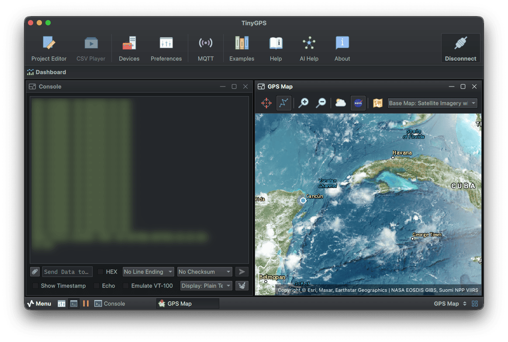
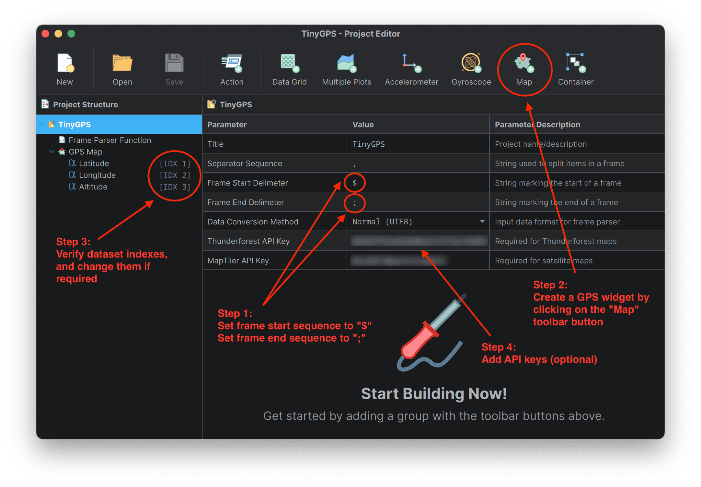

# TinyGPS + Serial Studio example

## Overview

This project shows how to use Serial Studio to visualize GPS location data from a GPS module (GY-NEO6MV2) connected to an Arduino Mega 2560. The Arduino reads GPS data (latitude, longitude, altitude) and sends it to Serial Studio over serial for display on a map.



**Compatibility.** Works with any GPS module that outputs NMEA sentences at 9600 baud. Adjust wiring and serial port configuration if you use a different Arduino board (Uno, Nano, and so on).

## Hardware setup

You need a GY-NEO6MV2 GPS module and an Arduino Mega 2560. Connect the TX pin of the GPS module to the RX pin of the Arduino Mega 2560 (`Serial1`). Make sure the GPS module is set to 9600 baud, which matches the default in the Arduino sketch.

If you're on an Uno or Nano, which don't have multiple hardware serial ports, you can use a software serial port instead. Uncomment this code:

```cpp
// Uncomment for Uno/Nano:
// #include <SoftwareSerial.h>
// SoftwareSerial gpsSerial(2, 3); // RX, TX pins for SoftwareSerial
```

## Step by step

### 1. Arduino sketch (`TinyGPS.ino`)

Install the **TinyGPS** library:

- Open the Arduino IDE, go to **Sketch > Include Library > Manage Libraries**, search for "TinyGPS", and install it.

Once installed, open `TinyGPS.ino`, connect the GPS module to `Serial1` on the Mega 2560, and upload. The GPS data is transmitted with these delimiters:

- **Start delimiter (`$`).** Marks the start of a frame.
- **End delimiter (`;`).** Marks the end of the frame.
- **Separator (`,`).** Separates fields (latitude, longitude, altitude).

The frame looks like:

```
$latitude,longitude,altitude;
```

### 2. Serial Studio configuration

Serial Studio needs to be configured to parse the GPS data:

1. **Download and install Serial Studio.** Visit [Serial Studio's website](https://serial-studio.github.io/) to download and install.
2. **Open Serial Studio and import `TinyGPS.ssproj`.** Launch Serial Studio and load the `TinyGPS.ssproj` file from this project in the Project Editor. It has everything you need to interpret the Arduino's data.

#### Building from scratch

If you want to configure it yourself:

- **Frame start sequence:** `$`.
- **Frame end sequence:** `;`.
- **Data separator:** `,`.

Then click the **Map** button in Serial Studio to create a GPS map widget automatically. The widget uses the latitude and longitude to show the current position, and altitude is logged into the CSV.



### 3. API keys for maps

To get the most out of the mapping features, you may need API keys for some map styles:

- **Thunderforest API key.** Needed for some map types. Get one from [Thunderforest](https://www.thunderforest.com/docs/apikeys/).
- **MapTiler API key.** Needed for satellite maps. Get one from [MapTiler](https://www.maptiler.com/cloud/). The satellite map may take a bit to download and cache on first use.

### 4. Viewing GPS data

Once Serial Studio is configured:

- Connect to the Arduino by picking the correct serial port and setting the baud rate to 115200 (matching the Arduino sketch).
- You'll see the real-time GPS position on the map widget. Altitude can be logged to a CSV file for later analysis.

### Troubleshooting

- **No data on the map.** Make sure the GPS module has a clear view of the sky to get a satellite fix. Check that the correct port and baud rate are selected in Serial Studio.
- **Incorrect parsing.** Double-check that the start sequence (`$`), end sequence (`;`), and separator (`,`) are set correctly in the project settings.
