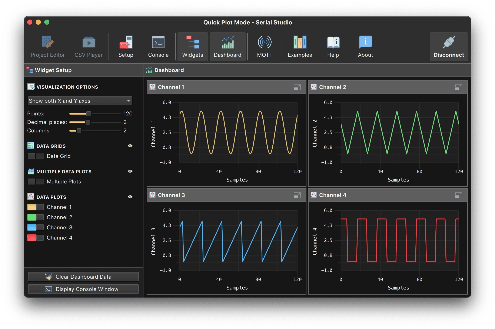

# UDP function generator example

## Overview

This project shows how to use the **UDP function generator** program to generate and transmit multiple real-time waveforms (sine, triangle, sawtooth, and square) over UDP. The program feeds CSV-formatted data to Serial Studio, so you can visualize the waveforms in real time.

With Serial Studio, you can use Quick Plot to visualize data coming in over UDP. It's a handy way to test and analyze waveform generation.



### What is a function generator?

A function generator produces electrical waveforms for testing circuits, analyzing systems, and generating real-time signals. This program simulates one but transmits its output over a UDP socket instead of generating physical signals.

The waveforms are useful for:

- Testing UDP-based communication.
- Stress-testing Serial Studio to find bugs.
- Visualizing signal behavior in applications.
- Learning and experimenting with waveform generation and signal processing.

## Program features

- **Waveform types.** Sine, triangular, sawtooth, and square.
- **Customizable settings:**
  - Number of waveforms to generate.
  - Frequency, phase, and type of each waveform.
  - Adjustable transmission interval.
- **Verbose output.** Print real-time data to the console (optional).
- **Aliasing protection.** Warns if the frequency is too high for smooth reconstruction.

## Getting started

### Requirements

- GCC or any compatible C compiler.
- A system with POSIX support for UDP sockets (Linux, macOS, or Windows with WSL).
- [Serial Studio](https://serial-studio.github.io/) for real-time visualization.

### 1. Compile the program

On UNIX systems:

```bash
gcc -o udp_function_generator udp_function_generator.c -lm
```

On Windows:

```bash
gcc -o udp_function_generator.exe udp_function_generator.c -lws2_32 -lm
```

### 2. Run the program

```bash
./udp_function_generator [-p port] [-i interval] [-n num_functions] [-v]
```

**Command-line options:**

- `-p <port>`: UDP port (default `9000`).
- `-i <interval>`: transmission interval in milliseconds (default `1.0` ms).
- `-n <num_functions>`: number of waveforms to generate (default `1`).
- `-v`: enable verbose output (prints generated data to the console).

**Example:**

```bash
./udp_function_generator -p 9000 -i 5 -n 3 -v
```

### 3. Visualize data in Serial Studio

1. **Download and install Serial Studio.** Visit the [official site](https://serial-studio.github.io/) to download and install.
2. **Configure Serial Studio.**
   - Set **I/O Interface** to **Network Socket**.
   - Pick **UDP** as the socket type.
   - Set **Host** to `localhost`.
   - Set both the local and remote ports to match the program's `-p` option (default `9000`).
3. **Enable Quick Plot.** In the Setup pane, tick the **Quick Plot** checkbox. It plots numeric values transmitted via UDP in real time.
4. **Run the program.** Waveforms will show up in Serial Studio's real-time plot.

## Step by step

### Waveform configuration

When you run the program, it prompts you to configure the waveforms:

1. Enter the waveform type (`sine`, `triangle`, `saw`, or `square`).
2. Enter the frequency in Hertz.
3. Enter the phase in radians.

The program validates your input and warns about aliasing or distortion if the frequency is too high relative to the sampling rate.

### Data transmission

The program formats the waveform data as a comma-separated string and transmits it over UDP at the interval you specified. You can view this data in Serial Studio or analyze it with any UDP client.

### Troubleshooting

- **No waveforms in Serial Studio.** Make sure the UDP port matches between the program and Serial Studio, and that the host is set to `localhost`.
- **Distorted waveforms.** Lower the frequency if it's approaching the Nyquist limit. The program issues warnings for frequencies near this threshold. If the frequencies look fine, please open a [bug report](https://github.com/Serial-Studio/Serial-Studio/issues/new?assignees=alex-spataru&labels=bug&projects=&template=bug_report.md).
- **No data output.** Make sure the program is running and the network configuration is correct.

## Examples

### Example 1: single sine wave

Command:

```bash
./udp_function_generator -p 9000 -i 1 -n 1 -v
```

Configuration:

- Waveform type: `sine`.
- Frequency: `10 Hz`.
- Phase: `0 radians`.

### Example 2: multiple waveforms

Command:

```bash
./udp_function_generator -p 8000 -i 5 -n 3 -v
```

Configuration:

1. Waveform 1: `triangle`, `5 Hz`, `0 radians`.
2. Waveform 2: `saw`, `20 Hz`, `1.5 radians`.
3. Waveform 3: `square`, `50 Hz`, `0 radians`.

Visualization: Serial Studio shows all three waveforms in real time, with a 5 ms sampling interval.

### Example 3: high-frequency warning

If the frequency exceeds 80% of the Nyquist rate, the program prints a warning:

```plaintext
Warning: Frequency 450.00 Hz approaches the Nyquist rate (500.00 Hz). 
Consider reducing it below 400.00 Hz to ensure smooth waveform reconstruction.
```

That keeps waveform visualization smooth.

## Enjoy your testing

For more advanced use cases, check the source code and explore the customizable options. Pull requests with improvements are welcome.
