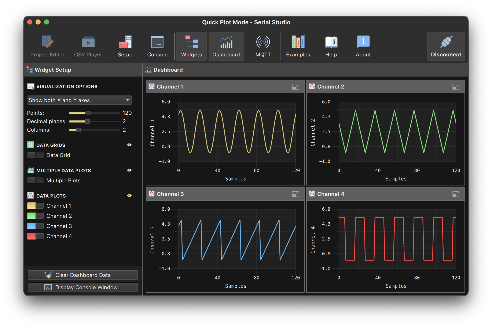

# UDP Function Generator Example

## Overview

This project demonstrates how to use the **UDP Function Generator** program to generate and transmit multiple real-time waveforms (sine, triangle, sawtooth, and square) over a UDP network. The program is designed to feed CSV-formatted data to **Serial Studio**, allowing users to visualize the generated waveforms in real-time.

With **Serial Studio**, you can use the **Quick Plot** feature to easily visualize data transmitted via the UDP socket. This provides an intuitive way to test and analyze waveform generation.



### What is a Function Generator?

A **function generator** creates electrical waveforms that can be used for testing circuits, analyzing systems, and generating real-time signals for processing. This program simulates such a generator but transmits its output over a UDP socket instead of generating physical signals.

The waveforms can be used for:
- Testing UDP-based communication.
- Stress-testing Serial Studio to find bugs.
- Visualizing signal behavior in applications.
- Learning and experimenting with waveform generation and signal processing.

## Program Features

- **Waveform Types**: Generate sine, triangular, sawtooth, and square waves.
- **Customizable Settings**:
  - Number of waveforms to generate.
  - Frequency, phase, and type of each waveform.
  - Adjustable transmission interval.
- **Verbose Output**: Print real-time data to the console (optional).
- **Aliasing Protection**: Warns if the frequency is too high to ensure smooth waveform reconstruction.

## Getting Started

### Requirements

- GCC or any compatible C compiler.
- A system with POSIX support for UDP sockets (Linux, macOS, or Windows with WSL).
- [**Serial Studio**](https://serial-studio.github.io/) for real-time visualization.

### 1. Compile the Program

To compile the program in UNIX systems, use the following command:

```bash
gcc -o udp_function_generator udp_function_generator.c -lm
```

On Windows, you will need to use:

```bash
gcc -o udp_function_generator.exe udp_function_generator.c -lws2_32 -lm
```

### 2. Run the Program

Use the following command to execute the program:

```bash
./udp_function_generator [-p port] [-i interval] [-n num_functions] [-v]
```

#### Command-Line Options:

- `-p <port>`: UDP port (default: `9000`).
- `-i <interval>`: Transmission interval in milliseconds (default: `1.0 ms`).
- `-n <num_functions>`: Number of waveforms to generate (default: `1`).
- `-v`: Enable verbose output (prints generated data to the console).

#### Example:

```bash
./udp_function_generator -p 9000 -i 5 -n 3 -v
```

### 3. Visualize Data in Serial Studio

To visualize the transmitted data:

1. **Download and Install Serial Studio**:
   Visit the [official website](https://serial-studio.github.io/) to download and install the software.

2. **Configure Serial Studio**:
   - Set the **I/O Interface** to `Network Socket`.
   - Select `UDP` as the **Socket Type**.
   - Set the **Host** to `localhost`.
   - Configure both the **Local** and **Remote** ports to match the program's `-p` option (default: `9000`).

3. **Enable Quick Plot**:
   - In Serial Studio, click on the **Quick Plot** checkbox in the **Setup** pane.
   - This feature plots numerical values transmitted via UDP in real time.

4. **Run the Program**:
   Execute the `udp_function_generator` program. Waveforms will be displayed in Serial Studio's real-time plot.

## Step-by-Step Guide

### Waveform Configuration

When you run the program, it prompts you to configure the waveforms:

1. Enter the **type of waveform** (`sine`, `triangle`, `saw`, or `square`).
2. Specify the **frequency** in Hertz.
3. Enter the **phase** in radians.

The program validates your input and warns about aliasing or distortion if the frequency is too high relative to the sampling rate.

### Data Transmission

The program formats the waveform data into a comma-separated string and transmits it via UDP at the specified interval. You can view this data in Serial Studio or analyze it using any UDP-compatible client.

### Troubleshooting

- **No Waveforms in Serial Studio**: Ensure that the UDP port matches between the program and Serial Studio, and that the **host** is set to `localhost`.
- **Distorted Waveforms**: Reduce the frequency of the waveforms if they approach the Nyquist limit. The program issues warnings for frequencies near this threshold. If the frequencies are ok, please open a [bug report](https://github.com/Serial-Studio/Serial-Studio/issues/new?assignees=alex-spataru&labels=bug&projects=&template=bug_report.md).
- **No Data Output**: Ensure the program is running and the network configuration is correct.

## Examples

### Example 1: Single Sine Wave

Command:

```bash
./udp_function_generator -p 9000 -i 1 -n 1 -v
```

Configuration:
- Waveform Type: `sine`
- Frequency: `10 Hz`
- Phase: `0 radians`

### Example 2: Multiple Waveforms

Command:

```bash
./udp_function_generator -p 8000 -i 5 -n 3 -v
```

Configuration:
1. Waveform 1: `triangle`, `5 Hz`, `0 radians`.
2. Waveform 2: `saw`, `20 Hz`, `1.5 radians`.
3. Waveform 3: `square`, `50 Hz`, `0 radians`.

Visualization:
- Serial Studio will display all three waveforms in real time, with a sampling interval of 5 ms.

### Example 3: High-Frequency Warning

If the frequency exceeds 80% of the Nyquist rate, the program displays a warning:

```plaintext
Warning: Frequency 450.00 Hz approaches the Nyquist rate (500.00 Hz). 
Consider reducing it below 400.00 Hz to ensure smooth waveform reconstruction.
```

This ensures a smooth visualization of waveforms.

## Enjoy Your Testing!

For more advanced use cases, refer to the source code and explore the customizable options. You're welcome to make a PR with an improved version of this code.
