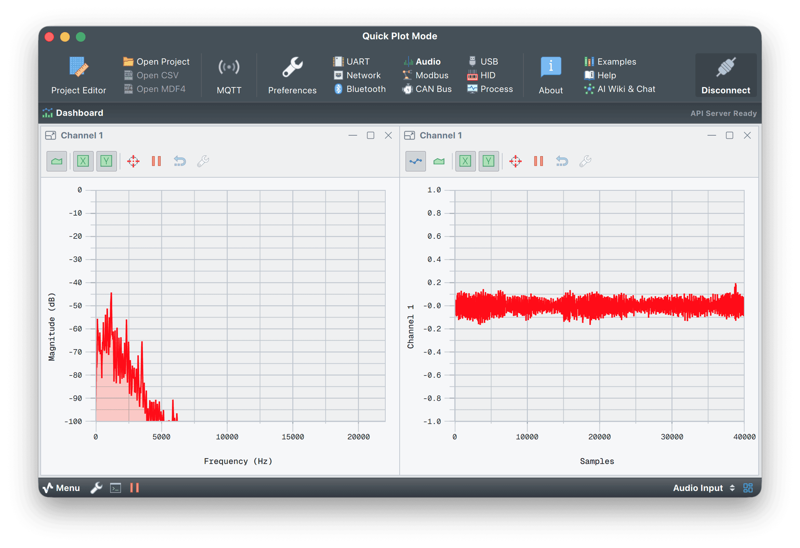

# Serial Studio audio pipeline validator

## Overview

This project is a utility for converting audio data recorded via Serial Studio's Audio I/O driver into playable WAV files. It's for developers testing Serial Studio's data pipeline integrity using audio signals like voice, tones, or music. If the reconstructed `.wav` file sounds like the original, the I/O pipeline works.

No extra hardware needed. Just Serial Studio, a microphone or audio source, and this Python script.

> Serial Studio's audio features may need a paid license. See [serial-studio.com](https://serial-studio.com/) for details.



## Audio format

Serial Studio logs audio samples to CSV like this:

```csv
RX Date/Time,Audio Input/Channel 1,Audio Input/Channel 2,...
2025/08/02 23:43:57::950,0.000000,0.002541,...
```

- **First column.** Timestamp (ignored by this tool).
- **Remaining columns.** Audio samples for each channel (float, typically normalized).
- **Channel count.** Mono, stereo, surround, and so on, depending on how many channels are logged.

## Features

- Converts any Serial Studio CSV into a valid `.wav` file.
- Supports mono, stereo, and multichannel audio.
- CLI options for:
  - Output sample rate (default 44,100 Hz).
  - Sample format (`float32`, `int16`, `int24`, `int32`, `uint8`).
- Normalizes audio automatically if needed.
- Helps debug Serial Studio pipelines by letting you listen to the reconstructed audio.

## How to use

### 1. Record audio in Serial Studio

- Set the input source to an Audio I/O device.
- Configure the number of channels (1 = mono, 2 = stereo, and so on).
- Enable data logging to a `.csv` file.
- Speak, play music, or record any sound.

### 2. Convert CSV to WAV

```bash
python3 csv2wav.py path/to/audio.csv
```

You can optionally specify an output path, sample rate, and format:

```bash
python3 csv2wav.py path/to/audio.csv output.wav --rate 48000 --format int16
```

### 3. Listen to the result

- Open the generated WAV file in any media player.
- Compare it to your original source (mic recording, test tone, and so on).
- Clean, accurate playback means the data path works end to end.

## Supported sample formats

| Format   | Bit depth | Range                       |
|----------|-----------|-----------------------------|
| float32  | 32-bit    | -1.0 to 1.0                 |
| int16    | 16-bit    | -32768 to 32767             |
| int24    | 24-bit    | -8388608 to 8388607         |
| int32    | 32-bit    | -2147483648 to 2147483647   |
| uint8    | 8-bit     | 0 to 255 (biased unsigned)  |

Default is `float32`. For playback compatibility, `int16` is usually a safe bet.

## Example use case

As a developer or tester:

- Inject an audio signal into Serial Studio using a virtual mic or file playback.
- Serial Studio logs the raw data into a CSV file.
- Run `csv2wav.py` to convert it back into a WAV.
- Listen to check whether the WAV matches the original audio.

If it sounds correct, the pipeline works. If it's clipped, noisy, or silent, check device config, sample rate, or formatting.

## Files

- `csv2wav.py`: the core CSV to WAV conversion script.
- `README.md`: project documentation and usage guide.

## Dependencies

- Python 3.x.
- `numpy` (install via pip).

```bash
pip install numpy
```

## Command-line usage

```bash
python3 csv2wav.py input.csv [output.wav] [--rate <hz>] [--in_format <type>]
```

- `input.csv`: CSV file exported from Serial Studio.
- `output.wav`: optional name for the output WAV file.
- `--rate`: optional sample rate in Hz (default 44100).
- `--in_format`: input format (`float32`, `int16`, `int24`, `int32`, `uint8`).

> [!TIP]
> For advanced resampling, route audio through a [virtual loopback device](https://existential.audio/blackhole/) and set the target frequency with [Serial Studio](https://github.com/Serial-Studio/Serial-Studio). Then run `csv2wav.py` to export at the new frequency. This trick often delivers some of the cleanest downsampling results you'll hear, nice for slowed and reverb style mixes.

## Troubleshooting

- **WAV plays silence.** Check whether your CSV actually has audio values, or just zeros.
- **Distortion.** Input values may exceed [-1, 1]. Normalize or rescale properly.
- **Wrong channel order.** Check that your audio source is mapped correctly in Serial Studio.
