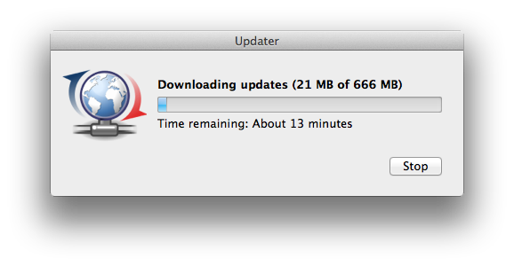

# QSimpleUpdater

<a href="#">
    
</a>

[](#)

QSimpleUpdater is an implementation of an auto-updating system to be used with Qt projects. It allows you to easily check for updates, download them and install them. Additionally, the QSimpleUpdater allows you to check for updates for different "modules" of your application. Check the [FAQ](#faq) for more information.

[](etc/screenshots/)

## Integrating QSimpleUpdater with your projects

### Using CMake (recommended)

Add QSimpleUpdater as a subdirectory in your `CMakeLists.txt`:

```cmake
# Disable tutorial/tests if you don't need them
set(QSIMPLE_UPDATER_BUILD_TUTORIAL OFF CACHE BOOL "" FORCE)
set(QSIMPLE_UPDATER_BUILD_TESTS OFF CACHE BOOL "" FORCE)

add_subdirectory(3rd-party/QSimpleUpdater)
target_link_libraries(YourApp PRIVATE QSimpleUpdater)
```

### Using qmake

1. Copy the QSimpleUpdater folder in your "3rd-party" folder.
2. Include the QSimpleUpdater project include (*.pri*) file using the `include()` function.
3. That's all! Check the [tutorial project](/tutorial) as a reference for your project.

## Update Definitions File

QSimpleUpdater downloads a JSON file that describes the latest version and download URLs for each platform. Example:

```json
{
  "updates": {
    "windows": {
      "open-url": "",
      "latest-version": "2.0.0",
      "download-url": "https://example.com/app-setup.exe",
      "changelog": "<p>Bug fixes and improvements.</p>",
      "mandatory-update": false
    },
    "osx": {
      "open-url": "",
      "latest-version": "2.0.0",
      "download-url": "https://example.com/app.dmg",
      "changelog": "<p>Bug fixes and improvements.</p>",
      "mandatory-update": false
    },
    "linux": {
      "open-url": "",
      "latest-version": "2.0.0",
      "download-url": "https://example.com/app.AppImage",
      "changelog": "<p>Bug fixes and improvements.</p>",
      "mandatory-update": false
    }
  }
}
```

### Fields

| Field              | Type    | Description                                                                |
|--------------------|---------|----------------------------------------------------------------------------|
| `open-url`         | string  | If set, opens this URL in a browser instead of downloading.                |
| `latest-version`   | string  | The latest version string (e.g. `"2.0.0"`, `"v1.3.0-beta2"`).             |
| `download-url`     | string  | Direct download URL for the update file.                                   |
| `changelog`        | string  | HTML-formatted changelog text shown to the user.                           |
| `mandatory-update` | boolean | If `true`, the user cannot skip the update; the app quits on cancellation. |

### Platform keys

| Platform          | Key         |
|-------------------|-------------|
| Microsoft Windows | `windows`   |
| macOS             | `osx`       |
| GNU/Linux         | `linux`     |
| iOS               | `ios`       |
| Android           | `android`   |

You can also set custom platform keys with `setPlatformKey()`.

## Version Comparison

QSimpleUpdater supports semantic versioning with optional pre-release suffixes:

- `1.2.3` vs `1.2.4` — patch upgrade detected
- `v1.0.0-alpha1` vs `v1.0.0` — stable is newer than pre-release
- `v1.0.0-alpha1` vs `v1.0.0-beta1` — beta is newer than alpha
- `v1.0.0-rc1` vs `v1.0.0-rc2` — rc2 is newer than rc1

The `v` prefix is optional and ignored during comparison.

## FAQ

### 1. How does the QSimpleUpdater check for updates?

The QSimpleUpdater downloads an update definition file stored in JSON format. This file specifies the latest version, the download links and changelogs for each platform (you can also register your own platform easily if needed).

After downloading this file, the library compares the local version and the remote version. If the remote version is greater than the local version, then the library infers that there is an update available and notifies the user.

An example update definition file can be found [here](https://github.com/alex-spataru/QSimpleUpdater/blob/master/tutorial/definitions/updates.json).

### 2. Can I customize the update notifications shown to the user?

Yes! You can toggle which notifications to show using the library's functions or re-implement the notifications yourself by reacting to the signals emitted by the QSimpleUpdater.

```cpp
QString url = "https://example.com/updates.json";

QSimpleUpdater::getInstance()->setNotifyOnUpdate(url, true);
QSimpleUpdater::getInstance()->setNotifyOnFinish(url, false);
QSimpleUpdater::getInstance()->checkForUpdates(url);
```

### 3. Is the application able to download the updates directly?

Yes. If there is an update available, the library will prompt the user if he/she wants to download the update. You can enable or disable the integrated downloader with the following code:

```cpp
QString url = "https://example.com/updates.json";
QSimpleUpdater::getInstance()->setDownloaderEnabled(url, true);
```

### 4. Why do I need to specify a URL for each function of the library?

The QSimpleUpdater allows you to use different updater instances, which can be accessed with the URL of the update definitions. While it is not obligatory to use multiple updater instances, this can be useful for applications that make use of plugins or different modules.

Say that you are developing a game, in this case, you could use the following code:

```cpp
// Update the game textures
QString textures_url = "https://example.com/textures.json";
QSimpleUpdater::getInstance()->setModuleName(textures_url, "textures");
QSimpleUpdater::getInstance()->setModuleVersion(textures_url, "0.4");
QSimpleUpdater::getInstance()->checkForUpdates(textures_url);

// Update the game sounds
QString sounds_url = "https://example.com/sounds.json";
QSimpleUpdater::getInstance()->setModuleName(sounds_url, "sounds");
QSimpleUpdater::getInstance()->setModuleVersion(sounds_url, "0.6");
QSimpleUpdater::getInstance()->checkForUpdates(sounds_url);

// Update the client (name & versions are already stored in qApp)
QString client_url = "https://example.com/client.json";
QSimpleUpdater::getInstance()->checkForUpdates(client_url);
```

### 5. Does QSimpleUpdater support FTP?

No. QSimpleUpdater only supports HTTP and HTTPS protocols for downloading update definitions and update files. If your files are hosted on an FTP server, consider using an HTTP/HTTPS proxy or migrating to an HTTP-based hosting solution.

### 6. Can I use custom install procedures?

Yes. If you want to handle the downloaded file yourself (e.g. for silent installs or custom extraction), disable the built-in install handler and connect to the `downloadFinished` signal:

```cpp
QString url = "https://example.com/updates.json";
QSimpleUpdater::getInstance()->setUseCustomInstallProcedures(url, true);

connect(QSimpleUpdater::getInstance(), &QSimpleUpdater::downloadFinished,
        [](const QString &url, const QString &filepath) {
    // Handle the downloaded file at 'filepath'
});
```

## License

QSimpleUpdater is free and open-source software, it is released under the [MIT](LICENSE.md) license.
